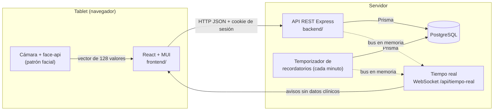

# Arquitectura



## Backend (`backend/`)

Node.js + Express 5 + TypeScript, organizado **por módulo de negocio**
(`src/modulos/<modulo>/`). Cada módulo tiene, según necesite:

| Archivo         | Responsabilidad                                                                        |
| --------------- | -------------------------------------------------------------------------------------- |
| `*.rutas.ts`    | Endpoints: leen y validan la entrada, piden el permiso, llaman al servicio y responden |
| `*.esquemas.ts` | Esquemas de validación (zod) de lo que entra por la API                                |
| `*.servicio.ts` | Reglas de negocio y acceso a datos; cada cambio se audita dentro de su transacción     |
| `*.test.ts`     | Pruebas del módulo (unitarias y de integración contra la base)                         |

Piezas comunes en `src/comun/`: errores con código (`ErrorApi`), manejo de errores, validación,
paginación, parámetros y el `reloj` (fuente única de la hora, reemplazable en las pruebas).

Flujo de un pedido:

```
cookie → autenticar (valida token, relee el usuario, renueva la sesión)
       → requierePermiso('modulo.accion')
       → validar(esquema, body/query)
       → servicio (transacción: cambio + auditoría)
       → { data } | { error: { codigo, mensaje } }
```

Express 5 propaga solo los errores de los handlers asíncronos al middleware de errores, que los
traduce al formato de la API.

**Arranque** ([`servidor.ts`](../backend/src/servidor.ts) · `levantarServidor()`): un solo proceso
atiende la API, el **tiempo real** por WebSocket en `/api/tiempo-real` (mismo puerto, sesión por la
cookie) y el **temporizador de recordatorios** (E5). `crearApp()` solo arma Express, sin
temporizador ni WebSocket: es lo que usan las pruebas. Los servicios que cambian recordatorios
publican en un **bus en memoria** _después_ de confirmar su transacción, y el tiempo real reenvía
el aviso a las tablets conectadas, que vuelven a pedir la lista. Detalle en
[recordatorios.md](recordatorios.md).

## Frontend (`frontend/`)

React 19 + Vite + MUI 7, pensado para **tablet**:

| Carpeta            | Contenido                                                                                                            |
| ------------------ | -------------------------------------------------------------------------------------------------------------------- |
| `src/api/`         | Cliente HTTP, tipos y funciones por módulo (con TanStack Query para el estado del servidor)                          |
| `src/auth/`        | Contexto de sesión, cierre por inactividad, rutas protegidas por permiso                                             |
| `src/componentes/` | Componentes reutilizables (guía en [componentes.md](componentes.md))                                                 |
| `src/navegacion/`  | Menú por rol, disposición de pantalla, notificaciones, insignia de recordatorios                                     |
| `src/paginas/`     | Una carpeta por módulo con sus pantallas y pruebas                                                                   |
| `src/tiempoReal/`  | Conexión WebSocket con reconexión, proveedor y avisos de recordatorios nuevos ([recordatorios.md](recordatorios.md)) |
| `src/utilidades/`  | Formatos, filtros en la URL, foco en el primer error, cambios sin guardar                                            |
| `src/pruebas/`     | Servidor simulado (MSW), datos y ayudantes de render                                                                 |

**Rutas.** [`App.tsx`](../frontend/src/App.tsx) usa un **router de datos** (`createBrowserRouter`)
con una sola ruta comodín que envuelve `ProveedorSesion` y [`RutasApp`](../frontend/src/RutasApp.tsx),
donde sigue el mapa de pantallas. El router de datos hace falta para `useBlocker`, que usa
[`useCambiosSinGuardar`](../frontend/src/utilidades/useCambiosSinGuardar.tsx) para preguntar antes
de salir de un formulario sin guardar. `QueryClientProvider` y el tema quedan fuera del router. En
las pruebas, `renderizarApp` arma lo mismo con `createMemoryRouter`: una pantalla con formulario
se prueba con `renderizarApp`, no con `MemoryRouter`. **Carga diferida** (T702): Reportes,
Auditoría y la gestión (usuarios, biometría, catálogo) se descargan al abrirlas o al apuntar a su
enlace (`pantallaDiferida` + `usePrecargaAlApuntar`), con el `Cargando` común mientras llegan y
`LimiteDeCarga` con "Reintentar" si fallan; lo de al lado de la cama va en el arranque. Por eso
una pantalla diferida aparece de forma asíncrona en las pruebas (`findBy…`). Tamaños y decisiones
en [rendimiento.md](rendimiento.md#frontend-carga-inicial).

**Tiempo real.** `ProveedorTiempoReal` se monta en `Disposicion` (solo con sesión y
`recordatorios.ver`): abre `/api/tiempo-real`, y cada aviso vuelve a pedir
`GET /api/recordatorios`, que es la fuente de verdad.

## Base de datos

PostgreSQL con migraciones versionadas de Prisma. Las reglas que la base puede garantizar
(cama con un solo paciente activo, DNI único, dosis positivas, auditoría inalterable) se
garantizan en la base además de en el código. Ver [modelo-de-datos.md](modelo-de-datos.md).
