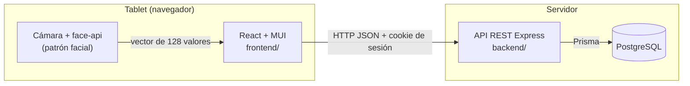

# Arquitectura



## Backend (`backend/`)

Node.js + Express 5 + TypeScript, organizado **por módulo de negocio**
(`src/modulos/<modulo>/`). Cada módulo tiene, según necesite:

| Archivo         | Responsabilidad                                                                        |
| --------------- | -------------------------------------------------------------------------------------- |
| `*.rutas.ts`    | Endpoints: leen y validan la entrada, piden el permiso, llaman al servicio y responden |
| `*.esquemas.ts` | Esquemas de validación (zod) de lo que entra por la API                                |
| `*.servicio.ts` | Reglas de negocio y acceso a datos; cada cambio se audita dentro de su transacción     |
| `*.test.ts`     | Pruebas del módulo (unitarias y de integración contra la base)                         |

Piezas comunes en `src/comun/`: errores con código (`ErrorApi`), manejo de errores, validación,
paginación, parámetros y el `reloj` (fuente única de la hora, reemplazable en las pruebas).

Flujo de un pedido:

```
cookie → autenticar (valida token, relee el usuario, renueva la sesión)
       → requierePermiso('modulo.accion')
       → validar(esquema, body/query)
       → servicio (transacción: cambio + auditoría)
       → { data } | { error: { codigo, mensaje } }
```

Express 5 propaga solo los errores de los handlers asíncronos al middleware de errores, que los
traduce al formato de la API.

## Frontend (`frontend/`)

React 19 + Vite + MUI 7, pensado para **tablet**:

| Carpeta            | Contenido                                                                                   |
| ------------------ | ------------------------------------------------------------------------------------------- |
| `src/api/`         | Cliente HTTP, tipos y funciones por módulo (con TanStack Query para el estado del servidor) |
| `src/auth/`        | Contexto de sesión, cierre por inactividad, rutas protegidas por permiso                    |
| `src/componentes/` | Componentes reutilizables (guía en [componentes.md](componentes.md))                        |
| `src/navegacion/`  | Menú por rol, disposición de pantalla, notificaciones                                       |
| `src/paginas/`     | Una carpeta por módulo con sus pantallas y pruebas                                          |
| `src/pruebas/`     | Servidor simulado (MSW), datos y ayudantes de render                                        |

## Base de datos

PostgreSQL con migraciones versionadas de Prisma. Las reglas que la base puede garantizar
(cama con un solo paciente activo, DNI único, dosis positivas, auditoría inalterable) se
garantizan en la base además de en el código. Ver [modelo-de-datos.md](modelo-de-datos.md).
