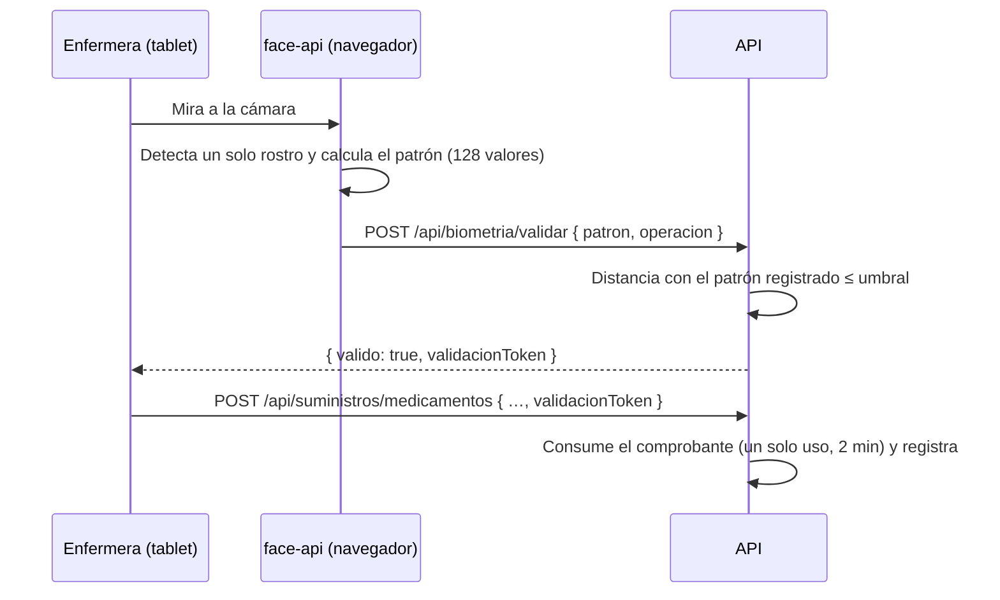

# Reconocimiento facial

> Tareas T401–T407 · Cubre CU07–CU10, RF02. Es la parte de mayor riesgo técnico del proyecto.

## Cómo funciona



- **Dónde corre**: el reconocimiento corre **en el navegador de la tablet** con
  [`@vladmandic/face-api`](https://github.com/vladmandic/face-api) (TensorFlow.js). El video
  nunca sale del dispositivo: al servidor solo viaja el patrón de 128 números.
- **Modelos** (en `frontend/public/models`, los copia `scripts/copiar-modelos.mjs` antes de `dev`
  y `build`): `tiny_face_detector` (detector liviano para móviles), `face_landmark_68` (alinea el
  rostro) y `face_recognition` (genera el patrón). La librería (~1,3 MB) se descarga recién la
  primera vez que se usa la cámara.
- **Captura** ([`CapturaRostro.tsx`](../frontend/src/biometria/CapturaRostro.tsx)): cámara
  frontal, exige **exactamente un rostro** en dos cuadros seguidos (evita capturas movidas) y
  avisa si hay más de una persona.
- **Comparación** ([`comparacion.ts`](../backend/src/modulos/biometria/comparacion.ts)):
  distancia euclídea entre el patrón guardado y el capturado. Coincide si es ≤
  `BIOMETRIA_UMBRAL` (**0,5** por defecto). face-api sugiere 0,6; se eligió uno más estricto
  porque un falso positivo deja registrado a otra persona como responsable.
- **Validación 1:1**: se compara con el patrón del **usuario que tiene la sesión abierta**, no
  con todo el personal (supuesto S6).
- **Comprobante**: si coincide, el backend entrega un JWT firmado que vence a los
  `BIOMETRIA_VALIDEZ_SEG` (120 s), está atado al usuario y se consume **una sola vez**. Las
  operaciones que exigen el rostro (registrar y corregir suministros) lo piden.
- **Fallos (T407)**: cada fallo queda en la auditoría (`VALIDACION_FACIAL_FALLIDA`). Al tercero
  seguido (`BIOMETRIA_MAX_INTENTOS`) se cancela la operación (`OPERACION_CANCELADA`) y se
  **notifica a los administradores**. Una validación correcta reinicia el contador.

## Registro del rostro (T406)

Menú **Biometría** (permiso `biometria.gestionar`): listado del personal con su estado, y por
cada persona **Registrar / Actualizar rostro** (con vista previa de la foto de referencia) y
**Eliminar datos biométricos**. La foto de referencia se guarda para que el administrador pueda
verificar visualmente de quién es el patrón; nunca se usa para comparar.

El patrón y la foto se guardan **cifrados con AES-256-GCM** (`BIOMETRIA_CLAVE`, T705) y solo se
descifran en memoria para comparar o para mostrar la foto al administrador. Formato, clave,
migración y rotación: [seguridad.md](seguridad.md#cifrado-del-dato-biométrico-en-reposo-rnf06).

## Modo de demostración (sin cámara)

Para mostrar o probar el sistema en una PC sin cámara:

```bash
# frontend/.env.development.local
VITE_BIOMETRIA_MODO=simulado
```

En ese modo la captura muestra dos botones: **Simular el rostro de &lt;usuario&gt;** y **Simular
otro rostro**. El patrón simulado se deriva del nombre de usuario con el mismo algoritmo en el
frontend y en la semilla del backend, así que los usuarios de prueba ya tienen su "rostro"
registrado. **En modo cámara** (por defecto) esos patrones no coinciden con ningún rostro: hay
que registrar el rostro real desde Biometría.

## Prueba de concepto (T401)

El plan pide probar face-api en una **tablet real** antes de avanzar. El prototipo deja lista
la herramienta, pero **la prueba en la tablet del hospital queda pendiente** porque requiere el
dispositivo. Pasos:

1. Abrir el sistema en la tablet por HTTPS (o `localhost`): el navegador solo da acceso a la
   cámara en un contexto seguro.
2. Ingresar como administrador → **Biometría → Prueba de reconocimiento → Iniciar prueba**.
3. Registrar durante un minuto, con buena luz y con poca luz:
   - **Tiempo promedio de detección**: aceptable por debajo de ~500 ms.
   - **Con un solo rostro**: % de cuadros con exactamente un rostro (debería ser > 90 % con la
     persona de frente).
   - **Luz**: "Poca luz" por debajo de un brillo medio de 60/255.
   - **Variación del patrón**: distancia entre patrones seguidos del mismo rostro; tiene que
     quedar bien por debajo del umbral (≈ 0,2–0,3) para que la validación sea estable.
4. Registrar el rostro de tres personas y validar cada una contra su propio rostro y contra el
   de las otras (ninguna debe pasar con un rostro ajeno).

**Plan B** (riesgo del plan): si el tiempo o la precisión no alcanzan en la tablet, el motor
está detrás de la interfaz `MotorFacial`
([`motor.ts`](../frontend/src/biometria/motor.ts)) para reemplazarlo por un servicio externo sin
tocar las pantallas; como alternativa temporal, la confirmación podría pasar a usuario y
contraseña.

## Limitaciones conocidas

- **Sin prueba de vida**: una foto impresa de la persona podría engañar al detector. Mitigación
  futura: detección de parpadeo o un servicio con _liveness_.
- **El patrón lo calcula el cliente**: alguien con acceso a la API y al patrón de otra persona
  podría falsificar una validación. El patrón nunca sale del servidor por la API (no hay
  endpoint que lo devuelva), y todas las validaciones quedan auditadas.
- **Clave en el servidor**: el patrón está cifrado en reposo (T705), pero la clave vive en una
  variable de entorno del mismo servidor; perderla obliga a registrar todos los rostros de nuevo.
- **Comprobantes usados en memoria**: el registro de comprobantes ya consumidos vive en la
  memoria del proceso; con más de una instancia del backend habría que llevarlo a la base o a
  Redis.
