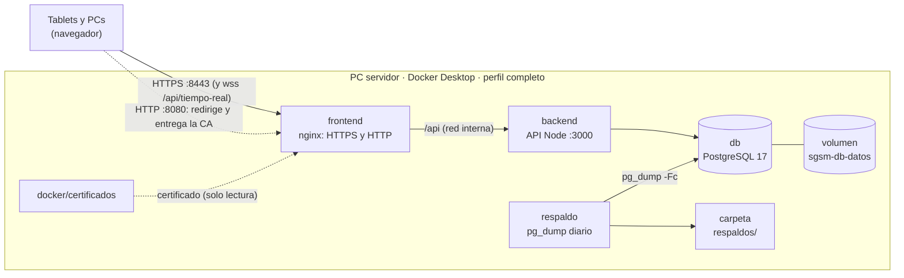

# Despliegue local en el servidor del hospital

> Tareas T005, T007, T801, T802 y T803 (E8). Por decisión del equipo **todo corre en forma local con
> Docker**, en una PC del hospital: no hay nube ni despliegue automático. Variables del backend en
> [entorno.md](entorno.md); seguridad de la API en [seguridad.md](seguridad.md).

## Arquitectura



| Servicio   | Imagen                            | Qué hace                                                                                        | Puerto en la PC                             |
| ---------- | --------------------------------- | ----------------------------------------------------------------------------------------------- | ------------------------------------------- |
| `db`       | `postgres:17-alpine`              | La base (volumen `sgsm-rc_sgsm-db-datos`)                                                       | `DB_PUERTO` (solo `127.0.0.1`)              |
| `backend`  | `sgsm-rc-backend` (se construye)  | La API; aplica las migraciones al arrancar                                                      | ninguno (solo la red interna)               |
| `frontend` | `sgsm-rc-frontend` (se construye) | nginx: la interfaz por HTTPS, `/api` y el WebSocket hacia la API, redirección desde HTTP, la CA | `HTTPS_PUERTO` (8443), `HTTP_PUERTO` (8080) |
| `respaldo` | `postgres:17-alpine`              | Un `pg_dump` por día a `RESPALDO_CARPETA`, con retención                                        | ninguno                                     |

`db` está siempre (es la misma base de desarrollo de `npm run db:up`); los otros tres son del
perfil `completo`, que en el servidor activa el `.env` (`COMPOSE_PROFILES=completo`).

### Archivos

| Archivo                                                                                     | Para qué                                                                                                                               |
| ------------------------------------------------------------------------------------------- | -------------------------------------------------------------------------------------------------------------------------------------- |
| [`docker-compose.yml`](../docker-compose.yml)                                               | Los cuatro servicios, healthchecks, reinicio, rotación de registros, secretos obligatorios                                             |
| [`.env.ejemplo`](../.env.ejemplo)                                                           | Plantilla del `.env` del servidor (el `.env` no se versiona)                                                                           |
| [`backend/Dockerfile`](../backend/Dockerfile)                                               | Imagen de la API (usuario sin privilegios; migraciones y arranque)                                                                     |
| [`frontend/Dockerfile`](../frontend/Dockerfile)                                             | Imagen de la interfaz: `vite build`, hash de la CSP y nginx                                                                            |
| [`frontend/nginx.conf`](../frontend/nginx.conf)                                             | Plantilla de nginx: TLS, redirección, `/api`, WebSocket, caché                                                                         |
| [`docker/nginx/seguridad.conf`](../docker/nginx/seguridad.conf)                             | Encabezados de seguridad de la interfaz (CSP, HSTS, Permissions-Policy…)                                                               |
| [`docker/nginx/csp-scripts.mjs`](../docker/nginx/csp-scripts.mjs)                           | Calcula el hash de los scripts en línea de `index.html` para la CSP                                                                    |
| [`docker/nginx/05-verificar-certificados.sh`](../docker/nginx/05-verificar-certificados.sh) | nginx no arranca sin certificado y lo dice claro                                                                                       |
| [`docker/nginx/generar-certificados.sh`](../docker/nginx/generar-certificados.sh)           | La CA local y el certificado del servidor (con openssl)                                                                                |
| [`docker/respaldo/`](../docker/respaldo/)                                                   | `programar.sh` (horario), `respaldar.sh` (un respaldo), `salud.sh` (healthcheck)                                                       |
| `docker/certificados/`                                                                      | La CA y los certificados generados (no se versiona: `.gitignore` propio)                                                               |
| [`scripts/certificado.sh`](../scripts/certificado.sh) (y `.ps1`)                            | Genera o renueva el certificado                                                                                                        |
| [`scripts/respaldar.sh`](../scripts/respaldar.sh)                                           | Un respaldo ahora                                                                                                                      |
| [`scripts/restaurar.sh`](../scripts/restaurar.sh)                                           | Restaura un respaldo (nunca sin `--si`)                                                                                                |
| [`scripts/estado.sh`](../scripts/estado.sh)                                                 | Contenedores, API, certificado, último respaldo y disco                                                                                |
| [`scripts/actualizar.sh`](../scripts/actualizar.sh)                                         | Respaldo, construcción y arranque de una versión nueva                                                                                 |
| [`backend/src/scripts/instalar.ts`](../backend/src/scripts/instalar.ts)                     | Instalador: datos base, primer administrador y datos del hospital desde CSV ([paso 7](#7-datos-iniciales-y-primer-administrador-t803)) |
| [`docs/ejemplos/`](ejemplos/)                                                               | Modelos de `salas.csv`, `catalogo.csv` y `personal.csv` con datos inventados                                                           |

Los scripts son de bash: en Windows se corren desde **Git Bash** (viene con Git for Windows), en la
carpeta del proyecto, por ejemplo `bash scripts/estado.sh`.

## Primera instalación

### 1. Preparar la PC servidor

- Windows 10/11 Pro de 64 bits, 8 GB de RAM o más (mejor 16), disco SSD con 50 GB libres.
- **IP fija** en la red del hospital (una reserva en el DHCP) y, si se puede, un nombre en el DNS
  del hospital (por ejemplo `sgsm.hospital.lan`). Sin DNS se puede usar el nombre de la PC
  terminado en `.local` (lo resuelven el iPad y las PCs con Windows; en Android depende de la
  versión) o directamente la IP: el certificado lleva las dos cosas.
- Energía: que **no se suspenda** ni apague el disco; idealmente con UPS.
- [Docker Desktop](https://www.docker.com/products/docker-desktop/) con WSL 2, con "Start Docker
  Desktop when you sign in" activado. Docker Desktop arranca **cuando alguien inicia sesión**:
  tras un corte de luz o una actualización de Windows hay que iniciar sesión en la PC (o configurar
  el inicio de sesión automático de un usuario dedicado). Verificar además que la licencia de
  Docker Desktop alcance al hospital (es gratuita solo para organizaciones chicas).
- [Git for Windows](https://git-scm.com/download/win) (trae Git Bash, `openssl` y `curl`).
- Firewall de Windows: permitir la entrada a los puertos de la interfaz en la red privada. En una
  PowerShell **como administrador**:

  ```powershell
  New-NetFirewallRule -DisplayName "SGSM-RC" -Direction Inbound -Protocol TCP -LocalPort 443,80 -Action Allow -Profile Private
  ```

  (con los puertos que se elijan en el `.env`; la red del hospital tiene que estar como "Privada").

- Opcional pero recomendado: rotación de registros para todos los contenedores en Docker Desktop
  (Settings → Docker Engine), agregando `"log-opts": { "max-size": "10m", "max-file": "5" }`. La
  API, nginx y el respaldo ya rotan por `docker-compose.yml`; esto cubre además a la base.

### 2. Traer el sistema

En Git Bash, en una carpeta **fuera de OneDrive** (los respaldos tienen datos de pacientes y no
tienen que sincronizarse a la nube):

```bash
git clone <repositorio> /c/sgsm-rc
cd /c/sgsm-rc
```

### 3. Configurar el `.env`

```bash
cp .env.ejemplo .env
openssl rand -base64 48   # → JWT_SECRETO
openssl rand -base64 32   # → BIOMETRIA_CLAVE (32 bytes exactos)
openssl rand -hex 24      # → POSTGRES_CLAVE (solo letras y números)
```

Completar en `.env` los tres secretos, `SGSM_SERVIDOR` (los nombres) y `SGSM_IP` (la IP fija). En
el servidor conviene `HTTPS_PUERTO=443` y `HTTP_PUERTO=80`: las tablets entran con
`https://sgsm.hospital.lan` sin escribir puerto (ver D85). Detalle de cada variable en
[Variables](#variables).

**Guardar una copia del `.env` fuera de la PC** (en un lugar seguro, no junto a los respaldos):
sin `BIOMETRIA_CLAVE` los rostros registrados no se pueden leer y hay que registrarlos de nuevo.

### 4. Generar el certificado

```bash
bash scripts/certificado.sh
```

Toma los nombres y la IP del `.env` y muestra la **huella SHA-256 de la CA**: anotarla para
comparar en las tablets. Ver [Certificado HTTPS](#certificado-https-t802).

### 5. Levantar

```bash
docker compose up -d --build --wait
```

La primera vez construye las imágenes (unos minutos). `--wait` espera a que los cuatro servicios
estén sanos y falla si alguno no lo logra. Si falta un secreto, compose ni arranca y dice cuál:

```text
error while interpolating services.backend.environment.JWT_SECRETO: required variable JWT_SECRETO
is missing a value: Falta JWT_SECRETO en .env (generalo con openssl rand -base64 48)
```

### 6. Comprobar

```bash
bash scripts/estado.sh
```

Y abrir `https://<servidor>` desde la propia PC (con la CA instalada, sin advertencias).

### 7. Datos iniciales y primer administrador (T803)

La semilla de desarrollo (`npm run db:sembrar`) se niega a correr con `NODE_ENV=production` porque
crea usuarios con contraseñas públicas. En el servidor se usa el **instalador**, que viene en la
imagen de la API ([`backend/src/scripts/instalar.ts`](../backend/src/scripts/instalar.ts)):

- Carga los **datos base**: roles y permisos (al día con la versión instalada) y tipos de estudio.
  Las salas, camas y medicamentos inventados de la semilla de desarrollo **no** van al servidor
  (D102): los del hospital salen de los CSV.
- Crea el **primer administrador** solo si no hay ningún usuario Administrador activo. Si ya hay
  uno, no crea nada y lo dice.
- Opcional: **salas y camas**, **catálogo** y **personal** desde CSV.
- Se puede correr las veces que haga falta: solo agrega lo que falta y nunca modifica lo que ya
  está. Primero revisa todos los archivos sin tocar la base y después carga todo en **una sola
  transacción**: si algo falla, no queda nada cargado (D103).

**Solo el primer administrador** (lo mínimo para entrar al sistema):

```bash
docker compose run --rm backend node dist/scripts/instalar.js
```

Pregunta usuario, nombre, apellido, DNI y contraseña; la contraseña **no se muestra** al escribirla
y se pide dos veces. Valen las mismas reglas que el alta desde la pantalla de Usuarios (al menos 8
caracteres, con letras y números). La contraseña nunca aparece en la pantalla ni en la auditoría.

Sin una persona frente a la terminal (un script), los datos van en variables ([entorno.md](entorno.md)):

```bash
read -rs INSTALAR_ADMIN_CLAVE && export INSTALAR_ADMIN_CLAVE   # se escribe sin eco
docker compose run --rm -T -e INSTALAR_ADMIN_USUARIO=lmendez -e INSTALAR_ADMIN_NOMBRE=Laura \
  -e INSTALAR_ADMIN_APELLIDO=Méndez -e INSTALAR_ADMIN_DNI=20111111 -e INSTALAR_ADMIN_CLAVE \
  backend node dist/scripts/instalar.js
```

(`-e INSTALAR_ADMIN_CLAVE` sin `=` la toma de la sesión: no queda en el historial de la consola.)
Lo que falte se pregunta si hay terminal; si no, termina con código 1 y dice qué variables faltan.

**Con los datos del hospital.** Preparar los CSV en la carpeta `instalacion/` del proyecto (no se
versiona: está en `.gitignore`), a partir de los modelos de [`docs/ejemplos/`](ejemplos/):

```bash
mkdir -p instalacion   # salas.csv, catalogo.csv y personal.csv
MSYS_NO_PATHCONV=1 docker compose run --rm -v "$PWD/instalacion:/instalacion" backend \
  node dist/scripts/instalar.js --salas /instalacion/salas.csv \
  --catalogo /instalacion/catalogo.csv --personal /instalacion/personal.csv
```

`MSYS_NO_PATHCONV=1` evita que Git Bash convierta `/instalacion/…` en una ruta de Windows (en Linux
no hace falta). Cada opción es independiente: se puede cargar solo `--salas` hoy y el personal otro
día. En Linux, la carpeta tiene que poder escribirla el usuario del contenedor (uid 1000) para dejar
las credenciales.

| Archivo        | Columnas                                               | Qué carga                                                                                                                                                      |
| -------------- | ------------------------------------------------------ | -------------------------------------------------------------------------------------------------------------------------------------------------------------- |
| `salas.csv`    | `sala`, `cama`                                         | Una fila por cama; la sala se crea con su primera cama. Sala hasta 60 caracteres, cama hasta 10. **No hay pantalla para dar de alta salas**: este es el camino |
| `catalogo.csv` | `tipo`, `nombre`, `presentacion`, `unidad`             | `tipo` es Medicamento o Insumo; la presentación puede ir vacía. Mismas reglas que el alta desde Catálogo                                                       |
| `personal.csv` | `usuario`, `nombre`, `apellido`, `dni`, `rol`, `email` | `rol` es Administrador, Médico o Enfermero (también en femenino); el DNI con o sin puntos; `email` es opcional. Mismas reglas que el alta desde Usuarios       |

- **Formato**: UTF-8 (en Excel, "Guardar como" → "CSV UTF-8 (delimitado por comas)"; el "CSV" común
  de Excel no es UTF-8 y el instalador lo rechaza con esa indicación), separado por comas o por punto
  y coma, con el encabezado en la primera fila (no importan mayúsculas, tildes ni el orden de las
  columnas). Un valor con comas va entre comillas (`"Gotas 2,5 mg/ml"`).
- **Errores**: se muestran todos juntos, cada uno con el archivo, la fila (como en la planilla: el
  encabezado es la fila 1), la columna y lo que dice la celda, y no se carga nada:

  ```text
  No se cargó nada. Corrija lo siguiente y vuelva a correr el instalador:
    salas.csv: Fila 4, cama: Escriba el número o nombre de la cama
    personal.csv: Fila 3, dni: El DNI debe tener 7 u 8 dígitos, sin puntos (dice "3011")
    personal.csv: Fila 5, usuario: el usuario "ana" ya está en la fila 2
  ```

- **Lo que ya existe**: escrito igual, se saltea ("ya estaba"). Escrito distinto (otra mayúscula o
  tilde: "sala a" contra "Sala A") es un error, para no duplicar una sala o un medicamento que
  después no se pueden borrar. Una persona que ya existe con el mismo usuario y DNI se deja como
  está (rol, contraseña y todo); si coincide solo el usuario o solo el DNI, es un error.

Al terminar muestra un resumen:

```text
Datos base: 3 roles y 20 permisos al día con esta versión; tipos de estudio: 8 nuevos (0 ya estaban).
Primer administrador: se creó "lmendez" (Méndez, Laura).
salas.csv: 2 salas nuevas (0 ya estaban) y 7 camas nuevas (0 ya estaban).
catalogo.csv: 9 medicamentos e insumos nuevos (0 ya estaban).
personal.csv: 4 usuarios nuevos (0 ya estaban).
Contraseñas temporales de los 4 usuarios nuevos en /instalacion/credenciales-iniciales.csv: entréguelas en mano, el administrador las cambia desde Usuarios y después borre el archivo.
Instalación terminada.
```

Y avisa si después de cargar no hay camas (no se puede internar) o el catálogo está vacío.

**Contraseñas del personal (D104).** El sistema no tiene "cambiar la contraseña en el primer
ingreso". Cada usuario nuevo de `personal.csv` recibe una contraseña temporal al azar (12
caracteres en tres grupos, sin 0/O ni 1/l/I, con las reglas del alta) que se escribe **una sola
vez** en `credenciales-iniciales.csv`, junto a `personal.csv` (o donde diga `--credenciales`), con
permisos 600 (en Windows rigen los de la carpeta). Nunca se muestra en la pantalla y el archivo no
se pisa: si ya existe y hay usuarios nuevos, no se carga nada. Procedimiento:

1. Entregar a cada persona **en mano** su usuario y su contraseña temporal (impresa o anotada).
2. El administrador la cambia desde **Usuarios** (en el formulario del usuario, "Contraseña nueva")
   con la persona presente, que elige la suya.
3. **Borrar** `credenciales-iniciales.csv`. La carpeta `instalacion/` no se versiona ni va en los
   respaldos, pero tiene datos del personal: no dejarla en la PC más de lo necesario.

Después, registrar el rostro de cada persona en **Biometría** (T804). Volver a correr el
instalador con el mismo `personal.csv` no crea a nadie ni genera contraseñas nuevas.

**Auditoría (D105).** Cada alta queda como `CREAR` sin usuario actor (en la pantalla de auditoría,
origen "Sistema"), con el archivo y la fila en el detalle (`Instalador: personal.csv, fila 3`); el
primer administrador, con "Primer administrador, creado por el instalador". Las salas y camas se
auditan como `Sala` y `Cama`.

**En desarrollo**: `npm run instalar -w backend -- --salas ../docs/ejemplos/salas.csv` (las rutas
son relativas a `backend/`; usa la base de `backend/.env`, que con la semilla ya tiene un
administrador). `--ayuda` muestra todas las opciones.

### 8. Instalar la CA en cada tablet y probar la cámara

Ver [Instalar la CA en las tablets](#instalar-la-ca-en-las-tablets). Después, en la tablet,
**Biometría → Prueba de reconocimiento → Iniciar prueba**: tiene que pedir permiso para la cámara
y mostrar la imagen.

## Certificado HTTPS (T802)

El navegador solo da acceso a la cámara (validación facial, [biometria.md](biometria.md)) en un
contexto seguro: `localhost` o HTTPS. Las tablets entran por la red, así que la interfaz va por
HTTPS con un certificado de una **CA local** propia del hospital, que se instala una sola vez en
cada tablet.

`scripts/certificado.sh` corre openssl dentro de un contenedor (`nginx:1.27-alpine`, la misma base
de la interfaz; la primera vez necesita internet para instalar openssl en él) y deja:

| Archivo                                          | Qué es                                                                                     |
| ------------------------------------------------ | ------------------------------------------------------------------------------------------ |
| `docker/certificados/ca/sgsm-ca.key`             | Clave de la CA. **Secreta**: nunca entra a un contenedor; guardar una copia fuera de la PC |
| `docker/certificados/ca/sgsm-ca.crt`             | Certificado de la CA (público), válido 10 años                                             |
| `docker/certificados/nginx/servidor.*`           | Certificado y clave del servidor que monta nginx, válidos 825 días                         |
| `docker/certificados/nginx/sgsm-ca.crt` / `.cer` | La CA en PEM y en DER, para descargar desde las tablets                                    |

- El certificado del servidor vale para los nombres de `SGSM_SERVIDOR`, las IP de `SGSM_IP`,
  `localhost` y `127.0.0.1`. Otros nombres o IP: `--nombre` y `--ip` (se repiten).
- 825 días es el máximo que acepta iOS para una CA instalada a mano.
- **Renovar** (antes de que venza, o si cambia el nombre o la IP): volver a correr
  `bash scripts/certificado.sh` y `docker compose restart frontend`. La CA se reutiliza: las
  tablets no se tocan. `scripts/estado.sh` avisa 30 días antes.
- `--nueva-ca` crea otra CA (si la clave se perdió o se filtró): hay que reinstalarla en todas
  las tablets. `--local` usa el openssl de la PC (Git Bash) en lugar de Docker.
- En PowerShell: `powershell -ExecutionPolicy Bypass -File scripts\certificado.ps1 -Nombre sgsm.local -Ip 192.168.1.50`.

### Instalar la CA en las tablets

Con la interfaz levantada, la CA se descarga por HTTP desde la propia PC servidor (es pública).
Antes de confiar en ella, **comparar su huella SHA-256** con la que mostró el script (la ve quien
la instala en los detalles del certificado): así nadie puede colar otra CA en la red.

**Android (Chrome)**

1. En Chrome, abrir `http://<servidor>:<HTTP_PUERTO>/sgsm-ca.crt` (con los puertos 80/443,
   `http://<servidor>/sgsm-ca.crt`). Se descarga el archivo.
2. Ajustes → Seguridad y privacidad → Más ajustes de seguridad → Cifrado y credenciales →
   Instalar un certificado → **Certificado de CA** → aceptar la advertencia → elegir
   `sgsm-ca.crt` (los nombres de los menús cambian según la marca). Android pide que la tablet
   tenga bloqueo de pantalla.
3. Verificar en Credenciales de confianza → Usuario que aparece "SGSM-RC CA local".

Chrome confía en las CA instaladas por el usuario; Firefox para Android no (salvo que se active
en su configuración): usar Chrome.

**iPad (Safari)**

1. En **Safari** (no en Chrome), abrir `http://<servidor>:<HTTP_PUERTO>/sgsm-ca.cer` → Permitir.
2. Ajustes → Perfil descargado (o General → VPN y gestión de dispositivos) → Instalar.
3. Ajustes → General → Información → Ajustes de confianza de certificados → activar
   "SGSM-RC CA local". Sin este paso Safari no confía en ella.

**PC con Windows** (para usar el sistema desde una PC de la red): doble clic en `sgsm-ca.crt` →
Instalar certificado → Equipo local → "Entidades de certificación raíz de confianza".

Comprobar: `https://<servidor>` abre sin advertencias y con el candado.

## Variables

Van en el `.env` de la raíz (plantilla [`.env.ejemplo`](../.env.ejemplo)). Las de la API que no
están acá toman su valor por defecto ([entorno.md](entorno.md)).

| Variable                   | En `.env.ejemplo` | Para qué                                                                                                  |
| -------------------------- | ----------------- | --------------------------------------------------------------------------------------------------------- |
| `COMPOSE_PROFILES`         | `completo`        | Activa la API, la interfaz y el respaldo; con el perfil activado desde acá, los secretos son obligatorios |
| `SGSM_SERVIDOR`            | `sgsm.local`      | Nombres del servidor, separados por comas (certificado)                                                   |
| `SGSM_IP`                  | `192.168.1.50`    | IP fija del servidor, separadas por comas (certificado)                                                   |
| `HTTPS_PUERTO`             | `8443`            | Puerto HTTPS de la interfaz (443 recomendado en el servidor)                                              |
| `HTTP_PUERTO`              | `8080`            | Puerto HTTP: redirige a HTTPS y entrega la CA (80 recomendado)                                            |
| `DB_PUERTO`                | `127.0.0.1:5432`  | Dirección y puerto de PostgreSQL en la PC; con `127.0.0.1` no se alcanza desde la red                     |
| `JWT_SECRETO`              | — (obligatorio)   | Firma de las sesiones: `openssl rand -base64 48`                                                          |
| `BIOMETRIA_CLAVE`          | — (obligatorio)   | Cifrado del patrón y la foto: `openssl rand -base64 32`. Copia fuera de la PC                             |
| `BIOMETRIA_CLAVE_ANTERIOR` | vacío             | Solo durante una [rotación](#rotar-la-clave-biométrica)                                                   |
| `POSTGRES_CLAVE`           | — (obligatorio)   | Contraseña de la base: `openssl rand -hex 24`. Se aplica al crear la base; después no se cambia acá       |
| `LOGIN_IP_MAX_FALLIDOS`    | `0`               | Límite de fallidos por IP del login; ver D96                                                              |
| `RESPALDO_HORA`            | `03:00`           | Hora del respaldo diario (HH:MM, hora de Argentina)                                                       |
| `RESPALDO_RETENCION`       | `14`              | Respaldos automáticos que se guardan                                                                      |
| `RESPALDO_CARPETA`         | `./respaldos`     | Dónde quedan (mejor otro disco: `D:/respaldos-sgsm`)                                                      |
| `VITE_BIOMETRIA_MODO`      | `camara`          | `simulado` para demostrar sin cámara (se fija al construir la imagen)                                     |

Otras que compose pasa si están en el `.env`: `LOGIN_IP_VENTANA_MIN`, `CONFIAR_PROXY` (1 por
defecto: nginx es el único proxy), `TIEMPO_REAL_ORIGENES` (no hace falta: nginx conserva el `Host`
con el puerto) y `DB_CONTENEDOR` (nombre del contenedor de la base, `sgsm-db`).

Fijas en `docker-compose.yml`: `NODE_ENV=production`, `COOKIE_SEGURA=true` (la cookie de sesión
sale `Secure`), `TZ=America/Argentina/Buenos_Aires` en todos los servicios.

## Respaldos (T801)

### Automáticos

El servicio `respaldo` hace un `pg_dump -Fc` de la base `sgsm` todos los días a `RESPALDO_HORA`:

- Nombre con fecha: `sgsm-2026-10-07_030000.dump`, en `RESPALDO_CARPETA`.
- Se escribe primero como `.parcial`, se **lee entero con `pg_restore`** para comprobar que no está
  dañado y recién entonces toma su nombre.
- Retención: quedan los últimos `RESPALDO_RETENCION` automáticos (14). Los que llevan etiqueta
  (`-manual`, `-antes-de-actualizar`, `-antes-de-restaurar`) no se borran solos.
- Si la PC estaba apagada o suspendida a esa hora, el respaldo se hace apenas vuelve; al arrancar,
  si no hay ninguno automático de las últimas 24 h, también. Si falla, reintenta a los 30 minutos.
- Healthcheck: el servicio queda `unhealthy` si no hay un respaldo automático de las últimas 26 h.
- Registro: `docker compose logs respaldo`.

Un respaldo **ahora** (por ejemplo antes de un cambio grande):

```bash
bash scripts/respaldar.sh            # sgsm-…-manual.dump
bash scripts/respaldar.sh antes-de-cambio-de-catalogo
```

### Fuera de la PC

Un respaldo en el mismo disco no protege de una falla del disco ni de un robo. Como mínimo:
`RESPALDO_CARPETA` en **otro disco** y una copia semanal a un disco externo que se guarde en otro
lugar. Los respaldos tienen datos de pacientes (los patrones faciales van cifrados con
`BIOMETRIA_CLAVE`, que se guarda **aparte**): tratarlos con el mismo cuidado que la base.

### Restaurar

```bash
bash scripts/restaurar.sh respaldos/sgsm-2026-10-07_030000.dump                 # solo muestra el plan
bash scripts/restaurar.sh respaldos/sgsm-2026-10-07_030000.dump --si            # en la base sgsm_restaurada
```

- Sin `--si` **no toca nada**: muestra los datos del respaldo (fecha, base, versión) y el plan.
- Por defecto restaura en una base aparte, `sgsm_restaurada`, para revisar sin tocar el sistema.
  `--base NOMBRE` elige otra.
- Si la base destino ya existe, antes de borrarla la respalda
  (`<base>-<fecha>-antes-de-restaurar.dump`) y comprueba ese respaldo. Se niega si tiene
  conexiones abiertas, salvo `--forzar`.
- Carga todo en una sola transacción y al final muestra las filas de cada tabla.
- Los patrones faciales del respaldo se leen con la `BIOMETRIA_CLAVE` con la que se hicieron (o
  la anterior, durante una rotación).

**Volver el sistema a un respaldo:**

```bash
docker compose stop backend
bash scripts/restaurar.sh respaldos/sgsm-2026-10-07_030000.dump --base sgsm --si
docker compose start backend
```

**Probar los respaldos una vez por mes** (un respaldo que nunca se restauró no está probado):
restaurarlo en `sgsm_restaurada`, mirar que las filas tengan sentido y borrarla:

```bash
docker compose exec db psql -U sgsm -d postgres -c 'DROP DATABASE sgsm_restaurada'
```

## Monitoreo (T801)

| Servicio   | Healthcheck                                                                                    | Cada   |
| ---------- | ---------------------------------------------------------------------------------------------- | ------ |
| `db`       | `pg_isready`                                                                                   | 5 s    |
| `backend`  | `GET /api/salud` dentro del contenedor: 503 si la base no contesta un `SELECT 1` en 2 s (D100) | 30 s   |
| `frontend` | `GET https://127.0.0.1/` (nginx con TLS y la interfaz)                                         | 30 s   |
| `respaldo` | hay un respaldo automático de las últimas 26 h                                                 | 10 min |

- Todos con `restart: unless-stopped`: se levantan solos si se caen y cuando arranca Docker.
- Registros con rotación (`json-file`, 5 archivos de 10 MB por servicio; la base, ver D94):
  `docker compose logs -f backend`, `docker compose logs --since 24h frontend`.
- `docker compose ps`: estado y salud de cada servicio.
- **`bash scripts/estado.sh`**: contenedores (estado, salud y reinicios), `/api/salud` a través de
  nginx con la CA, días que le quedan al certificado, último respaldo automático (avisa si tiene
  más de un día), espacio libre en el disco del sistema y en el de los respaldos (avisa con 90 %
  usado), tamaño de la base y uso de disco de Docker. Termina con código 1 si algo necesita
  atención (marcado con `!!`).

Para revisarlo todos los días sin acordarse: una tarea del Programador de tareas de Windows que
corra `"C:\Program Files\Git\bin\bash.exe" -lc "cd /c/sgsm-rc && bash scripts/estado.sh > estado.txt 2>&1"`
y mirar `estado.txt` (o el resultado de la última ejecución, distinto de 0 si algo falla). Las
alertas por correo o mensaje quedan fuera de esta etapa.

## Actualizar a una versión nueva

La API aplica las migraciones pendientes **al arrancar** (`prisma migrate deploy` en el `CMD` de
[`backend/Dockerfile`](../backend/Dockerfile)), así que actualizar es construir y levantar. El
script hace antes un respaldo:

1. Traer la versión nueva sin tocar `.env`, `docker/certificados/` ni `respaldos/` (por ejemplo
   `git pull`, o una etiqueta: `git checkout v1.2.0`).
2. `bash scripts/actualizar.sh`: respaldo `-antes-de-actualizar`, `docker compose build --pull`
   (incluye las actualizaciones de seguridad de las imágenes de node y nginx),
   `docker compose up -d --wait` (recrea lo que cambió y espera a que esté sano) y el estado.
3. `docker compose run --rm -T backend node dist/scripts/instalar.js`: suma los permisos y tipos de
   estudio nuevos de la versión y deja los roles con los permisos de esta versión (la API no los
   carga sola: así llegaron los de reportes y auditoría de E6). No toca nada más (D106).

Si se quiere ver las migraciones antes de aplicarlas:
`docker compose run --rm --no-deps backend npx prisma migrate status`.

### Volver atrás

Si la versión nueva no queda sana (`docker compose logs --tail 100 backend`):

```bash
docker compose stop backend
bash scripts/restaurar.sh respaldos/sgsm-…-antes-de-actualizar.dump --base sgsm --si
# traer la versión anterior del código (git checkout <versión anterior>)
bash scripts/actualizar.sh
```

### Rotar la clave biométrica

Detalle y motivos en [seguridad.md](seguridad.md) (D53). En el servidor:

1. Generar la nueva (`openssl rand -base64 32`) y en el `.env` poner
   `BIOMETRIA_CLAVE_ANTERIOR=<la actual>` y `BIOMETRIA_CLAVE=<la nueva>`.
2. `docker compose up -d --wait` (la API arranca con las dos).
3. `docker compose exec backend node dist/scripts/cifrar-biometria.js` hasta que diga
   `Registros por cifrar: 0` (en desarrollo, el equivalente es
   `BIOMETRIA_CLAVE=<nueva> BIOMETRIA_CLAVE_ANTERIOR=<vieja> npm run biometria:cifrar -w backend`).
4. Borrar `BIOMETRIA_CLAVE_ANTERIOR` del `.env`, `docker compose up -d` y guardar la clave nueva
   fuera de la PC. Los respaldos anteriores a la rotación necesitan la clave vieja.

## Probar el despliegue en una PC de desarrollo

En la PC de desarrollo `sgsm-db` es la base de desarrollo: para probar el perfil completo sin
tocarla, se usa otro proyecto de compose con su propia base y un archivo de variables aparte:

```bash
export COMPOSE_PROJECT_NAME=sgsm-prueba COMPOSE_ENV_FILES=/c/ruta/prueba.env
# prueba.env: como .env.ejemplo, con DB_CONTENEDOR=sgsm-prueba-db y DB_PUERTO=127.0.0.1:55432
bash scripts/certificado.sh --nombre sgsm.local --ip <IP de la PC>
docker compose up -d --build --wait
docker compose run --rm -e NODE_ENV=development backend npm run db:sembrar   # usuarios de prueba
# … probar en https://localhost:8443 …
docker compose down && docker volume rm sgsm-prueba_sgsm-db-datos
```

La semilla corre con el mismo `BIOMETRIA_CLAVE` que la API (lo toma del servicio). **Nunca**
`docker compose down -v` en el proyecto de desarrollo: borraría el volumen de la base.

## Integración continua (T012)

[`.github/workflows/ci.yml`](../.github/workflows/ci.yml) corre formato, lint, tipos y todas
las pruebas (con PostgreSQL de servicio) en cada push a `main`/`develop` y en cada pull request.
La imagen de la interfaz no repite el chequeo de tipos (D89): se confía en esta verificación.

## Lo que queda fuera

- **Nube y despliegue automático** (la parte de nube de T007/T008): no hay proveedor; todo es
  local en una PC.
- **Registro de rostros** del personal (T804): se hace desde Biometría con cada persona presente,
  después del paso 7.
- **Piloto** en una sala (T805) y **capacitación** del personal (T808).
- Alertas automáticas (correo, mensajes) del monitoreo; copia automática de los respaldos fuera de
  la PC y cifrado de los respaldos.
- Alta disponibilidad: es una sola PC; si se rompe, se reinstala en otra y se restaura el último
  respaldo (por eso las copias fuera de la PC, del `.env` y de la clave de la CA).
- Restringir la CA a los nombres del hospital (`nameConstraints`): limitaría el daño si se filtra
  su clave, pero obliga a reinstalarla en todas las tablets si cambia el nombre o la IP.

## Decisiones

| #    | Decisión                                                                                                                                                                                                                                                                                                                                                                                                                                                                                            | Por qué                                                                                                                                                                                                                                                                                                                    |
| ---- | --------------------------------------------------------------------------------------------------------------------------------------------------------------------------------------------------------------------------------------------------------------------------------------------------------------------------------------------------------------------------------------------------------------------------------------------------------------------------------------------------- | -------------------------------------------------------------------------------------------------------------------------------------------------------------------------------------------------------------------------------------------------------------------------------------------------------------------------- |
| D80  | Un solo `docker-compose.yml`: `db` siempre y el perfil `completo` (API, interfaz, respaldo) para el servidor, activado desde el `.env` con `COMPOSE_PROFILES=completo`.                                                                                                                                                                                                                                                                                                                             | Lo que se prueba es lo que se instala; en el servidor alcanza con `docker compose up -d`; `npm run db:up` sigue levantando solo la base.                                                                                                                                                                                   |
| D81  | Los secretos del perfil son obligatorios con `${COMPOSE_PROFILES:+${X:?mensaje}}`, no con `${X:?mensaje}` solo. Sin `.env`, la API (con `NODE_ENV=production`) igual se niega a arrancar sin `JWT_SECRETO` ni `BIOMETRIA_CLAVE`.                                                                                                                                                                                                                                                                    | Compose interpola todo el archivo aunque el perfil no esté activo: un `:?` directo rompería `npm run db:up` en cualquier PC de desarrollo sin `.env`. Así el `.env` del servidor falla con un mensaje que dice qué falta y cómo generarlo.                                                                                 |
| D82  | HTTPS con una CA local propia (10 años) que firma el certificado del servidor (825 días, RSA, SAN con nombres e IP); la CA se reutiliza al renovar.                                                                                                                                                                                                                                                                                                                                                 | No hay dominio público ni salida obligatoria a internet para Let's Encrypt; un autofirmado suelto obliga a aceptar advertencias en cada tablet. 825 días es el máximo de iOS. Renovar no toca las tablets.                                                                                                                 |
| D83  | openssl corre en un contenedor (`nginx:1.27-alpine`, la base de la interfaz) con `--local` como alternativa; la clave de la CA nunca se monta en nginx.                                                                                                                                                                                                                                                                                                                                             | No depende de lo instalado en la PC; nginx solo ve lo que necesita.                                                                                                                                                                                                                                                        |
| D84  | La CA pública se descarga por HTTP desde la propia interfaz (`/sgsm-ca.crt`, `/sgsm-ca.cer`) y se valida comparando la huella SHA-256.                                                                                                                                                                                                                                                                                                                                                              | Es lo más simple para instalarla en cada tablet; la huella evita que alguien en la red cuele otra CA.                                                                                                                                                                                                                      |
| D85  | Puertos 8443/8080 por defecto, 443/80 recomendados en el servidor.                                                                                                                                                                                                                                                                                                                                                                                                                                  | Los por defecto no chocan en una PC de desarrollo. En el servidor, sin puerto en la dirección; además, con HSTS el navegador pasa `http://x:8080` a `https://x:8080` (puerto equivocado) y con 80/443 eso no pasa.                                                                                                         |
| D86  | HSTS de un año, sin `includeSubDomains` y nunca para `localhost`; en `/api` nginx reemplaza el HSTS de la API por el suyo.                                                                                                                                                                                                                                                                                                                                                                          | `includeSubDomains` con un nombre del DNS del hospital alcanzaría a otros sistemas internos. HSTS en `localhost` haría que el navegador de esa PC fuerce HTTPS en todos sus puertos (también el servidor de Vite).                                                                                                         |
| D87  | Encabezados de la interfaz (bloque de [seguridad.md](seguridad.md)) en cada `location` de la interfaz y no en `/api`. CSP con el hash del script del tema calculado al construir la imagen, `'wasm-unsafe-eval'`, `style-src 'unsafe-inline'` y `wss://` explícito.                                                                                                                                                                                                                                 | La API ya pone los suyos. El hash calculado no se desactualiza si cambia el script. Probado en Chromium: TensorFlow.js compila WebAssembly al cargar (sin el permiso hay una violación); MUI inserta estilos; Safari viejo no cuenta wss en `'self'`.                                                                      |
| D88  | nginx busca la IP de la API en cada pedido (`resolver 127.0.0.11` y `proxy_pass` con variable) y manda `Host` con el puerto, `X-Forwarded-For` y `X-Forwarded-Proto`.                                                                                                                                                                                                                                                                                                                               | Al recrear la API en una actualización cambia su IP; el `Host` con puerto coincide con el `Origin` del WebSocket (sin `TIEMPO_REAL_ORIGENES`); la IP del cliente la usa el límite del login (`CONFIAR_PROXY=1`).                                                                                                           |
| D89  | La imagen de la interfaz corre solo `vite build` (con los modelos del `prebuild`), sin el `tsc -b` de `npm run build`.                                                                                                                                                                                                                                                                                                                                                                              | `tsc -b` revisa también las pruebas, que importan esquemas del backend que la imagen no tiene; los tipos los controlan `npm run verificar` y la CI.                                                                                                                                                                        |
| D90  | Las migraciones se aplican al arrancar la API; `scripts/actualizar.sh` respalda antes de construir y levantar.                                                                                                                                                                                                                                                                                                                                                                                      | Una actualización es un solo comando y la imagen trae exactamente sus migraciones; el respaldo previo permite volver atrás si una migración falla.                                                                                                                                                                         |
| D91  | El respaldo es un servicio con un bucle de `sh` (no cron): mira el reloj cada 30 s, recupera el respaldo perdido si la PC estuvo apagada, reintenta a los 30 min, verifica el archivo entero y retiene por cantidad solo los automáticos.                                                                                                                                                                                                                                                           | Funciona igual con la PC suspendida o apagada a esa hora, deja todo en `docker compose logs` y no borra los respaldos que alguien hizo a propósito.                                                                                                                                                                        |
| D92  | `scripts/restaurar.sh` no toca nada sin `--si`, restaura por defecto en una base aparte, respalda la base destino antes de borrarla, se niega si tiene conexiones y carga en una sola transacción.                                                                                                                                                                                                                                                                                                  | Restaurar es la operación más peligrosa: los errores tienen que ser imposibles o reversibles.                                                                                                                                                                                                                              |
| D93  | Monitoreo con healthchecks, `restart: unless-stopped`, rotación de registros y `scripts/estado.sh` con código de salida; sin servicio de alertas.                                                                                                                                                                                                                                                                                                                                                   | Cubre lo que se puede revisar en una sola PC sin infraestructura extra; el código de salida permite programarlo.                                                                                                                                                                                                           |
| D94  | El servicio `db` no cambió en lo efectivo (la contraseña y el nombre del contenedor son variables con el mismo valor por defecto): sin rotación de registros propia. En el servidor, `DB_PUERTO=127.0.0.1:5432` y `POSTGRES_CLAVE` solo letras y números.                                                                                                                                                                                                                                           | Cambiar su configuración recrearía el contenedor de la base de desarrollo en todas las PCs; PostgreSQL escribe poco en su registro (la rotación general de Docker Desktop la cubre). La contraseña va dentro de `DATABASE_URL`.                                                                                            |
| D95  | La API corre como el usuario `node`, con `exec` para que reciba el `SIGTERM` y con `init: true`; `npx` sin aviso de versiones de npm.                                                                                                                                                                                                                                                                                                                                                               | Sin privilegios de root; `docker compose stop` cierra ordenado (WebSocket con 1001); no sale a internet en cada arranque.                                                                                                                                                                                                  |
| D96  | `.env.ejemplo` trae `LOGIN_IP_MAX_FALLIDOS=0`.                                                                                                                                                                                                                                                                                                                                                                                                                                                      | Con Docker Desktop las conexiones de la red llegan a nginx con la IP de Docker (comprobado: 172.19.0.1 desde la propia PC y desde su IP de red), así que el límite por IP sería uno solo para todo el hospital. Queda el bloqueo por cuenta. En Linux, dejarlo vacío.                                                      |
| D100 | `GET /api/salud` responde 200 solo si la base contesta un `SELECT 1` en 2 s; si no, `503 { data: { estado: 'sin-base' } }` y el motivo (solo el mensaje) va al registro del servidor.                                                                                                                                                                                                                                                                                                               | Antes respondía "ok" con la base caída: el healthcheck de compose (que da 5 s) y `scripts/estado.sh` decían que todo estaba sano. 2 s deja margen dentro de esos 5 s; la respuesta no dice por qué (D61).                                                                                                                  |
| D102 | Los datos base de cualquier instalación son roles, permisos y tipos de estudio (`sembrarDatosBase`); las salas, camas e insumos de la semilla son de demostración (`sembrarCatalogoDeDemostracion`) y solo los usa la semilla de desarrollo.                                                                                                                                                                                                                                                        | Roles, permisos y tipos de estudio no se pueden cargar desde la aplicación y no dependen del hospital. Las salas y el catálogo de la semilla son inventados: en el servidor se mezclarían con los reales, y las salas ni se pueden borrar.                                                                                 |
| D103 | CSV en UTF-8 (otro se rechaza diciendo cómo guardarlo), con coma o punto y coma, encabezado por nombre sin importar mayúsculas ni tildes, filas numeradas como en la planilla y todos los errores juntos (archivo, fila, columna, lo que dice). Catálogo y personal se validan con los esquemas del alta. Solo agrega; lo escrito distinto que algo que ya existe es un error. Todo se valida antes de tocar la base y se carga en una transacción (datos base, administrador, CSV y credenciales). | El hospital va a armar los datos en Excel: en español separa con punto y coma y su "CSV" común rompe las tildes. Sin pantalla para borrar salas, un duplicado por una mayúscula quedaría para siempre. Con "todo o nada" se corrige el archivo y se vuelve a correr sin limpiar nada.                                      |
| D104 | El personal se crea activo con una contraseña temporal al azar (12 caracteres sin 0/O ni 1/l/I, ~70 bits, con las reglas del alta) escrita una sola vez en `credenciales-iniciales.csv` (crear sin pisar, permisos 600); nunca en la pantalla. Si la transacción se deshace, el archivo se borra; si ya existe y hay usuarios nuevos, no se carga nada. Se entrega en mano y el administrador la cambia desde Usuarios.                                                                             | El sistema no tiene "cambiar la contraseña en el primer ingreso" y no se inventó para esto. Una contraseña por persona y por escrito evita una clave común para todos; sin pisar el archivo no se pierden las de una corrida anterior.                                                                                     |
| D105 | El primer administrador se crea solo si no hay un Administrador activo, con las variables `INSTALAR_ADMIN_*` o preguntando (la contraseña sin eco y dos veces, hasta 5 intentos por dato), con el esquema del alta. Su alta y las de los CSV se auditan como `CREAR` sin usuario actor y con el detalle de dónde salieron.                                                                                                                                                                          | No lo hace una persona con sesión sino una herramienta del servidor, y quien la corre puede no ser el administrador: atribuírselo al propio usuario creado sería falso. Así queda en el origen "Sistema", junto a lo que hace el temporizador.                                                                             |
| D106 | El instalador es `node dist/scripts/instalar.js` en la imagen de la API, con `docker compose run --rm` y la carpeta `instalacion/` montada (fuera de git); se vuelve a correr después de cada actualización.                                                                                                                                                                                                                                                                                        | Usa el código compilado y las variables de la base del servicio; los CSV y las credenciales quedan del lado de la PC. Probado con la imagen real contra `sgsm_test` (bind mount con ruta de Git Bash y el usuario `node` escribiendo las credenciales). Es idempotente, así que sincronizar permisos es volver a correrlo. |
