# Manual del administrador

**SGSM-RC · Hospital Zonal Especializado en Rehabilitación "El Dique"**

Este manual es para la persona que administra el sistema en el hospital: registra al personal y su rostro, mantiene la lista de medicamentos e insumos, recibe los avisos y consulta los reportes y la auditoría. No hace falta saber de computación: cada tarea va paso a paso, con la pantalla tal como se ve en la tablet. Se lee una vez y después se vuelve a la sección que haga falta.

## Antes de empezar

**Qué necesita**

- **Una tablet o una PC del hospital**, conectada a la red del hospital (Wi-Fi). En la PC, donde este manual dice «toque», haga clic. También funciona en un teléfono: ver [En el teléfono](#en-el-teléfono).
- **Su usuario y su contraseña.** Se los entrega otro administrador; el primero lo crea el área de sistemas al instalar el sistema. No los comparta: todo lo que haga queda registrado a su nombre. **El primer día, cambie su contraseña** por una que solo sepa usted: en **Usuarios**, toque su propia fila, escriba la **Contraseña nueva** y toque **Guardar** (ver [Cambiar la contraseña o el rol](#cambiar-la-contraseña-o-el-rol)).
- **Otro administrador.** Conviene que el hospital tenga al menos dos: si una se olvida la contraseña, la otra se la cambia. Una sola administradora que se olvida la suya depende del área de sistemas.
- **Su rostro registrado, solo si lo va a necesitar.** Para las tareas de este manual no hace falta. **Confirmar con mi rostro** se pide al administrar un medicamento, registrar insumos o confirmar un estudio, que son tareas de enfermería.

**Reglas que explican casi todo**

- **Cada persona, su usuario.** Lo que se registra queda a nombre de quien ingresó y confirmó con su rostro. Por eso el rostro se registra con la persona presente, y nadie usa el usuario de otro.
- **Nada se borra, salvo el rostro si usted lo elimina.** A una persona o a un medicamento se los **da de baja**, y se los puede **reactivar**. Lo que ya se registró con ellos no cambia. A un paciente nunca se lo da de baja: se le **da el alta** (lo hace el médico). El rostro de una persona es lo único que se borra de verdad, y no se puede deshacer (ver [Actualizar o eliminar un rostro](#actualizar-o-eliminar-un-rostro)).
- **Todo queda en la [Auditoría](#auditoría-quién-cambió-algo)**: quién hizo cada cambio, cuándo, y qué había antes y después.
- **Las horas van en formato de 24 horas** (08:00, 16:00, 20:14).

### A quién llamar

Muchas respuestas de este manual terminan en «avise a…». **Complete estas tablas a mano el primer día**, con los datos que le dé la dirección del hospital, y téngalas a la vista.

| Para…                                                                                                                                         | A quién (nombre)                                      | Interno | Celular o guardia fuera de horario |
| --------------------------------------------------------------------------------------------------------------------------------------------- | ----------------------------------------------------- | ------- | ---------------------------------- |
| El sistema no anda, una tablet nueva, la cámara no funciona, recuperar un respaldo, agregar o quitar camas y salas (no hay pantalla para eso) | Área de sistemas: ………………                              | ………………  | ………………                             |
| Una toma vencida o una validación facial fallida en una sala                                                                                  | Enfermería de esa sala (ver la tabla de salas, abajo) |         |                                    |
| Lo mismo, de noche o el fin de semana                                                                                                         | ………………                                                | ………………  | ………………                             |
| Quién mira las [notificaciones](#notificaciones) de noche y el fin de semana                                                                  | ………………                                                | ………………  | ………………                             |
| Los otros administradores del sistema                                                                                                         | ………………                                                | ………………  | ………………                             |
| Dudas sobre un medicamento o un insumo del catálogo                                                                                           | Farmacia: ………………                                      | ………………  |                                    |
| Autorizar el rol Administrador, un [permiso delicado](#qué-permite-cada-permiso) o un usuario para alguien que no es médico ni de enfermería  | Dirección: ………………                                     | ………………  |                                    |

**Salas.** Los avisos de tomas vencidas dicen la cama, no la sala. Anote acá cada sala:

| Sala   | Las camas empiezan con | Interno de enfermería |
| ------ | ---------------------- | --------------------- |
| ……………… | ………………                 | ………………                |
| ……………… | ………………                 | ………………                |
| ……………… | ………………                 | ………………                |
| ……………… | ………………                 | ………………                |

Si no sabe de qué sala es una cama, toque **Pacientes** en el menú y escriba la cama en el buscador (por ejemplo, «C-02»): la columna **Sala** lo dice.

**Si no atiende nadie.** Por una toma vencida o una validación facial fallida, llame a quien figura para la noche y el fin de semana, y no marque leída la notificación hasta hablar con alguien. Si el sistema no anda y sistemas no atiende, siga como indique el hospital para trabajar sin sistema y vuelva a llamar.

**Sobre las capturas.** Todas las personas, pacientes y datos de las imágenes son ficticios. Algunos nombres de usuario aparecen borrosos a propósito. La franja de arriba que dice «Modo demostración: la validación facial se simula. No usar con pacientes reales.» aparece solo en el equipo de prueba. **Si la ve en una tablet del hospital, no cargue nada de pacientes reales en ese equipo** y avise al área de sistemas. Los números en círculo de cada imagen se explican debajo de ella.

**Índice**

1. [Entrar y salir del sistema](#entrar-y-salir-del-sistema)
2. [La pantalla de Inicio](#la-pantalla-de-inicio)
3. [Registrar a una persona nueva (Nuevo usuario)](#registrar-a-una-persona-nueva-nuevo-usuario)
4. [Corregir los datos de una persona](#corregir-los-datos-de-una-persona) (y [cambiarle la contraseña](#cambiar-la-contraseña-o-el-rol))
5. [Dar de baja y reactivar a una persona](#dar-de-baja-y-reactivar-a-una-persona)
6. [Permisos adicionales](#permisos-adicionales) (y [qué permite cada uno](#qué-permite-cada-permiso))
7. [Registrar el rostro del personal](#registrar-el-rostro-del-personal) (y [actualizarlo o eliminarlo](#actualizar-o-eliminar-un-rostro), [prueba de reconocimiento](#prueba-de-reconocimiento))
8. [Catálogo de medicamentos e insumos](#catálogo-de-medicamentos-e-insumos)
9. [Notificaciones](#notificaciones) (y [qué se espera de usted](#qué-se-espera-del-administrador))
10. [Reportes y estadísticas](#reportes-y-estadísticas) (y [descargar el PDF o el Excel](#descargar-el-pdf-o-el-excel))
11. [Auditoría: quién cambió algo](#auditoría-quién-cambió-algo)
12. [En el teléfono](#en-el-teléfono)
13. [Si algo no funciona](#si-algo-no-funciona)
14. [Preguntas frecuentes](#preguntas-frecuentes)
15. [Glosario](#glosario)
16. [Anexo: tareas del área de sistemas](#anexo-tareas-del-área-de-sistemas)

## Entrar y salir del sistema

1. Abra el SGSM-RC en la tablet: toque el acceso directo **SGSM-RC** que deja el área de sistemas en la pantalla de la tablet (el dibujo depende de la tablet; búsquelo por el nombre), o escriba en el navegador la dirección que le den.
2. En **Usuario**, escriba su usuario, en minúsculas.
3. En **Contraseña**, escriba su contraseña. Distingue mayúsculas de minúsculas.
4. Toque **Ingresar**.

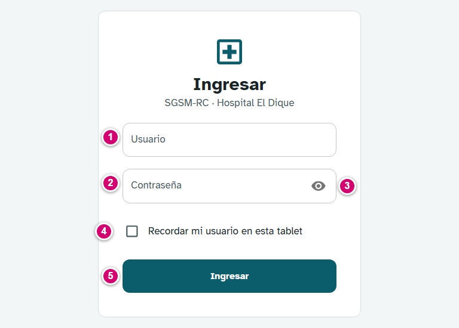

1. **Usuario**.
2. **Contraseña**.
3. **El ojo**: muestra u oculta la contraseña mientras la escribe.
4. **Recordar mi usuario en esta tablet**: márquelo solo si la tablet la usa siempre usted. Guarda el usuario, nunca la contraseña.
5. **Ingresar**.

**Cuando sale bien**, se abre la pantalla de Inicio con su nombre: «Hola, …» y debajo «Administrador · ¿Qué necesita hacer?».

| Aviso que puede aparecer                                                                                       | Qué hacer                                                                                                                                                                                                                                          |
| -------------------------------------------------------------------------------------------------------------- | -------------------------------------------------------------------------------------------------------------------------------------------------------------------------------------------------------------------------------------------------- |
| «Ingrese su usuario» / «Ingrese su contraseña»                                                                 | Falta completar ese campo.                                                                                                                                                                                                                         |
| «Usuario o contraseña incorrectos»                                                                             | Vuelva a escribirlos: el usuario en minúsculas y la contraseña con sus mayúsculas (use el ojo para verla). Al tercer intento fallido seguido la cuenta se bloquea.                                                                                 |
| «La cuenta está bloqueada por intentos fallidos hasta las …»                                                   | Espere hasta esa hora (en general, 15 minutos). Nadie la puede desbloquear antes, tampoco otro administrador.                                                                                                                                      |
| «Se cerró la sesión por inactividad. Los avisos de recordatorios quedan apagados hasta que vuelva a ingresar.» | La sesión se cerró sola por falta de uso. Ingrese de nuevo. «Los avisos de recordatorios» son el sonido y el texto de las tomas nuevas, que son para enfermería. Sus [notificaciones](#notificaciones) no se pierden: las ve al volver a ingresar. |

**Cierre por inactividad.** Si no toca la pantalla durante un rato (en general, 15 minutos), un minuto antes aparece **¿Sigue ahí?**: «Por seguridad, la sesión se cierra en … segundos si no hay actividad. Lo que no se guardó se pierde.» Toque **Seguir trabajando** para continuar.

**Para salir**, toque **Salir**, arriba a la derecha. Hágalo siempre que deje la tablet.

## La pantalla de Inicio

Desde acá se llega a cada tarea con un toque. Las tareas del administrador van primero.

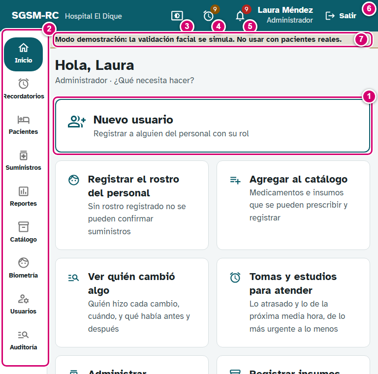

1. **Nuevo usuario**: la tarea destacada. Debajo están **Registrar el rostro del personal**, **Agregar al catálogo** y **Ver quién cambió algo** (la auditoría).
2. **Menú lateral**: Inicio, Recordatorios, Pacientes, Suministros, Reportes, **Catálogo**, **Biometría** (el rostro del personal), **Usuarios** y **Auditoría**. La opción en la que está se ve resaltada.
3. **Tema de la pantalla**: claro, oscuro o igual que el dispositivo. El ícono cambia según lo elegido: un rectángulo con medio círculo relleno (igual que el dispositivo), un sol (claro) o una luna (oscuro).
4. **Reloj de recordatorios**: cuántas tomas y estudios hay para atender en todo el hospital; si alguno es urgente, el número va sobre fondo de color. **Es para enfermería: usted no tiene que atenderlo.** Sus avisos están en la campana (5). Que los dos números coincidan en la imagen es casualidad: cuentan cosas distintas.
5. **Notificaciones** (la campana): el número rojo dice cuántos avisos para los administradores tiene sin leer. Ver [Notificaciones](#notificaciones).
6. **Salir**.
7. **Franja de modo demostración**: solo en el equipo de prueba (ver [Sobre las capturas](#antes-de-empezar)).

**Las opciones clínicas del menú.** Usted puede entrar a mirar, pero no registre nada: lo que se registra queda a nombre de quien lo registra, y esas tareas son de enfermería y de los médicos.

- **Recordatorios**: la lista de tomas y estudios para atender en todo el hospital (lo mismo que el reloj). Sirve para saber si una toma vencida ya se atendió.
- **Pacientes**: buscar un paciente (por apellido, DNI o cama) y ver su ficha.
- **Suministros**: lo que registró enfermería, por paciente, fecha o responsable.

Más abajo en el Inicio siguen las tareas clínicas: **Tomas y estudios para atender**, **Administrar medicamento**, **Registrar insumos**, **Buscar paciente**, **Internar paciente**, **Ver lo que se registró** y **Ver reportes**. El rol Administrador las tiene habilitadas, pero se explican en la [Guía del médico](medico.md) y en el manual de enfermería. No registre tareas de enfermería con su usuario.

**Si su tablet suena** o muestra «1 recordatorio nuevo», es el aviso de recordatorios de enfermería: el rol Administrador también lo recibe. No tiene que hacer nada. Si trabaja en una oficina y le molesta, puede apagar **Sonido de avisos** en **Recordatorios**: se apaga solo en ese equipo. Nunca lo apague en una tablet que use enfermería.

## Registrar a una persona nueva (Nuevo usuario)

Para que alguien del personal pueda ingresar al sistema con su rol.

1. **Primero, búsquela.** Toque **Usuarios** en el menú, elija **Estado: Todos** y escriba su apellido o su DNI. Si aparece **Dado de baja**, no la registre de nuevo: [reactívela](#dar-de-baja-y-reactivar-a-una-persona). Si aparece **Activo**, ya tiene usuario. Si no aparece, siga.
2. Toque **Nuevo usuario**.
3. Complete los **Datos personales**.
4. Complete el **Acceso al sistema**: usuario, rol y contraseña.
5. Toque **Guardar**.

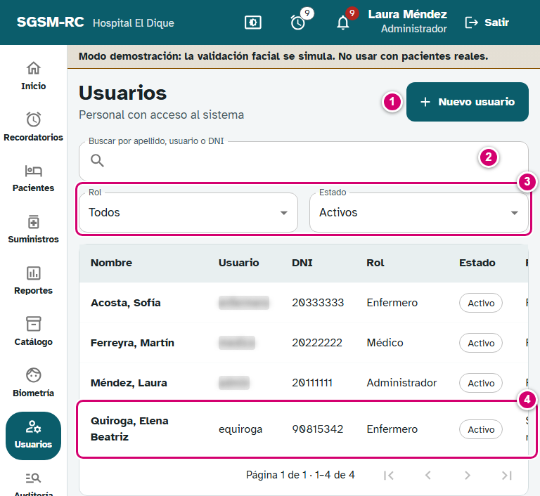

1. **Nuevo usuario**: abre el formulario.
2. **Buscar por apellido, usuario o DNI**: la lista se filtra mientras escribe.
3. **Rol** (Todos, Administrador, Médico o Enfermero) y **Estado**: **Activos** (por defecto), **Dados de baja** o **Todos**.
4. **Fila de una persona**: tóquela para abrir su ficha. La columna **Estado** dice **Activo**, **Bloqueado** (por intentos fallidos, por un rato) o **Dado de baja**.

En la tablet, la tabla se desplaza de costado: deslícela para ver la última columna, **Rostro** (Registrado o Sin registrar).

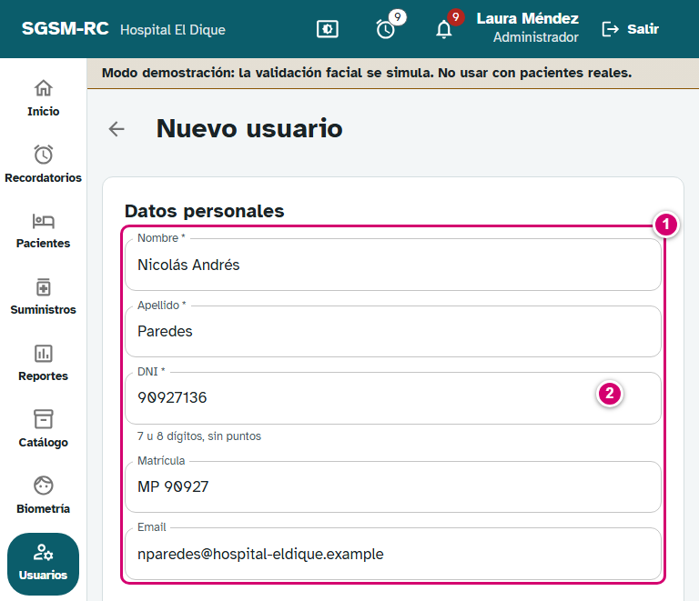

1. **Datos personales**: **Nombre**, **Apellido** y **DNI** son obligatorios (llevan asterisco \*). **Matrícula** y **Email** son opcionales y quedan solo como dato en la ficha: el sistema no manda correos. En **Matrícula** va la matrícula profesional de médicos y enfermería, como figura en su credencial (por ejemplo, «MP 90927»); a los demás, déjela vacía.
2. **DNI**: 7 u 8 dígitos, sin puntos. Un DNI tiene un solo usuario.

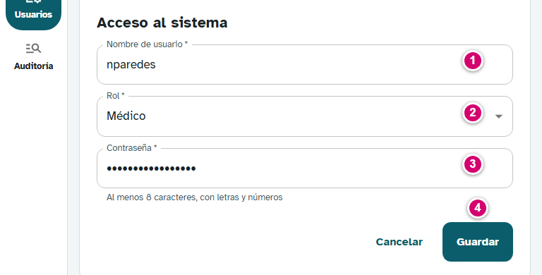

1. **Nombre de usuario**: con el que la persona va a ingresar. De 3 a 30 letras, números, puntos o guiones, sin espacios, sin tildes y sin ñ (escriba n: para Muñoz, «munoz»). Se guarda en minúsculas. Use siempre la misma forma en el hospital (por ejemplo, inicial del nombre y apellido).
2. **Rol**: **Administrador**, **Médico** o **Enfermero**. Define qué puede hacer (ver [Permisos adicionales](#permisos-adicionales)). La jefa de enfermería lleva el rol **Enfermero**, con los permisos adicionales que necesite. **El rol Administrador, solo a quien administre el sistema** y con autorización de la dirección: puede hacer todo, también crear usuarios y tareas clínicas. Para alguien que no es médico ni de enfermería (kinesiología, farmacia, administración), ningún rol sirve «solo para mirar»: Médico permite indicar medicamentos y Enfermero, registrarlos. No le dé un rol por las dudas: consulte a la dirección si lleva usuario.
3. **Contraseña**: al menos 8 caracteres, con letras y números. **Que la escriba la persona**, con usted al lado: así solo ella la conoce. El campo muestra puntitos y no tiene ojo para verla: que la escriba despacio. Si la persona no está, escriba una provisoria y, el primer día que venga, que la cambie ella en su ficha (**Contraseña nueva**) con usted al lado.
4. **Guardar**. **Cancelar**, a su izquierda, sale sin guardar.

**Cuando sale bien**, vuelve a la lista con el aviso «Usuario … creado» (con el nombre de usuario en minúsculas, como lo tiene que escribir). Después:

- **Que pruebe ingresar antes de irse**: en otra tablet, o salga usted y que ingrese ella. Así sabe que la contraseña anda; si no, se la cambia en el momento, antes de que se le bloquee la cuenta.
- **Si le entregó una contraseña provisoria, hágalo en persona**, nunca por un grupo de mensajes. El sistema no le pide cambiarla al entrar, y la persona no la puede cambiar sola: se cambia desde su ficha, con usted.
- **Si es de enfermería, registre su rostro** ([Registrar el rostro del personal](#registrar-el-rostro-del-personal)). Sin rostro no puede administrar medicamentos, registrar insumos ni confirmar estudios. Los médicos no lo necesitan.

| Aviso que puede aparecer                                                                           | Qué hacer                                                                                                                              |
| -------------------------------------------------------------------------------------------------- | -------------------------------------------------------------------------------------------------------------------------------------- |
| «Ingrese el nombre», «Ingrese el DNI», «Elija el rol», «Ingrese una contraseña»…                   | Falta un dato obligatorio. La pantalla lleva al primer campo con error.                                                                |
| «El DNI debe tener 7 u 8 dígitos, sin puntos»                                                      | Escriba solo los números.                                                                                                              |
| «Ya existe un usuario con ese DNI»                                                                 | La persona ya tiene usuario. Búsquela con **Estado: Todos**; si está dada de baja, reactívela.                                         |
| «Ese nombre de usuario ya está en uso»                                                             | Elija otro (por ejemplo, agregue la segunda inicial).                                                                                  |
| «El usuario debe tener entre 3 y 30 letras, números, puntos o guiones, sin espacios»               | Saque los espacios, las tildes, la ñ (cámbiela por n) y otros signos.                                                                  |
| «La contraseña debe tener al menos 8 caracteres» / «… al menos una letra» / «… al menos un número» | Arme una contraseña que cumpla las tres cosas.                                                                                         |
| «¿Descartar lo cargado?»                                                                           | Tocó la flecha **←**, el menú o **Cancelar** con datos sin guardar. **Seguir editando** vuelve al formulario; **Descartar** lo pierde. |

## Corregir los datos de una persona

Para corregir un nombre, un DNI o un correo, cambiarle el rol, el nombre de usuario o darle una contraseña nueva.

1. Toque **Usuarios** en el menú.
2. Busque a la persona y toque su fila.
3. Corrija lo que haga falta.
4. Toque **Guardar**, al pie.

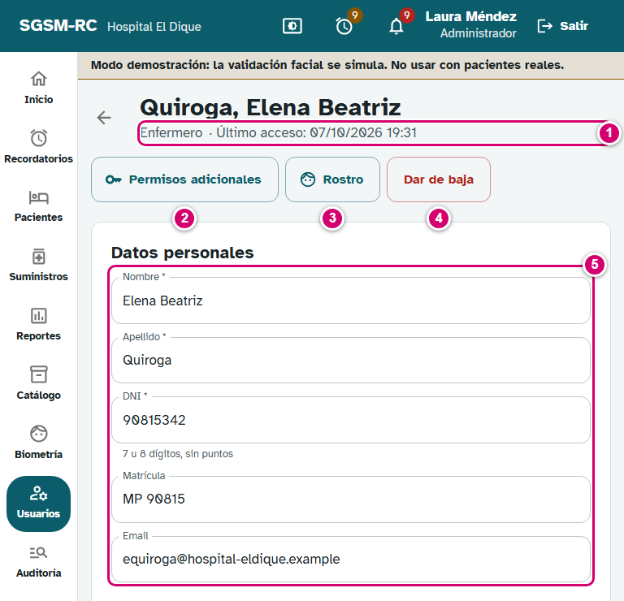

1. **Rol y Último acceso**: el rol de la persona y la última vez que ingresó al sistema.
2. **Permisos adicionales**: ver [Permisos adicionales](#permisos-adicionales).
3. **Rostro**: abre su registro facial (lo mismo que **Biometría**).
4. **Dar de baja**: ver [Dar de baja y reactivar](#dar-de-baja-y-reactivar-a-una-persona). No aparece en su propia ficha: un administrador no se puede dar de baja a sí mismo.
5. **Datos personales**: se corrigen en el mismo lugar. Más abajo están **Acceso al sistema** y el botón **Guardar**.

**Cuando sale bien**, aparece el aviso «Los cambios se guardaron».

### Cambiar la contraseña o el rol

En **Acceso al sistema**, más abajo en la misma ficha:

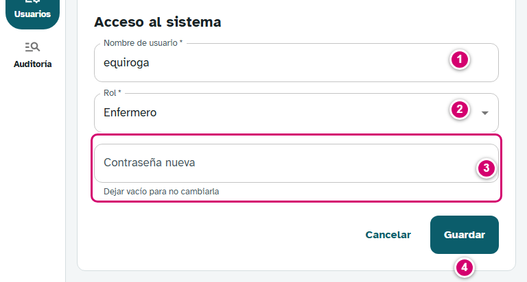

1. **Nombre de usuario**: también se puede corregir. Si lo cambia, avísele a la persona: desde ese momento ingresa con el nuevo.
2. **Rol**: elija el nuevo. El cambio rige enseguida; para ver su menú nuevo, la persona tiene que salir y volver a ingresar. Los permisos adicionales que tenía **no se quitan solos** al cambiar el rol: revíselos en **Permisos adicionales**. El rostro registrado también queda.
3. **Contraseña nueva**: escriba la nueva solo si la quiere cambiar (por ejemplo, si la persona se la olvidó). Vacía, no cambia nada: la ayuda dice «Dejar vacío para no cambiarla». Las reglas son las mismas: al menos 8 caracteres, con letras y números. Igual que en el alta, mejor que la escriba la persona, con usted al lado.
4. **Guardar**: guarda todo lo de la ficha. **Cancelar** vuelve a la lista sin guardar.

En la auditoría queda «Se cambió la contraseña», nunca la contraseña. Para cambiar **su propia** contraseña, haga lo mismo en su propia ficha.

## Dar de baja y reactivar a una persona

Para que alguien que ya no trabaja en el hospital (o que está de licencia larga) no pueda ingresar. Sus registros se conservan y se puede reactivar.

1. Abra la ficha de la persona (**Usuarios** › su fila).
2. Toque **Dar de baja**.
3. Lea el mensaje y toque **Dar de baja** otra vez para confirmar.

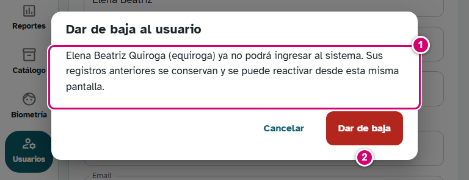

1. **Qué pasa**: «… ya no podrá ingresar al sistema. Sus registros anteriores se conservan y se puede reactivar desde esta misma pantalla.»
2. **Dar de baja**: confirma. **Cancelar** cierra sin cambiar nada.

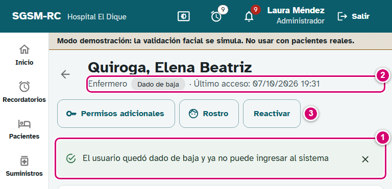

1. **Aviso**: «El usuario quedó dado de baja y ya no puede ingresar al sistema».
2. **Dado de baja**: la etiqueta junto al rol.
3. **Reactivar**: aparece en lugar de **Dar de baja**.

La baja rige enseguida: si la persona tenía la sesión abierta, lo próximo que intente hacer ya no funciona. Si intenta ingresar, la pantalla le dice «Usuario o contraseña incorrectos» (no dice que está dada de baja).

**Para reactivarla**: en **Usuarios**, elija **Estado: Dados de baja** (o **Todos**), abra su ficha y toque **Reactivar**. No pide confirmación.

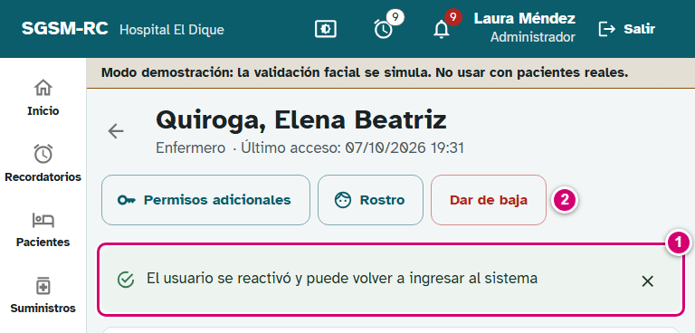

1. **Aviso**: «El usuario se reactivó y puede volver a ingresar al sistema».
2. **Dar de baja** vuelve a aparecer.

Al reactivarla, conserva su rol, sus permisos adicionales y su rostro. Dar de baja **no borra el rostro**. **Si la persona deja el hospital para siempre, elimine también su rostro** con el botón **Rostro** de su ficha ([Actualizar o eliminar un rostro](#actualizar-o-eliminar-un-rostro)): es un dato personal sensible que ya no hace falta guardar. Lo que registró no cambia. Si es una licencia y va a volver, no lo elimine.

## Permisos adicionales

Cada rol trae sus permisos. Si una persona necesita algo más (por ejemplo, una jefa de enfermería que tiene que ver los reportes o consultar la auditoría), se le suma un permiso extra sin cambiarle el rol.

| Rol               | Qué puede hacer, en resumen                                                                                                                                             |
| ----------------- | ----------------------------------------------------------------------------------------------------------------------------------------------------------------------- |
| **Administrador** | Todo: usuarios, permisos, rostros, catálogo, auditoría y también todas las tareas clínicas. Dar este rol es darle acceso a todo: solo con autorización de la dirección. |
| **Médico**        | Internar, trasladar y dar de alta pacientes; indicar prescripciones; programar estudios; ver reportes (sin descargarlos).                                               |
| **Enfermero**     | Administrar medicamentos, registrar insumos y corregirlos; atender recordatorios; confirmar estudios con su rostro. No ve reportes.                                     |

1. Abra la ficha de la persona y toque **Permisos adicionales**.
2. Marque los permisos extra que necesita.
3. Baje hasta el final y toque **Guardar permisos**.

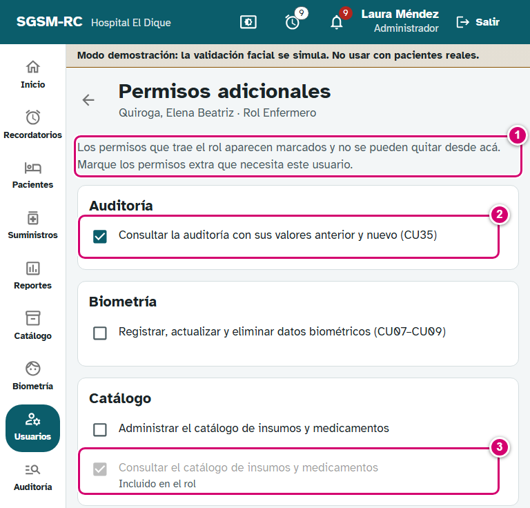

1. **Explicación**: «Los permisos que trae el rol aparecen marcados y no se pueden quitar desde acá. Marque los permisos extra que necesita este usuario.»
2. **Un permiso extra marcado**: en la imagen, consultar la auditoría.
3. **Un permiso del rol**: marcado, en gris y con la leyenda **Incluido en el rol**. No se puede desmarcar.

Los códigos entre paréntesis (CU35, T513…) son referencias internas del proyecto: no hace falta tenerlos en cuenta.

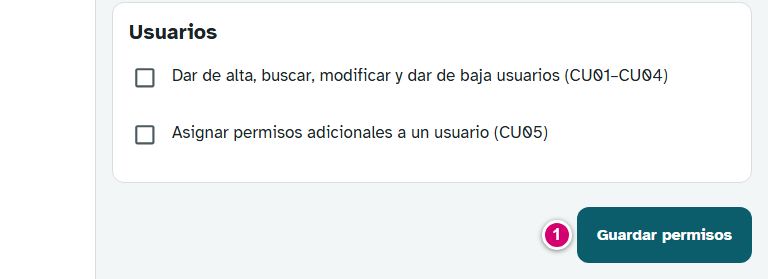

1. **Guardar permisos**.

**Cuando sale bien**: «Los permisos se guardaron. Rigen desde el próximo pedido del usuario.» Es decir, desde lo próximo que la persona haga en el sistema. Para ver las opciones nuevas en su menú, tiene que salir y volver a ingresar. Para **quitar** un permiso extra, desmárquelo y toque **Guardar permisos**. Dé solo los permisos que la persona necesita para su trabajo.

### Qué permite cada permiso

Los nombres de la pantalla, sin los códigos, y lo que permiten en palabras simples. **Los marcados como delicados, solo con autorización de la dirección.**

| En la pantalla dice                                                                     | Qué permite                                                                                                                                                                                           | Ya lo trae el rol  |
| --------------------------------------------------------------------------------------- | ----------------------------------------------------------------------------------------------------------------------------------------------------------------------------------------------------- | ------------------ |
| **Usuarios**: «Dar de alta, buscar, modificar y dar de baja usuarios»                   | **Delicado.** Crear usuarios (acá «dar de alta» quiere decir **Nuevo usuario**), cambiarles el rol y la contraseña, y darlos de baja. Quien lo tiene puede darse a sí mismo el rol Administrador.     | Administrador      |
| **Usuarios**: «Asignar permisos adicionales a un usuario»                               | **Delicado.** Sumar o quitar permisos a cualquiera, también a sí mismo.                                                                                                                               | Administrador      |
| **Biometría**: «Registrar, actualizar y eliminar datos biométricos»                     | **Delicado.** Registrar o borrar el rostro de cualquier persona: podría registrar en una cuenta un rostro que no es el de su dueña.                                                                   | Administrador      |
| **Pacientes**: «Buscar pacientes y consultar su historial»                              | Buscar pacientes y ver su ficha.                                                                                                                                                                      | Médico y Enfermero |
| **Pacientes**: «Registrar, modificar, trasladar y dar de baja pacientes»                | Internar, corregir datos, cambiar de cama y **dar de alta** pacientes (acá «dar de baja pacientes» quiere decir dar de alta). Es tarea del médico.                                                    | Médico             |
| **Catálogo**: «Consultar el catálogo de insumos y medicamentos»                         | Ver el catálogo.                                                                                                                                                                                      | Médico y Enfermero |
| **Catálogo**: «Administrar el catálogo de insumos y medicamentos»                       | Agregar, corregir, dar de baja y reactivar medicamentos e insumos.                                                                                                                                    | Administrador      |
| **Prescripciones**: «Consultar las prescripciones de un paciente»                       | Ver las indicaciones de un paciente.                                                                                                                                                                  | Médico y Enfermero |
| **Prescripciones**: «Cargar, modificar, suspender y finalizar prescripciones»           | **Delicado.** Indicar medicamentos: solo para médicos.                                                                                                                                                | Médico             |
| **Suministros**: «Registrar la administración de medicamentos e insumos»                | Administrar medicamentos y registrar insumos (con su rostro registrado).                                                                                                                              | Enfermero          |
| **Suministros**: «Consultar el historial de suministros»                                | Ver lo que se registró.                                                                                                                                                                               | Médico y Enfermero |
| **Suministros**: «Corregir un suministro dentro de las 24 horas»                        | Corregir lo que se registró, con su rostro.                                                                                                                                                           | Enfermero          |
| **Recordatorios**: «Ver los recordatorios de tomas y estudios y recibir sus avisos»     | Ver la lista de recordatorios y el reloj de la barra.                                                                                                                                                 | Médico y Enfermero |
| **Recordatorios**: «Atender un recordatorio: administrar o registrar por qué no se dio» | Atender una toma desde su recordatorio o registrar **No se administró**. Con este permiso la tablet también suena con los recordatorios nuevos.                                                       | Enfermero          |
| **Estudios**: «Consultar los estudios programados de un paciente»                       | Ver los estudios.                                                                                                                                                                                     | Médico y Enfermero |
| **Estudios**: «Programar, reprogramar y cancelar estudios»                              | Programar estudios: tarea del médico.                                                                                                                                                                 | Médico             |
| **Estudios**: «Confirmar con el rostro que un estudio se realizó»                       | Confirmar un estudio, con su rostro.                                                                                                                                                                  | Enfermero          |
| **Reportes**: «Ver el reporte de suministros y las estadísticas»                        | Ver **Reportes** en pantalla. Es el que se suma, por ejemplo, a una jefa de enfermería.                                                                                                               | Médico             |
| **Reportes**: «Descargar el reporte y las estadísticas en PDF o Excel»                  | Los botones **Descargar PDF** y **Descargar Excel**. Los archivos tienen datos de pacientes. Es el que se suma a un médico que pide reportes seguido (ver [Descargar](#descargar-el-pdf-o-el-excel)). | Administrador      |
| **Auditoría**: «Consultar la auditoría con sus valores anterior y nuevo»                | Ver la auditoría: quién hizo cada cosa, con datos de pacientes y del personal.                                                                                                                        | Administrador      |

El rol Administrador trae todos.

## Registrar el rostro del personal

Para que una persona pueda **Confirmar con mi rostro** lo que registra (administrar un medicamento, registrar insumos, confirmar un estudio). Sin rostro registrado, el sistema no la deja confirmar.

**Hágalo siempre con la persona presente**, frente a la tablet, y verifique quién es (por ejemplo, con su DNI). Lo que después registre con su rostro queda a su nombre.

1. Toque **Biometría** en el menú (o **Registrar el rostro del personal** en el Inicio, o **Rostro** en la ficha de la persona).
2. Toque la fila de la persona.
3. Toque **Registrar rostro**.
4. **La primera vez en esa tablet**, la tablet pregunta si esta página puede usar la cámara: toque **Permitir**. Si toca **No permitir** (o **Bloquear**), la cámara no se enciende y hay que llamar al área de sistemas para que lo habilite.
5. Pídale a la persona que mire la cámara. La captura se hace sola.
6. Revise la foto y toque **Guardar**.

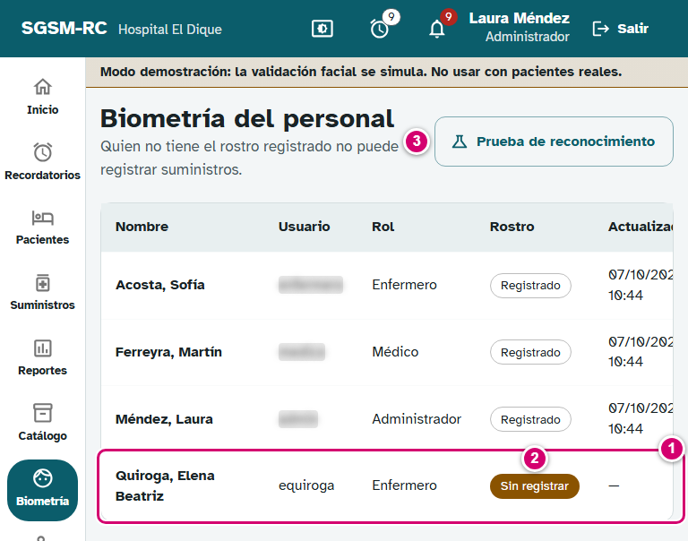

1. **Fila de la persona**: tóquela para registrar, actualizar o eliminar su rostro. La lista muestra solo al personal activo.
2. **Rostro**: **Sin registrar** o **Registrado**. La columna **Actualizado** (la fecha del último registro) queda a la derecha: deslice la tabla para verla.
3. **Prueba de reconocimiento**: ver [más abajo](#prueba-de-reconocimiento).

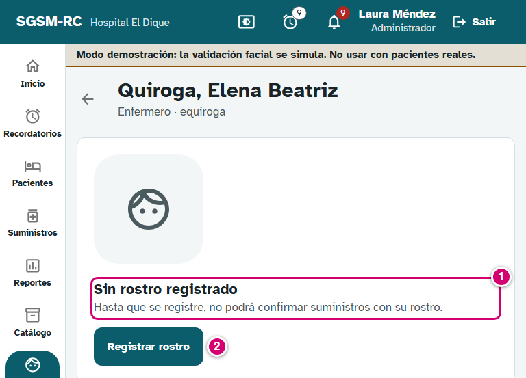

1. **Sin rostro registrado**: «Hasta que se registre, no podrá confirmar suministros con su rostro.»
2. **Registrar rostro**: abre la cámara.

**En la tablet del hospital** (no hay imagen: el equipo de las capturas no tiene cámara), se abre el diálogo **Registrar rostro de …** con un recuadro oscuro en el centro, donde aparece la imagen de la cámara frontal como en un espejo. Debajo del recuadro, en negrita, se lee qué hacer: primero «Encendiendo la cámara…», después «Mire a la cámara, con buena luz y el rostro descubierto.» Cuando ve un solo rostro quieto, el borde del recuadro se pone verde, dice «Rostro capturado.» y pasa a la revisión. Usted quédese fuera del cuadro: si aparece «Hay más de un rostro: quede solo usted frente a la tablet.», salga de la imagen. Abajo a la izquierda está **Cancelar**.

**En el equipo de prueba** no hay cámara y el diálogo se ve así:

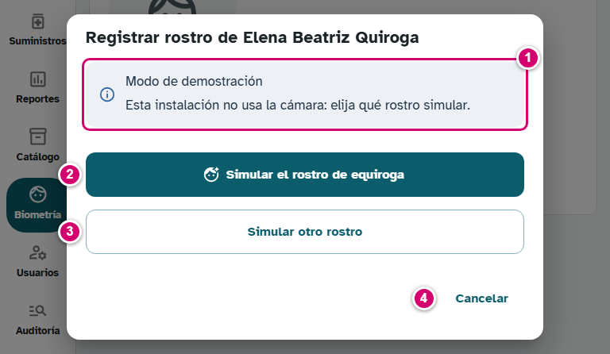

1. **Modo de demostración**: «Esta instalación no usa la cámara: elija qué rostro simular.» En el hospital este aviso no aparece: en su lugar se ve la cámara.
2. **Simular el rostro de …**: hace de cuenta que la persona se puso frente a la cámara. **Para registrar, use siempre este.**
3. **Simular otro rostro**: hace de cuenta que es otra persona. Sirve solo para practicar qué pasa cuando el rostro no coincide (al confirmar una tarea). Si lo usa al registrar, le queda registrado a la persona un rostro que no es el suyo y después el sistema no la reconoce.
4. **Cancelar**: cierra sin registrar nada.

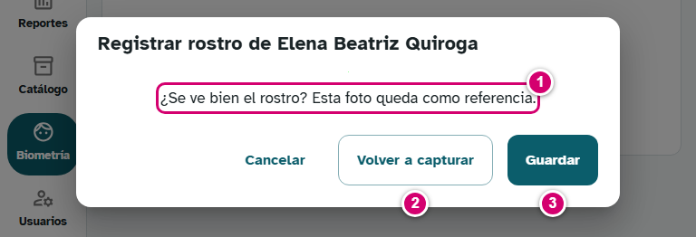

1. **«¿Se ve bien el rostro? Esta foto queda como referencia.»** En el hospital, encima de la pregunta se ve la foto que tomó la cámara. En el equipo de prueba no hay foto.
2. **Volver a capturar**: si la foto salió movida, oscura o con la cara tapada.
3. **Guardar**: registra el rostro. **Cancelar**, a la izquierda, cierra sin guardar: el rostro no queda registrado.

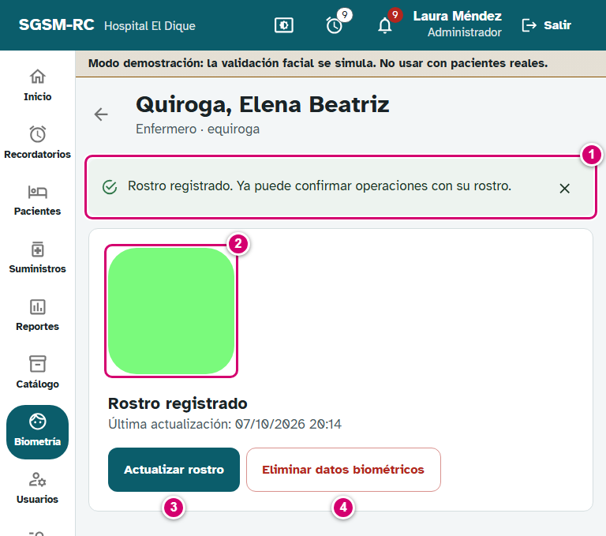

1. **Aviso**: «Rostro registrado. Ya puede confirmar operaciones con su rostro.»
2. **Foto de referencia** y **Última actualización** (fecha y hora). En el hospital se ve la foto de la persona; en el equipo de prueba, un cuadro de color. La foto sirve para que usted compruebe de quién es el rostro registrado: el sistema no la usa para reconocer.
3. **Actualizar rostro**: para registrarlo de nuevo.
4. **Eliminar datos biométricos**: ver [abajo](#actualizar-o-eliminar-un-rostro).

**Para comprobar que la reconoce**: pídale que, en su próxima tarea, use **Confirmar con mi rostro** y que le avise si falla. La [prueba de reconocimiento](#prueba-de-reconocimiento) no sirve para esto: no compara a nadie.

| Aviso que puede aparecer                                                                  | Qué hacer                                                                                                                                                                                                                                                    |
| ----------------------------------------------------------------------------------------- | ------------------------------------------------------------------------------------------------------------------------------------------------------------------------------------------------------------------------------------------------------------ |
| «No se pudo encender la cámara. Revise que la tablet le haya dado permiso a esta página…» | Toque **Reintentar**. Si sigue, cierre otras aplicaciones que usen la cámara o pruebe en otra tablet. Si alguna vez se tocó **No permitir** o **Bloquear** cuando la tablet preguntó por la cámara, **Reintentar** no lo arregla: llame al área de sistemas. |
| La captura no termina nunca                                                               | Busque más luz de frente, sin contraluz de una ventana. Que la persona se saque el barbijo o la gorra.                                                                                                                                                       |

### Actualizar o eliminar un rostro

**Actualizar rostro** se usa cuando la persona cambió mucho (barba, anteojos nuevos) o cuando el sistema no la reconoce seguido. Los pasos son los mismos del registro, con la persona presente, y reemplaza al anterior. **Si un rostro falla, use esto, no Eliminar.**

**Eliminar datos biométricos** borra el rostro de la persona. **No se puede deshacer**: hasta que la registre de nuevo, con ella presente, esa persona no puede confirmar con su rostro (no puede administrar medicamentos, registrar insumos ni confirmar estudios en su turno). Úselo solo cuando la persona deja el hospital para siempre.

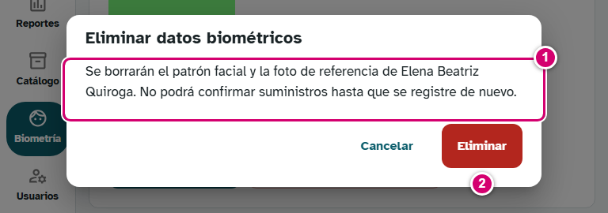

1. **Qué se borra**: «Se borrarán el patrón facial y la foto de referencia de …. No podrá confirmar suministros hasta que se registre de nuevo.»
2. **Eliminar**: confirma. **Cancelar** no borra nada.

**Cuando sale bien**: «Los datos biométricos se eliminaron.» Lo que la persona ya registró no cambia.

### Prueba de reconocimiento

Sirve para revisar cómo funciona la cámara en una tablet o en un lugar (por ejemplo, una sala con poca luz) antes de usarlos. No registra ni compara a nadie.

1. En **Biometría**, toque **Prueba de reconocimiento**.
2. Toque **Iniciar prueba**, arriba a la derecha, y póngase frente a la cámara un rato. El mismo botón pasa a decir **Detener**: tóquelo para terminar.

**Cómo se ve en la tablet del hospital** (no hay imagen: el equipo de las capturas no tiene cámara): debajo del título está la imagen de la cámara y, más abajo, siete recuadros con un número cada uno, de a dos por renglón: Detecciones, Tiempo promedio de detección, Última detección, **Con un solo rostro**, **Rostros en cuadro**, **Luz** y Variación del patrón.

Mire solo los tres en negrita: **Luz** tiene que decir **Buena** (no «Poca luz» ni «Demasiada luz»); **Rostros en cuadro**, 1; **Con un solo rostro**, cerca de 100 %. Si no, mejore la luz o la ubicación de la tablet, o avise al área de sistemas. Los otros números son para el área de sistemas. Si aparece «No se pudo usar la cámara. Revise los permisos del navegador.», es el mismo caso del permiso de la cámara: llame al área de sistemas.

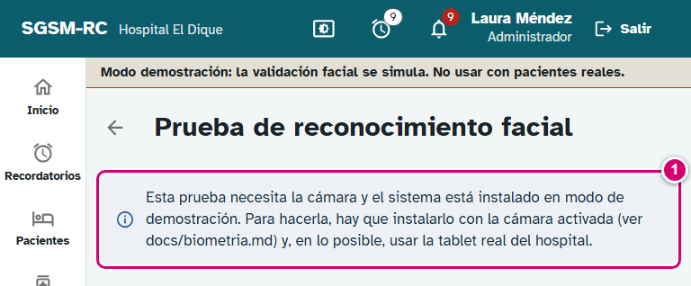

1. **En el equipo de prueba** solo aparece este aviso: la prueba necesita la cámara. La referencia técnica que menciona es para el área de sistemas.

## Catálogo de medicamentos e insumos

Es la lista de lo que los médicos pueden prescribir y enfermería puede registrar. **Medicamento** es lo que se prescribe y se administra; **Insumo** es el material no medicinal (pañales, gasas, guantes…).

1. Toque **Catálogo** en el menú (o **Agregar al catálogo** en el Inicio).
2. Escriba parte del nombre en **Buscar por nombre**.

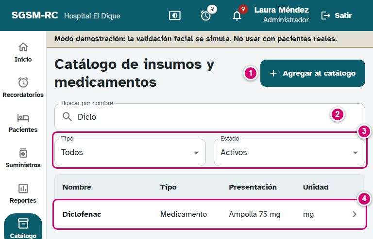

1. **Agregar al catálogo**.
2. **Buscar por nombre**: en la imagen, «Diclo».
3. **Tipo** (**Todos**, **Medicamentos** o **Insumos**) y **Estado** (**Activos** o **Dados de baja**).
4. **Fila de un medicamento**: nombre, tipo, presentación y unidad. Tóquela para corregirlo o darlo de baja.

**Antes de agregar algo, búsquelo**, también con **Estado: Dados de baja**: si estaba y se dio de baja, conviene reactivarlo en lugar de cargarlo de nuevo.

### Agregar al catálogo

1. Toque **Agregar al catálogo**.
2. Complete los datos.
3. Toque **Guardar**.

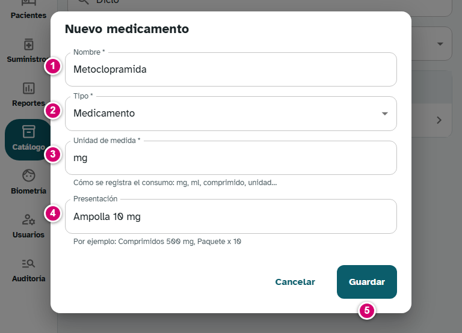

1. **Nombre**: el nombre genérico, como lo conoce el personal (en la imagen, «Metoclopramida»).
2. **Tipo**: **Medicamento** o **Insumo no medicinal**. El título del diálogo cambia: «Nuevo medicamento» o «Nuevo insumo».
3. **Unidad de medida**: en qué unidad se cuenta lo que se da o se usa. Ver la regla abajo.
4. **Presentación** (opcional): como figura en la caja, con el número y la unidad juntos; por ejemplo, «Ampolla 10 mg» o «Paquete x 10».
5. **Guardar**. **Cancelar** cierra sin guardar.

**Cómo elegir la Unidad de medida.** Para un medicamento, la unidad en que los médicos indican la dosis de ese medicamento; para un insumo, cómo se cuenta al usarlo. Al prescribir, el sistema le propone al médico esta unidad, y en los insumos enfermería registra la cantidad en esta unidad. Ejemplos:

| Producto                                          | Unidad de medida | Por qué                                |
| ------------------------------------------------- | ---------------- | -------------------------------------- |
| Paracetamol, comprimidos de 500 mg                | **mg**           | El médico indica «500 mg».             |
| Un jarabe, o Solución fisiológica (sachet 500 ml) | **ml**           | Se indica en mililitros.               |
| Insulina                                          | **UI**           | Se indica en unidades internacionales. |
| Gasa, pañal, jeringa, sonda                       | **unidad**       | Se cuenta de a uno.                    |
| Guantes                                           | **par**          | Se cuentan de a pares.                 |

Si en el hospital un medicamento se indica por comprimido («1 comprimido»), la unidad es **comprimido**. **Si no está segura, consulte a farmacia antes de guardar**: la unidad no se cambia después (ver [Corregir](#corregir-un-medicamento-o-insumo)).

**Cuando sale bien**: «… agregado al catálogo». Ya se puede prescribir y registrar.

| Aviso que puede aparecer                            | Qué hacer                                                                                                                                                                                                   |
| --------------------------------------------------- | ----------------------------------------------------------------------------------------------------------------------------------------------------------------------------------------------------------- |
| «Ingrese el nombre» / «Ingrese la unidad de medida» | Falta ese dato.                                                                                                                                                                                             |
| «Ya existe un insumo con ese nombre y presentación» | Ya está en el catálogo (también puede estar dado de baja). Búsquelo; si es otra presentación, cámbiela. El aviso dice «insumo» aunque esté cargando un medicamento: no quiere decir que eligió mal el Tipo. |

### Corregir un medicamento o insumo

1. Toque su fila en el catálogo. Se abre el diálogo **Editar medicamento** (o **Editar insumo**).
2. Corrija lo que haga falta.
3. Toque **Guardar**.

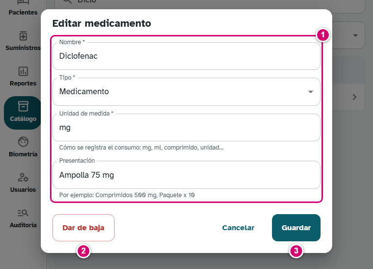

1. **Datos del medicamento**: se corrigen en el mismo lugar.
2. **Dar de baja**: ver abajo.
3. **Guardar**. **Cancelar** cierra sin guardar.

**Cuando sale bien**: «Se guardaron los cambios de …».

**Use este diálogo solo para errores de escritura** en el nombre o la presentación. El cambio se ve en todas las pantallas donde aparece, también en las prescripciones y los registros anteriores. **Nunca cambie la Unidad de medida ni el Tipo de algo que ya se usó**, aunque la pantalla lo deje: cambiaría también cómo se leen los registros anteriores. Si cambió el producto (otra presentación u otra unidad), agréguelo como nuevo y dé de baja el anterior.

### Dar de baja o reactivar un medicamento o insumo

**Antes de dar de baja un medicamento, consulte a farmacia o a los médicos** si hay pacientes que lo tienen indicado.

1. Toque su fila en el catálogo.
2. Toque **Dar de baja**.
3. Lea el mensaje y confirme con **Dar de baja**.

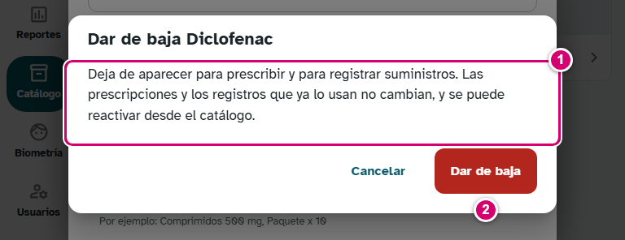

1. **Qué pasa**: «Deja de aparecer para prescribir y para registrar suministros. Las prescripciones y los registros que ya lo usan no cambian, y se puede reactivar desde el catálogo.»
2. **Dar de baja**: confirma. **Cancelar** vuelve sin cambios.

**Qué pasa con los pacientes que hoy lo tienen indicado**: nada. Sus prescripciones vigentes siguen igual: siguen llegando sus recordatorios y enfermería lo sigue administrando y registrando, hasta que el médico finalice esas prescripciones. Lo que ya no se puede es indicarlo en una prescripción nueva. Un **insumo** dado de baja, en cambio, ya no se puede registrar.

**Cuando sale bien**: «… fue dado de baja del catálogo».

**Para reactivarlo**: elija **Estado: Dados de baja**, toque su fila y toque **Reactivar** (en el lugar de **Dar de baja**). Aparece «… volvió a estar activo».

## Notificaciones

Los avisos que el sistema les manda a los administradores: tomas o estudios que vencieron sin atenderse, cuentas bloqueadas y operaciones canceladas porque el rostro no coincidió.

### Qué se espera del administrador

- **Las notificaciones solo se ven en la campana.** La campana no suena y el sistema no manda mensajes ni correos.
- **No se pierden.** Si su sesión está cerrada (o la tablet apagada), los avisos se guardan y aparecen la próxima vez que ingrese. No hace falta tener el sistema abierto todo el día; sí, mirarlo seguido.
- **Cada cuánto mirarla:** al empezar su turno y después cada hora mientras trabaja, salvo que el hospital indique otra cosa.
- **Cada administrador recibe su copia.** Si son dos, las dos ven el mismo aviso, y marcarlo leída no se lo cambia a la otra. Acuerden quién llama a la sala (por ejemplo, la que está de turno), para que no llamen las dos ni ninguna.
- **De noche y el fin de semana** nadie ve estos avisos, salvo que un administrador esté trabajando. Quién los mira lo decide el hospital: anótelo en [A quién llamar](#a-quién-llamar). Los que llegaron mientras no estaba, revíselos igual al ingresar.
- **Las tomas vencidas no dependen solo de usted.** Enfermería también las ve: siguen en su lista de **Recordatorios**, y la tablet de la sala (con el sonido encendido) vuelve a sonar cada 5 minutos mientras haya algo urgente sin atender. Su aviso es un segundo control.

### Leer y marcar las notificaciones

1. Toque la **campana**, arriba. El número rojo dice cuántas hay sin leer.
2. Lea cada aviso y haga lo que corresponde ([Qué hacer con cada aviso](#qué-hacer-con-cada-aviso)).
3. Toque **Marcar leída** en cada aviso cuando ya hizo lo que corresponde: por ejemplo, después de hablar con enfermería de la sala. Se marcan de a uno: no hay un botón para marcarlas todas.

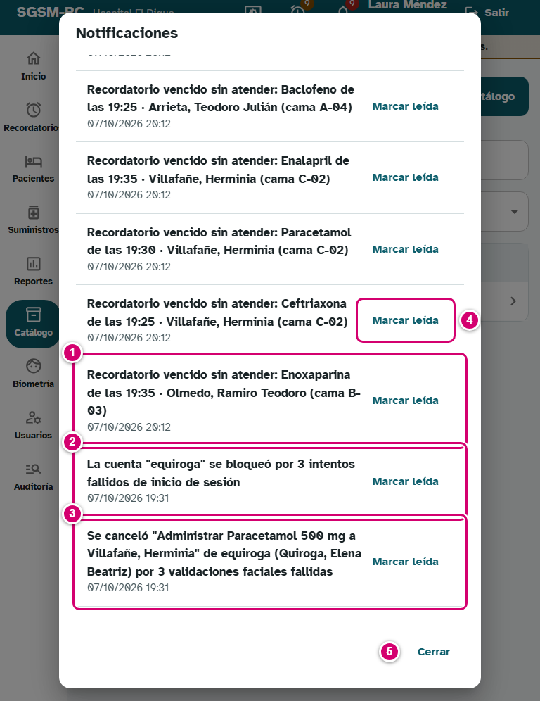

1. **Toma vencida**: «Recordatorio vencido sin atender: Enoxaparina de las 19:35 · Olmedo, Ramiro Teodoro (cama B-03)», con la fecha y hora del aviso.
2. **Cuenta bloqueada**: «La cuenta "…" se bloqueó por 3 intentos fallidos de inicio de sesión».
3. **Validación facial fallida**: «Se canceló "Administrar Paracetamol 500 mg a Villafañe, Herminia" de … por 3 validaciones faciales fallidas».
4. **Marcar leída**: está en cada aviso sin leer. El aviso pasa a letra normal, con «· Leída». Los no leídos van primero, en negrita.
5. **Cerrar**.

Si no hay avisos, dice «No hay notificaciones.» El número de la campana se actualiza solo, como mucho cada un minuto.

### Qué hacer con cada aviso

**«Recordatorio vencido sin atender: …»**

Una toma o un estudio no se atendió a tiempo. Pasa a **Vencida** en general unos 30 minutos después de la hora de la toma. Todavía la pueden dar tarde o registrar **No se administró** con el motivo. Usted no la registra.

1. Fíjese de qué sala es la cama que dice el aviso (en la tabla de salas de [A quién llamar](#a-quién-llamar), o en **Pacientes**, buscando la cama).
2. Llame a enfermería de esa sala y dígale el paciente, el medicamento y la hora.
3. Cuando habló con ellos, toque **Marcar leída**.

Para saber si ya se resolvió, toque el reloj de recordatorios: si la toma vencida sigue en la lista, nadie la atendió todavía; si ya no está, enfermería la atendió (las vencidas se ven en esa lista durante 12 horas).

**«La cuenta "…" se bloqueó por 3 intentos fallidos de inicio de sesión»**

Alguien escribió mal la contraseña de esa cuenta tres veces seguidas. Queda bloqueada un rato (en general, 15 minutos).

1. Hable con la persona.
2. Si se olvidó la contraseña, dele una [nueva](#cambiar-la-contraseña-o-el-rol): la va a poder usar cuando termine el bloqueo.
3. Si dice que no fue ella, cámbiele la contraseña y avise al área de sistemas.

**«Se canceló "…" de … por 3 validaciones faciales fallidas»**

El sistema no reconoció tres veces seguidas el rostro de quien quería registrar algo, y canceló la operación. **No quedó registrado, aunque el medicamento se haya dado.** Mientras no esté registrado, la toma figura como pendiente y otra persona podría volver a darla (doble dosis), o podría quedar sin darse. Por eso, lo primero es el paciente:

1. **Llame enseguida a la sala** y pregúntele a la persona que figura en el aviso si llegó a dar el medicamento (el aviso dice cuál y a qué paciente).
   - **Si lo dio**: que lo registre cuanto antes, volviendo a intentar **Confirmar con mi rostro** (puede intentarlo de nuevo enseguida). El registro queda con la hora en que se registra: que anote la hora real en **Observaciones**. Si el rostro le sigue fallando, que avise a la jefa de enfermería de la sala para que nadie repita la dosis hasta que quede registrado.
   - **Si no lo dio**: que lo dé y lo registre, si corresponde.
2. **Después, el rostro.** Si fue la luz o algo que le tapaba la cara, no hace falta nada más. Si no la reconoce seguido, [actualice su rostro](#actualizar-o-eliminar-un-rostro) con ella presente. Si dice que no fue ella, avise al área de sistemas.
3. Cuando el medicamento quedó registrado (o se aclaró que no se dio), toque **Marcar leída**.

## Reportes y estadísticas

Para saber cuánto se usó en un período: por paciente, por medicamento o insumo, por personal o por día. El administrador, además de verlos, los descarga en PDF o Excel.

1. Toque **Reportes** en el menú (o **Ver reportes** en el Inicio).
2. Elija el período y, si quiere, la sala, el tipo y cómo agrupar. **El resultado cambia solo** al elegir cada filtro: no hay botón Buscar.
3. Baje para ver el resultado.

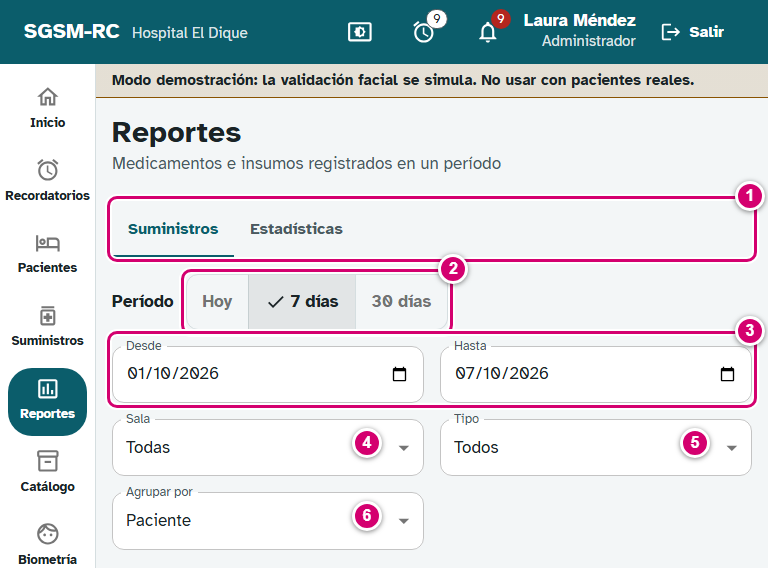

1. **Pestañas**: **Suministros** (la tabla) y **Estadísticas** (indicadores y gráficos).
2. **Período**: **Hoy**, **7 días** (por defecto) o **30 días**.
3. **Desde** y **Hasta**: otro período, de hasta 366 días.
4. **Sala**: **Todas** o una sala.
5. **Tipo**: **Todos**, **Medicamentos** o **Insumos**.
6. **Agrupar por**: **Paciente**, **Medicamento o insumo**, **Personal** (quién lo registró) o **Día**.

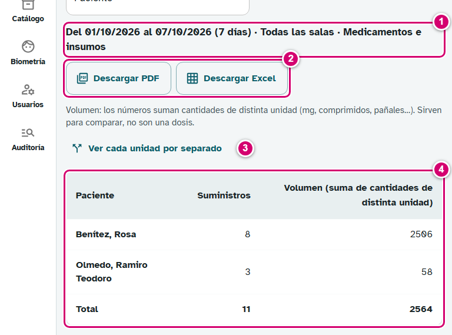

1. **Resumen**: el período, las salas y los tipos («Del 01/10/2026 al 07/10/2026 (7 días) · Todas las salas · Medicamentos e insumos»).
2. **Descargar PDF** y **Descargar Excel**: ver abajo.
3. **Ver cada unidad por separado**: cambia **Agrupar por** a **Medicamento o insumo** y muestra cada unidad en su fila (mg, comprimidos, pañales…).
4. **Tabla del reporte**: una fila por cada paciente (o lo que eligió en Agrupar por), con la cantidad de **Suministros** y la fila **Total**.

**La columna Volumen no es una dosis**: suma números de distinta unidad y solo sirve para comparar filas entre sí. Para ver cantidades reales, toque **Ver cada unidad por separado**.

**Para un solo paciente** («¿cuánto de tal medicamento recibió este paciente?»), Reportes no sirve: no tiene filtro por paciente. Use **Suministros** en el menú: elija el **Paciente** (la lista trae a los internados) y las fechas; cada fila dice qué se dio y cuánto. Para un paciente que ya se fue de alta, búsquelo en **Pacientes** con **Estado: Todos**, abra su ficha y toque la pestaña **Historial**.

### Descargar el PDF o el Excel

1. Arme el reporte en pantalla con el período, los filtros y la agrupación que necesita.
2. Toque **Descargar PDF** (para imprimir o mandar) o **Descargar Excel** (para seguir trabajando los números en una planilla).
3. Espere el aviso. El archivo queda en la carpeta **Descargas** del equipo.

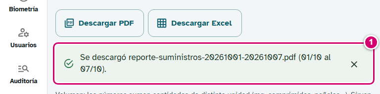

1. **Aviso**: «Se descargó reporte-suministros-20261001-20261007.pdf (01/10 al 07/10).» El nombre del archivo lleva las fechas del período.

El archivo sale con el mismo período, filtros y agrupación que la pantalla. Mientras se prepara, el botón dice «Preparando el archivo…» y aparece **Cancelar**; con muchos datos puede tardar un poco más. Cada descarga queda en la auditoría.

**Dónde queda el archivo.** En una PC, en la carpeta **Descargas**. En una tablet Android, en la aplicación **Archivos** (o **Mis archivos**), carpeta **Descargas**; en un iPad, en la aplicación **Archivos**, carpeta **Descargas**. Si lo tiene que mandar por correo, es más simple hacerlo desde una PC del hospital.

**El archivo tiene datos de pacientes.** Mándelo solo por el medio que el hospital autorice para datos de pacientes (por ejemplo, el correo institucional), nunca por un grupo de mensajes ni a un correo personal. Si el equipo es compartido, bórrelo de **Descargas** cuando ya lo mandó.

**Cuando un médico le pide un reporte**: el rol Médico ve los reportes pero no tiene los botones de descarga. Si es algo puntual, descárguelo usted: él le pasa el renglón del resumen («Del … al … · …») y cómo lo agrupó, usted arma lo mismo y se lo manda. Si lo pide seguido, se le puede sumar el permiso adicional de descargar reportes (ver [Qué permite cada permiso](#qué-permite-cada-permiso)), con autorización de la dirección.

| Aviso que puede aparecer                                                      | Qué hacer                                                                       |
| ----------------------------------------------------------------------------- | ------------------------------------------------------------------------------- |
| «No hay suministros …» con lo que conviene probar                             | No es un error: amplíe el período, cambie **Tipo** a **Todos** u otra sala.     |
| «La fecha "hasta" no puede ser anterior a "desde"» / «Elija una fecha válida» | Corrija las fechas.                                                             |
| «El período puede tener hasta 366 días»                                       | Acorte el período, o arme dos reportes.                                         |
| «No hay datos para descargar en este período»                                 | El reporte está vacío: cambie el período o los filtros.                         |
| «No se pudo descargar el PDF. …» (o el Excel)                                 | Revise la conexión e intente de nuevo; si se repite, avise al área de sistemas. |

### Estadísticas

1. En **Reportes**, toque la pestaña **Estadísticas**. Usa el mismo período y los mismos filtros.
2. Baje para ver los gráficos.

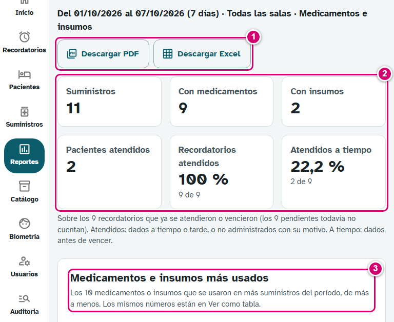

1. **Descargar PDF** o **Descargar Excel**: las estadísticas del período.
2. **Indicadores del período**: Suministros, Con medicamentos, Con insumos, Pacientes atendidos, Recordatorios atendidos y Atendidos a tiempo.
3. **Título y explicación de cada gráfico**. Son cuatro: Medicamentos e insumos más usados, Consumo por tipo, Evolución diaria y Recordatorios del período.

**Cómo leer «Recordatorios atendidos» y «Atendidos a tiempo».** Se cuentan solo los recordatorios del período que ya se atendieron o vencieron; los pendientes (los que todavía están a tiempo) se dejan afuera. **Atendido** quiere decir que enfermería dio la toma (a tiempo o tarde) o registró **No se administró** con su motivo. **A tiempo** quiere decir que la toma se dio antes de vencer; un **No se administró** nunca cuenta como a tiempo.

Por ejemplo, en la imagen hay 9 recordatorios que ya se atendieron o vencieron (los otros 9 del período todavía estaban pendientes, y por eso la explicación de la pantalla dice «los 9 pendientes todavía no cuentan»). Se atendieron los 9 (**100 %**, «9 de 9»), pero solo 2 tomas se dieron antes de vencer (**22,2 %**, «2 de 9»): las otras 7 vencieron —son avisos como los de la imagen de [Notificaciones](#notificaciones)— y después enfermería registró **No se administró** con su motivo. Por eso puede haber avisos de tomas vencidas y, a la vez, 100 % atendidos: lo que baja es **Atendidos a tiempo**. Una toma vencida que nadie atiende, en cambio, sí baja **Recordatorios atendidos**.

**Qué hacer con estos números.** El sistema no fija un valor aceptable. Si **Atendidos a tiempo** baja o **Recordatorios atendidos** no llega al 100 %, coménteselo a la jefatura de enfermería, o a quien indique el hospital.

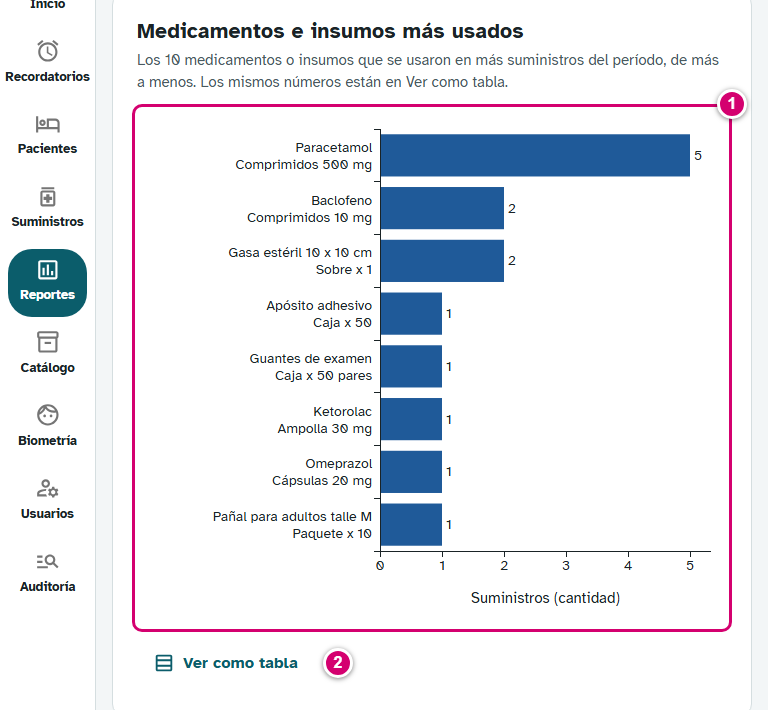

1. **Gráfico de barras**: cuántos suministros tuvo cada uno, de más a menos.
2. **Ver como tabla**: muestra los mismos números en una tabla.

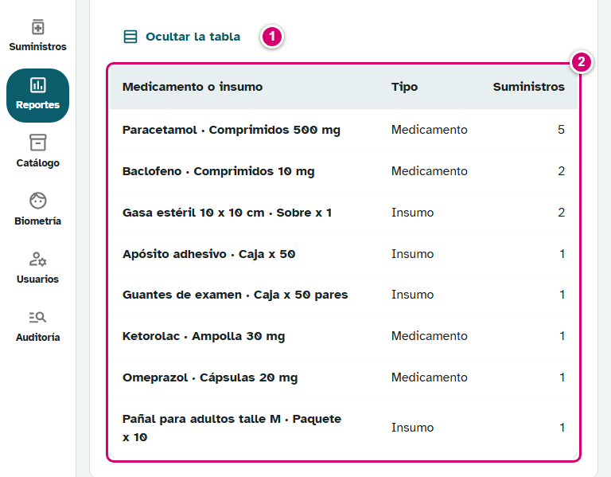

1. **Ocultar la tabla**: vuelve a dejar solo el gráfico.
2. **Tabla**: medicamento o insumo, tipo y cantidad de suministros, los mismos números del gráfico.

## Auditoría: quién cambió algo

La auditoría es el registro de todo lo que se hizo en el sistema: quién, cuándo, sobre qué, y qué había antes y después. No se puede modificar desde las pantallas. Sirve para responder preguntas como «¿quién le cambió la dosis a este paciente?» o «¿quién dio de baja a esta persona?».

1. Toque **Auditoría** en el menú (o **Ver quién cambió algo** en el Inicio).
2. Elija los filtros que necesite. La lista cambia sola.
3. Baje hasta **Movimientos** y toque uno para ver el detalle.

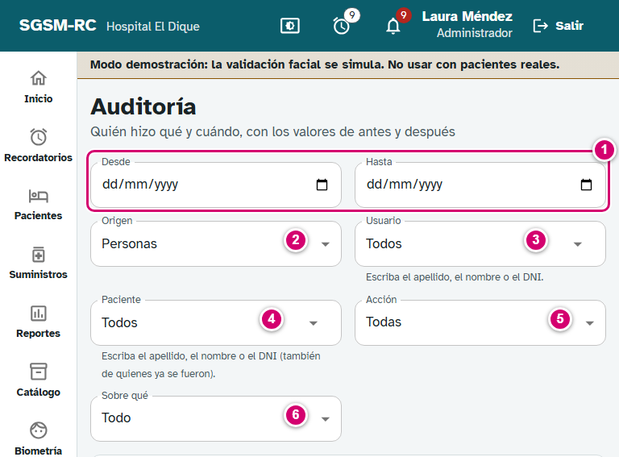

1. **Desde** y **Hasta**: el período. En la tablet del hospital, vacíos dicen «dd/mm/aaaa». Vacíos, muestra todo.
2. **Origen**: **Personas** (por defecto: lo que hizo alguien del personal), **Sistema** (lo que el sistema hace solo) o **Todos**.
3. **Usuario**: **quién hizo** el movimiento. Escriba el apellido, el nombre o el DNI y elija de la lista.
4. **Paciente**: sobre qué paciente. También encuentra a los que ya se fueron de alta.
5. **Acción**: qué se hizo. La lista trae solo las acciones que ya pasaron alguna vez (ver la tabla de abajo).
6. **Sobre qué**: Usuario, Paciente, Prescripción, Suministro, Insumo, Rostro, Recordatorio, Reporte…

**Ojo con la palabra «Usuario».** En el filtro y la columna **Usuario** está **quién lo hizo**. En **Sobre qué**, «Usuario n.º 4» es **a quién se lo hicieron**: la persona del personal afectada.

La lista de movimientos va de lo más nuevo a lo más viejo. **Quitar filtros** vuelve a mostrar todo.

**Las acciones que más va a ver**

| Acción                                                                     | Qué quiere decir                                                                                      |
| -------------------------------------------------------------------------- | ----------------------------------------------------------------------------------------------------- |
| **Creó** / **Modificó**                                                    | Cargó algo nuevo / cambió algo que ya estaba (una persona, un paciente, una prescripción, un insumo). |
| **Dio de baja** / **Reactivó**                                             | De una persona del personal o de algo del catálogo.                                                   |
| **Suspendió** / **Reanudó** / **Finalizó**                                 | Lo que hizo el médico con una prescripción. Finalizada, no se puede reanudar.                         |
| **Dio de alta** / **Trasladó** / **Reingresó**                             | Lo que hizo el médico con un paciente.                                                                |
| **Registró** / **Corrigió**                                                | Un suministro: lo que registró enfermería y su corrección.                                            |
| **Atendió** / **Marcó como no administrado**                               | Un recordatorio que atendió enfermería.                                                               |
| **Generó** / **Marcó como vencido**                                        | Lo hace el sistema solo con los recordatorios (Origen: Sistema).                                      |
| **Registró el rostro** / **Actualizó el rostro** / **Eliminó el rostro**   | Lo que hizo un administrador en Biometría.                                                            |
| **Modificó los permisos**                                                  | Permisos adicionales.                                                                                 |
| **Inició sesión** / **Intento de ingreso fallido** / **Bloqueó la cuenta** | Los ingresos al sistema.                                                                              |
| **Validación facial fallida** / **Canceló la operación**                   | El rostro no coincidió; a la tercera vez, se canceló.                                                 |
| **Exportó**                                                                | Alguien descargó un reporte.                                                                          |

### Ejemplo: ¿quién le cambió la dosis a este paciente?

1. En **Paciente**, elija al paciente (ver [Buscar lo que se hizo con un paciente](#buscar-lo-que-se-hizo-con-un-paciente)).
2. En **Sobre qué**, elija **Prescripción**.
3. Busque **Modificó** y tóquelo: en **Antes y después** aparece la **Dosis** de antes y la nueva, y en **Detalle**, el motivo que escribió el médico. En **Usuario**, quién lo hizo.
4. Si no hay ningún **Modificó**, el médico puede haber terminado la indicación y cargado otra: en la lista se ven **Finalizó** y **Creó** seguidos, a la misma hora (como en la imagen de [abajo](#buscar-lo-que-se-hizo-con-un-paciente)). Abra el **Creó** para ver la dosis nueva.

### Movimientos del sistema

El sistema hace cosas solo: genera los recordatorios de cada toma y los marca como vencidos. Para verlos, elija **Origen: Sistema** (o **Todos**).

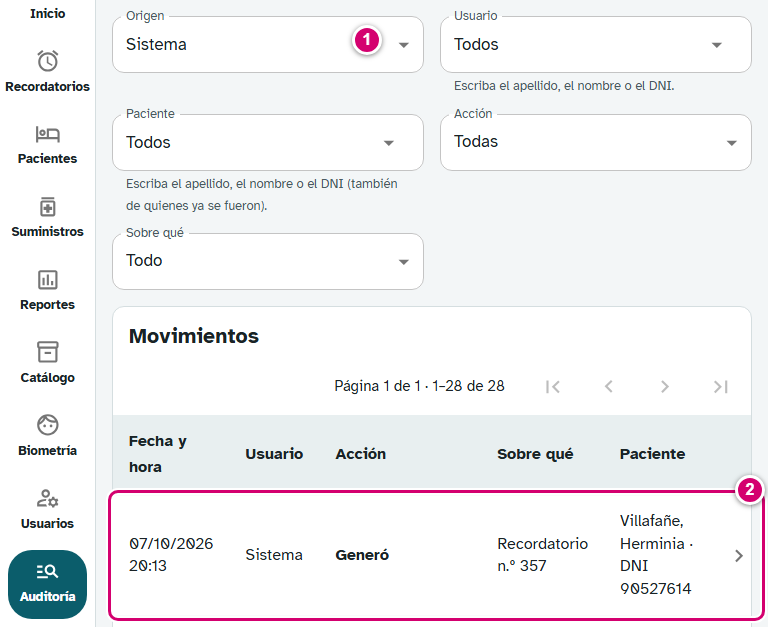

1. **Origen** en **Sistema**.
2. **Un movimiento del sistema**: en **Usuario** dice **Sistema**; en la imagen, «Generó · Recordatorio n.º 357», del paciente Villafañe, Herminia, con su DNI.

### Buscar lo que se hizo con un paciente

1. En **Paciente**, escriba parte del apellido, del nombre o del DNI.
2. Toque al paciente en la lista que aparece.

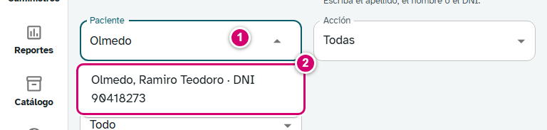

1. **Lo que escribió**: «Olmedo».
2. **Sugerencia**: apellido, nombre y DNI. Fíjese en el DNI si hay dos pacientes con el mismo apellido.

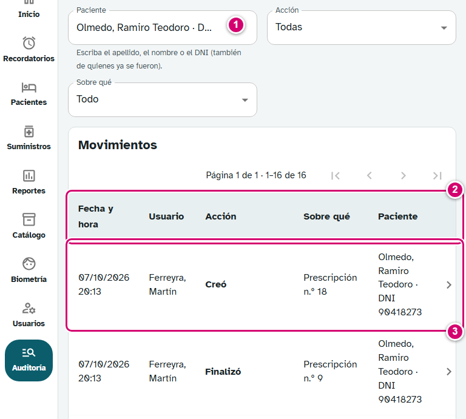

1. **Paciente elegido**.
2. **Columnas**: **Fecha y hora**, **Usuario** (quién lo hizo), **Acción**, **Sobre qué** y **Paciente** (con su DNI).
3. **Un movimiento**: en la imagen, Ferreyra, Martín «Creó» la «Prescripción n.º 18». Justo debajo, a la misma hora, «Finalizó» la n.º 9: terminó una indicación y cargó otra. Tóquelo para ver el detalle.

### Buscar por acción

Por ejemplo, para saber quién dio de baja a una persona: **Acción: Dio de baja** y **Sobre qué: Usuario**.

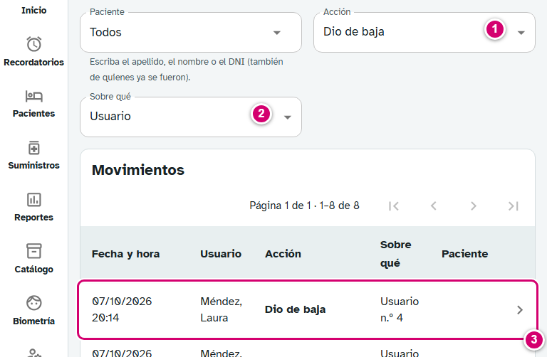

1. **Acción**: **Dio de baja**.
2. **Sobre qué**: **Usuario**.
3. **El movimiento**: cuándo (07/10/2026 20:14), quién lo hizo (Méndez, Laura, en la columna **Usuario**) y a quién (el usuario n.º 4, en **Sobre qué**).

Las personas del personal y los registros aparecen con un número («Usuario n.º 4»), no con el nombre. Para saber quién es el usuario n.º 4, busque **Acción: Creó** y **Sobre qué: Usuario**, y abra el movimiento de ese número: en **Después** figuran su nombre, su apellido y su DNI.

### El detalle: antes y después

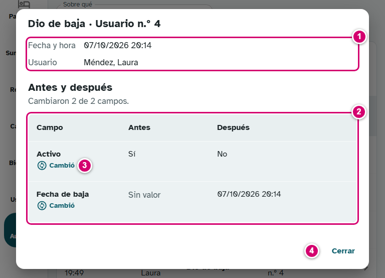

1. **Fecha y hora** y **Usuario**: cuándo y quién lo hizo.
2. **Antes y después**: cada campo con su valor anterior y el nuevo. Arriba dice cuántos cambiaron («Cambiaron 2 de 2 campos.»). **Sin valor** quiere decir que estaba vacío.
3. **Cambió**: marca los campos que cambiaron.
4. **Cerrar**.

### Lo que la auditoría no muestra

Las contraseñas y los rostros nunca quedan en la auditoría. Queda quién lo hizo, cuándo y sobre quién, pero no el dato.

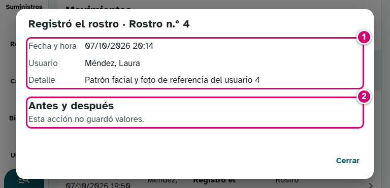

1. **Quién, cuándo y Detalle**: en la imagen, el patrón facial y la foto de referencia del usuario 4.
2. **«Esta acción no guardó valores.»**: el rostro no se guarda en la auditoría.

En movimientos más viejos puede ver «Dato protegido (no se muestra)» o «Los datos protegidos (contraseñas, rostros) no se muestran: solo se sabe que cambiaron.»: quiere decir lo mismo. Un cambio de contraseña aparece como «Modificó · Usuario» con el detalle «Se cambió la contraseña».

| Aviso que puede aparecer                                                                   | Qué hacer                                                                     |
| ------------------------------------------------------------------------------------------ | ----------------------------------------------------------------------------- |
| «No hay movimientos …» con lo que conviene probar                                          | Ningún movimiento cumple todos los filtros: amplíe las fechas o quite alguno. |
| «Todavía no hay movimientos de personas. Para ver los del sistema, cambie Origen a Todos.» | Cambie **Origen** a **Todos**.                                                |
| «No se pudo consultar la auditoría. …»                                                     | Toque **Quitar filtros** o intente de nuevo en unos minutos.                  |

## En el teléfono

El sistema también funciona en un teléfono, conectado al Wi-Fi del hospital y preparado por el área de sistemas (le instala el certificado del hospital). Las tareas son las mismas; cambia dónde están algunas cosas.

**Si puede usar su teléfono personal o solo uno del hospital, lo decide el hospital: pregúntelo antes.** El sistema tiene datos de pacientes. En cualquier teléfono: con bloqueo de pantalla, toque **Salir** al terminar, y no saque capturas de pantalla con datos de pacientes.

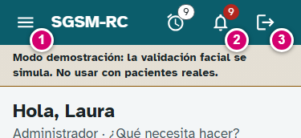

1. **Abrir el menú**: el botón de tres rayas, arriba a la izquierda.
2. **Notificaciones**: la campana, igual que en la tablet.
3. **Salir**: en el teléfono es solo el ícono de una flecha que sale de una puerta, sin texto.

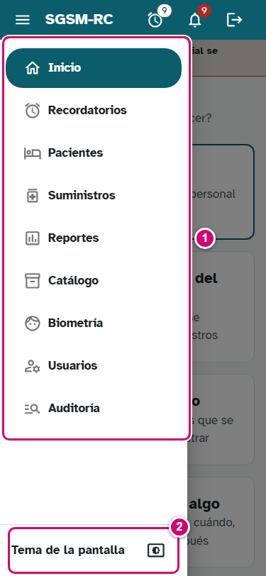

1. **Opciones del menú**: las mismas del menú lateral de la tablet.
2. **Tema de la pantalla**: en el teléfono está al pie del menú.

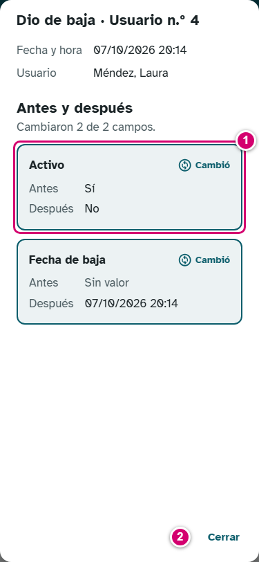

1. **Tarjeta de un campo**: en el teléfono, cada campo del detalle es una tarjeta con **Antes**, **Después** y la marca **Cambió**.
2. **Cerrar**.

## Si algo no funciona

| Lo que ve                                                                                    | Qué pasó y qué hacer                                                                                                                                                                                             |
| -------------------------------------------------------------------------------------------- | ---------------------------------------------------------------------------------------------------------------------------------------------------------------------------------------------------------------- |
| «No hay conexión con el servidor. Revise el Wi-Fi e intente de nuevo.»                       | La tablet perdió la red del hospital. Revise el Wi-Fi. **Antes de repetir lo que hacía, fíjese si quedó guardado** (por ejemplo, si la persona ya aparece en Usuarios): el corte pudo llegar después de guardar. |
| «No se pudo cargar …» con el botón **Reintentar**                                            | La información no llegó. **No quiere decir que no haya datos**: toque **Reintentar**.                                                                                                                            |
| «El servidor tuvo un problema…» u «Ocurrió un problema inesperado…»                          | Una falla del sistema. Intente de nuevo en unos minutos; si se repite, llame al área de sistemas.                                                                                                                |
| «No tiene permiso para realizar esta acción» (a usted o a otra persona)                      | El rol no incluye esa tarea. Si la persona la necesita, súmele el [permiso adicional](#permisos-adicionales); después, que salga y vuelva a ingresar.                                                            |
| «Demasiados intentos fallidos desde este dispositivo. Espere … minutos y vuelva a intentar.» | Desde esa tablet se escribieron mal muchas contraseñas en poco tiempo. Espere los minutos que indica.                                                                                                            |
| La cámara no se enciende en una tablet                                                       | Ver [Registrar el rostro del personal](#registrar-el-rostro-del-personal): si alguna vez se tocó **No permitir**, llame al área de sistemas.                                                                     |
| La franja «Modo demostración…» en una tablet del hospital                                    | Ese equipo no usa la cámara de verdad. No cargue pacientes reales en él y avise al área de sistemas.                                                                                                             |

## Preguntas frecuentes

**Alguien me llama porque la pantalla le dice «Usuario o contraseña incorrectos».**
Primero, búsquela en **Usuarios** con **Estado: Todos** y mire la columna **Estado**:

- **Dado de baja**: por eso no puede entrar. Si corresponde que vuelva, [reactívela](#dar-de-baja-y-reactivar-a-una-persona).
- **Bloqueado**: espere a que termine el bloqueo (en general, 15 minutos); mientras, puede darle una contraseña nueva si se la olvidó.
- **Activo**: que revise que escribe el usuario en minúsculas, tal como se lo dieron, y las mayúsculas de la contraseña (con el ojo para verla). Si se la olvidó, dele una [nueva](#cambiar-la-contraseña-o-el-rol), mejor escrita por ella, con usted al lado. Que no pruebe muchas veces: al tercer intento se bloquea.

**Una enfermera me llama porque su cuenta está bloqueada. ¿La desbloqueo?**
No se puede desbloquear antes de tiempo: el bloqueo dura un rato (en general, 15 minutos) y la pantalla de ingreso dice hasta qué hora. Si se olvidó la contraseña, dele una [nueva](#cambiar-la-contraseña-o-el-rol) para que la use cuando termine el bloqueo.

**Me olvidé mi contraseña (o se me bloqueó la cuenta).**
Si se bloqueó, espere a la hora que dice la pantalla. Si se la olvidó, pídale a otro administrador que le dé una nueva desde su ficha. Si es la única administradora, llame al área de sistemas. El sistema no tiene «recuperar contraseña».

**Alguien se olvidó la contraseña.**
Abra su ficha en **Usuarios**, escriba una **Contraseña nueva** y toque **Guardar**. Mejor que la escriba la persona, con usted al lado; si no está, entréguesela en persona. El sistema no tiene «recuperar contraseña».

**Una persona deja de trabajar en el hospital.**
[Dé de baja a la persona](#dar-de-baja-y-reactivar-a-una-persona): no podrá ingresar y todo lo que registró se conserva. Si se va para siempre, elimine también su rostro. Si es una licencia y vuelve, se reactiva.

**A una enfermera le aparece «No tiene el rostro registrado. Pídale al administrador que lo registre.» o «No se pudo leer el rostro registrado. Pídale al administrador que lo registre de nuevo.»**
Con ella presente, entre en **Biometría**, toque su fila y use **Registrar rostro** o **Actualizar rostro**.

**Un médico no encuentra un medicamento al prescribir.**
Búsquelo en el **Catálogo**, también con **Estado: Dados de baja**. Si está dado de baja, reactívelo; si no está, [agréguelo](#agregar-al-catálogo). Si es otro producto, la decisión de sumarlo es de quien corresponda en el hospital (farmacia, dirección médica).

**Un médico me pide un reporte en PDF o Excel.**
Pídale el período, la sala, el tipo y la agrupación (el renglón del resumen de su pantalla), arme lo mismo en **Reportes** y [descárguelo](#descargar-el-pdf-o-el-excel). Mándelo solo por el medio autorizado para datos de pacientes.

**Me piden habilitar una cama o internar a un paciente sin DNI.**
Las camas y las salas no se manejan desde las pantallas: pídaselo al área de sistemas. El sistema no acepta pacientes sin un DNI de 7 u 8 dígitos; no invente un número, porque podría ser el de otra persona. Consulte cómo procede el hospital.

**Cargué mal un usuario o un medicamento. ¿Lo puedo borrar?**
No se borra: corríjalo y toque **Guardar**, o dé de baja lo que no se tenía que cargar. Todo queda en la auditoría.

## Glosario

| Palabra                         | Qué significa en el sistema                                                                                           |
| ------------------------------- | --------------------------------------------------------------------------------------------------------------------- |
| **Usuario**                     | Cada persona del personal que ingresa al sistema. También, el nombre con el que ingresa («nombre de usuario»).        |
| **Nuevo usuario**               | Registrar a una persona del personal con su rol (en las pantallas no se dice «alta», salvo en la lista de permisos).  |
| **Rol**                         | Lo que una persona puede hacer según su trabajo: Administrador, Médico o Enfermero.                                   |
| **Permiso adicional**           | Algo más que se le permite a una persona, sin cambiarle el rol.                                                       |
| **Ficha**                       | La pantalla con los datos de una persona del personal (o de un paciente).                                             |
| **Matrícula**                   | La matrícula profesional de médicos y enfermería. Opcional.                                                           |
| **Sesión**                      | El tiempo entre que ingresa y sale (o el sistema la cierra por inactividad).                                          |
| **Dar de baja** / **Reactivar** | Desactivar a una persona o un medicamento o insumo del catálogo, y volver a activarlo. Nunca se usa para un paciente. |
| **Biometría**                   | El registro del rostro del personal (la opción del menú).                                                             |
| **Patrón facial**               | Los números que el sistema guarda de un rostro para reconocerlo. No es una foto y no se puede ver.                    |
| **Confirmar con mi rostro**     | Validación facial de quien registra una administración, unos insumos o un estudio.                                    |
| **Internar**                    | Registrar el ingreso de un paciente con su cama (lo hace el médico).                                                  |
| **Dar de alta**                 | El paciente se va del hospital: libera la cama y suspende sus prescripciones (lo hace el médico).                     |
| **Insumo**                      | Material no medicinal: pañal, gasa, filtro, guantes… (un medicamento no es un insumo).                                |
| **Prescripción**                | Indicación médica de un medicamento: dosis, frecuencia y vía.                                                         |
| **Toma**                        | Cada momento en que corresponde dar un medicamento según la prescripción.                                             |
| **Administrar**                 | Dar un medicamento a un paciente y registrarlo (lo hace enfermería).                                                  |
| **Suministro**                  | Registro de una administración o de los insumos usados con un paciente.                                               |
| **Estudio**                     | Práctica programada a un paciente (laboratorio, radiografía…) que enfermería confirma con su rostro.                  |
| **Recordatorio**                | Aviso de una toma o de un estudio que se acerca (30 minutos antes) o que está atrasado. Es para enfermería.           |
| **Vencida**                     | Toma que pasó unos 30 minutos de su hora sin atenderse: avisa al administrador y todavía se puede atender tarde.      |
| **No se administró**            | Registro de que una toma no se dio, con su motivo (ayuno, rechazo, estudio…).                                         |
| **Notificación**                | Aviso para los administradores, en la campana.                                                                        |
| **Reporte** / **Estadísticas**  | Totales de lo que se usó en un período; el administrador los descarga en PDF o Excel.                                 |
| **Volumen**                     | Columna del reporte que suma cantidades de distinta unidad: solo sirve para comparar filas, no es una dosis.          |
| **Auditoría**                   | Registro de quién hizo cada cambio, cuándo, y qué había antes y después.                                              |
| **Origen**                      | En la auditoría: si un movimiento lo hizo una persona o el sistema solo.                                              |

## Anexo: tareas del área de sistemas

**No hace falta leerlo.** Estas tareas no se hacen desde las pantallas: las hace el área de sistemas. Llámela ([A quién llamar](#a-quién-llamar)) para:

- Instalar el sistema y crear el primer administrador.
- Preparar una tablet o un teléfono nuevo: instalarle el certificado del hospital, sin el cual la cámara no funciona.
- Habilitar la cámara en una tablet donde se tocó **No permitir**.
- Recuperar datos de un respaldo.
- Instalar una versión nueva del sistema.
- Quitar el modo demostración y usar la cámara de verdad.
- Agregar o quitar salas y camas, o cargar de una vez el catálogo o el personal desde una planilla.
- Darle una contraseña nueva a la única administradora, si se la olvidó.

(Para el área de sistemas: el detalle técnico está en `docs/despliegue.md` y `docs/biometria.md`.)
