# Manual de enfermería

**SGSM-RC · Hospital Zonal Especializado en Rehabilitación "El Dique"**

Este manual es para el personal de enfermería que usa la tablet al lado de la cama: para ver qué toca, dar la medicación y anotar lo que usa con cada paciente. No hace falta haber usado el sistema antes. Cada tarea va paso a paso, con la pantalla tal como se ve. Léalo una vez con calma y después vuelva a la parte que necesite.

## Antes de empezar

### A quién llamar

**Si esta tabla está en blanco, pídale a su supervisora que la complete antes de su primer turno.** Cuando este manual dice «la supervisora», «el administrador», «el área de sistemas» o «el médico», se refiere a estas personas:

| Para…                                                                                                                     | Quién                                     | Interno o teléfono   | De noche y el fin de semana  |
| ------------------------------------------------------------------------------------------------------------------------- | ----------------------------------------- | -------------------- | ---------------------------- |
| Avisar que no puede registrar algo, un error de carga o cualquier duda del turno                                          | Supervisora de enfermería                 | \_\_\_\_\_\_\_\_\_\_ | \_\_\_\_\_\_\_\_\_\_\_\_\_\_ |
| Cuenta bloqueada, contraseña olvidada, rostro sin registrar o que no la reconoce, falta un insumo, un registro equivocado | Administrador del sistema: \_\_\_\_\_\_\_ | \_\_\_\_\_\_\_\_\_\_ | \_\_\_\_\_\_\_\_\_\_\_\_\_\_ |
| El sistema no anda (no carga, da errores, no hay conexión en el sector, la cámara no enciende)                            | Área de sistemas: \_\_\_\_\_\_\_\_\_\_    | \_\_\_\_\_\_\_\_\_\_ | \_\_\_\_\_\_\_\_\_\_\_\_\_\_ |
| Falta una prescripción, la dosis no le parece correcta, un estudio que no se pudo hacer, una indicación de palabra        | El médico del paciente o el de guardia    | \_\_\_\_\_\_\_\_\_\_ | \_\_\_\_\_\_\_\_\_\_\_\_\_\_ |

Si no puede registrar lo que hizo (el sistema no anda, la cámara no enciende, no la reconoce), siga [Si no puede registrar](#si-no-puede-registrar).

### Qué necesita

- **Una tablet del hospital**, conectada a la red del hospital (Wi-Fi). También funciona en un teléfono: ver [En el teléfono](#en-el-teléfono).
- **Su usuario y su contraseña.** Se los entrega el administrador del sistema. No los comparta: todo lo que registre queda a su nombre.
- **Su rostro registrado.** Lo registra el administrador una sola vez, con la cámara. Sin eso, el sistema no le deja confirmar lo que da ni lo que usa.

**Con guantes.** Al empezar el turno, pruebe si la pantalla le responde con los guantes que usa: con algunos guantes responde mal o no responde. Toque con la yema del dedo, firme y sin apuro. Limpie la tablet según la norma de control de infecciones del hospital, como cualquier cosa que entra a la habitación, y en especial entre un paciente y otro.

### Qué hace con el sistema

- Ver las tomas y los estudios que hay que atender ahora, en **Recordatorios**.
- Administrar un medicamento y confirmarlo con su rostro, o anotar que **no se administró** y por qué.
- Registrar los insumos que usó con un paciente.
- Buscar un paciente, ver sus prescripciones, sus datos (alergias) y su historial, y corregir algo que cargó mal.
- Confirmar que se realizó un estudio.

### Lo que tiene que tener presente

- **El rostro identifica a quien registra, no al paciente.** Al paciente lo identifica usted: cada pantalla muestra su nombre, DNI y cama. Compárelos con el paciente que tiene delante antes de confirmar.
- **Primero da el medicamento y después confirma, al lado de la cama.** La hora que queda registrada es la del momento en que confirma con su rostro, no la hora en que lo dio. Ver [El orden correcto](#el-orden-correcto).
- **La tablet avisa solo con la sesión abierta.** Con la tablet bloqueada, con el sistema cerrado o con la sesión cerrada, no suena ni avisa nada. No deje la tablet sola esperando que suene: cada vez que vuelve, mire usted la lista.
- **El sistema no controla alergias ni interacciones.** Solo deja dar lo que el médico prescribió. Si el médico anotó alergias, están en la ficha del paciente, pestaña **Datos**, en **Observaciones** ([cómo verlas](#datos-las-alergias)).
- **Nunca registre en la sesión de otra persona.** Si arriba a la derecha ve el nombre de otra persona, toque **Salir** y entre con su usuario. Ver [Salir](#salir).

### Sobre las imágenes

- Todos los pacientes y datos que se ven son ficticios.
- Las imágenes se sacaron en distintos momentos, con datos de prueba armados para mostrar cada pantalla. **No siga las horas de una imagen a otra como si fueran del mismo turno.**
- **Cómo leer los números:** los pasos van con números comunes (1., 2., 3.…). Los números en círculo que están dibujados sobre cada imagen se explican debajo de ella, en la lista **En la imagen**, con el mismo número en círculo (①, ②…). No son los pasos.
- La franja de arriba que dice «Modo demostración: la validación facial se simula. No usar con pacientes reales.» aparece solo en el equipo de prueba. **Si la ve en una tablet del hospital, no registre nada de pacientes reales en ese equipo** y avise al administrador.
- En el equipo de prueba, la ventana **Confirmar con su rostro** no tiene cámara: tiene dos botones. «Simular el rostro de …» (el nombre está tapado con gris) hace como si mirara usted. «Simular otro rostro» hace como si mirara otra persona: sirve para practicar qué pasa cuando el sistema no la reconoce (al tercer intento se cancela y se avisa al administrador, igual que en la tablet real). **En la tablet del hospital no están esos botones: en ese lugar se ve la cámara.**
- «(Demostración manual)» al final de algunas observaciones es una marca de los datos de prueba.

**Índice**

1. [Entrar y salir del sistema](#entrar-y-salir-del-sistema) (y [si deja de tocar la pantalla](#si-deja-de-tocar-la-pantalla), [la sesión de otra persona](#salir), [en el teléfono](#en-el-teléfono))
2. [Recordatorios: las tomas y estudios para atender](#recordatorios-las-tomas-y-estudios-para-atender) (y [Urgente, Pronto, Programada y Vencida](#urgente-pronto-programada-y-vencida), [el sonido](#los-avisos-y-el-sonido), [sin conexión en tiempo real](#si-dice-sin-conexión-en-tiempo-real))
3. [Administrar un medicamento](#administrar-un-medicamento) (y [el orden correcto](#el-orden-correcto), [No se sabe si quedó registrada](#si-aparece-no-se-sabe-si-quedó-registrada), [No se administró](#cuando-una-toma-no-se-da-no-se-administró))
4. [Registrar insumos](#registrar-insumos)
5. [Buscar un paciente y ver su ficha](#buscar-un-paciente-y-ver-su-ficha) (y [alergias](#datos-las-alergias), [corregir algo que cargó mal](#corregir-algo-que-cargó-mal), [confirmar un estudio](#confirmar-que-se-realizó-un-estudio))
6. [Si no puede registrar](#si-no-puede-registrar)
7. [Si algo no funciona](#si-algo-no-funciona)
8. [Preguntas frecuentes](#preguntas-frecuentes)
9. [Glosario](#glosario)

---

## Entrar y salir del sistema

Para empezar a trabajar con su nombre y cerrar al terminar.

### Ingresar

1. Abra el SGSM-RC en la tablet (el administrador le indica cómo: un acceso directo o una dirección).
2. Toque **Usuario** y escriba su usuario.
3. Toque **Contraseña** y escriba su contraseña.
4. Toque **Ingresar**.

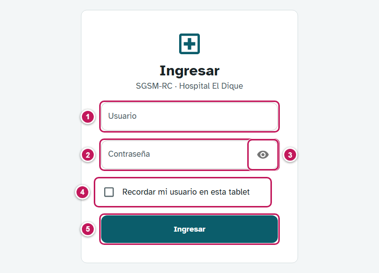

**En la imagen:**

- ① **Usuario**.
- ② **Contraseña**: lo que escribe se ve con puntos, para que nadie lo lea.
- ③ **El ojo**: muestra la contraseña para revisar lo que escribió. Tóquelo otra vez para ocultarla.
- ④ **Recordar mi usuario en esta tablet**: la próxima vez el usuario ya aparece escrito y solo pone la contraseña. Márquela solo si esa tablet la usa nada más usted. Nunca guarda la contraseña.
- ⑤ **Ingresar**.

**Cuando sale bien**, se abre la pantalla de Inicio con su nombre («Hola, Sofía») y debajo «Enfermero · ¿Qué necesita hacer?». «Enfermero» es el nombre del perfil de todo el personal de enfermería, enfermeras y enfermeros: no quiere decir que entró con un perfil equivocado.

> Si en **Usuario** aparece el usuario de otra persona, bórrelo, escriba el suyo y desmarque **Recordar mi usuario en esta tablet**.

| Aviso que puede aparecer                                                                     | Qué hacer                                                                                                                                                                                                                      |
| -------------------------------------------------------------------------------------------- | ------------------------------------------------------------------------------------------------------------------------------------------------------------------------------------------------------------------------------ |
| «Ingrese su usuario» / «Ingrese su contraseña»                                               | Falta completar ese campo.                                                                                                                                                                                                     |
| «Usuario o contraseña incorrectos»                                                           | Escríbalos de nuevo, despacio. Revise las mayúsculas y use el ojo para ver la contraseña.                                                                                                                                      |
| «La cuenta está bloqueada por intentos fallidos hasta las …»                                 | Después de tres intentos fallidos seguidos, la cuenta se bloquea un rato (en general, 15 minutos). Espere a la hora que indica o llame al administrador. Mientras tanto, siga [Si no puede registrar](#si-no-puede-registrar). |
| «Demasiados intentos fallidos desde este dispositivo. Espere … minutos y vuelva a intentar.» | Hubo muchos intentos fallidos en esa tablet. Espere los minutos que dice.                                                                                                                                                      |
| Se olvidó la contraseña                                                                      | La pantalla no la recupera: pídale una nueva al administrador. No pruebe varias veces, porque al tercer intento la cuenta se bloquea.                                                                                          |

### La pantalla de Inicio

Desde acá se llega a cada tarea con un toque.

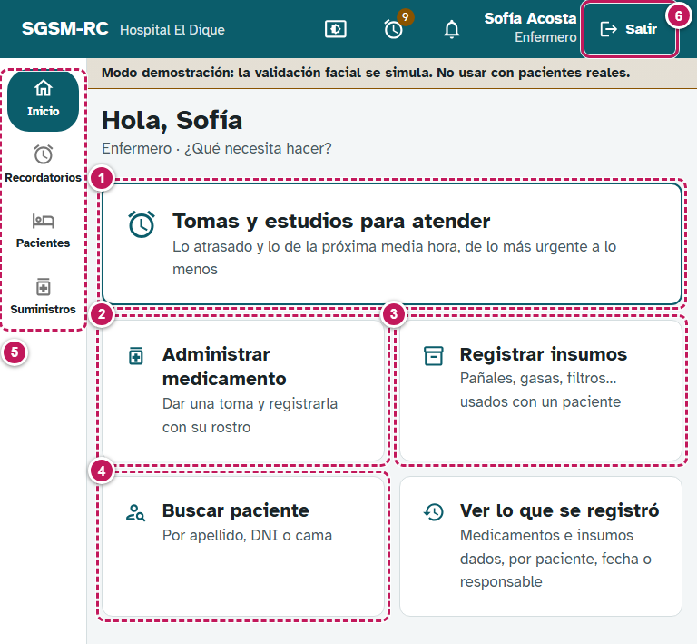

**En la imagen:**

- ① **Tomas y estudios para atender**: abre **Recordatorios**, la pantalla principal de enfermería. Ver [Recordatorios](#recordatorios-las-tomas-y-estudios-para-atender).
- ② **Administrar medicamento**: dar una toma y registrarla con su rostro. Ver [Administrar un medicamento](#administrar-un-medicamento).
- ③ **Registrar insumos**: pañales, gasas, filtros… usados con un paciente. Ver [Registrar insumos](#registrar-insumos).
- ④ **Buscar paciente**: por apellido, DNI o cama. Ver [Buscar un paciente](#buscar-un-paciente).
- ⑤ **Menú lateral**: **Inicio**, **Recordatorios**, **Pacientes** y **Suministros**. Está en todas las pantallas. Se ve resaltada la opción de la parte del sistema en la que está: **Administrar medicamento** y **Registrar insumos** son parte de **Suministros**, así que en esas pantallas el menú muestra resaltado **Suministros**; en la ficha de un paciente, **Pacientes**. No quiere decir que se fue a otra pantalla.
- ⑥ **Salir**: cierra la sesión.

La tarea **Ver lo que se registró** (abajo a la derecha) abre la pantalla **Suministros**, la misma que la opción **Suministros** del menú: los medicamentos e insumos registrados, por paciente, fecha o responsable.

En la barra de arriba, de izquierda a derecha, hay además:

- **Tema de la pantalla** (un rectángulo con medio círculo): toque y elija **Oscuro**, que de noche no encandila; **Claro**, para el día; o **Igual que el dispositivo**.
- **El reloj con un número**: cuántas tomas y estudios hay para atender en todo el hospital. Si alguno es urgente, el número va sobre fondo de color. Un toque abre **Recordatorios**, desde cualquier pantalla.
- **La campana**: son avisos para el administrador. A enfermería no le llega ninguno: si la abre, dice «No hay notificaciones».

### Si deja de tocar la pantalla

Por seguridad, la sesión se cierra sola si nadie toca la pantalla durante un rato (en general, 15 minutos). Un minuto antes aparece un aviso en la pantalla. **El aviso no suena**: si usted está en otra habitación, no se va a enterar.

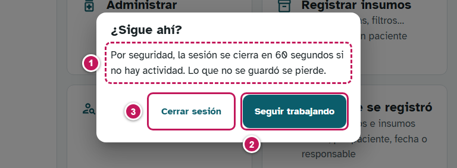

**En la imagen:**

- ① **La cuenta regresiva**: «Por seguridad, la sesión se cierra en 60 segundos si no hay actividad. Lo que no se guardó se pierde.»
- ② **Seguir trabajando**: toque acá para seguir. Lo que estaba cargando queda como estaba.
- ③ **Cerrar sesión**: sale enseguida.

Si no toca nada, la sesión se cierra y la tablet vuelve a la pantalla de ingreso con este aviso:

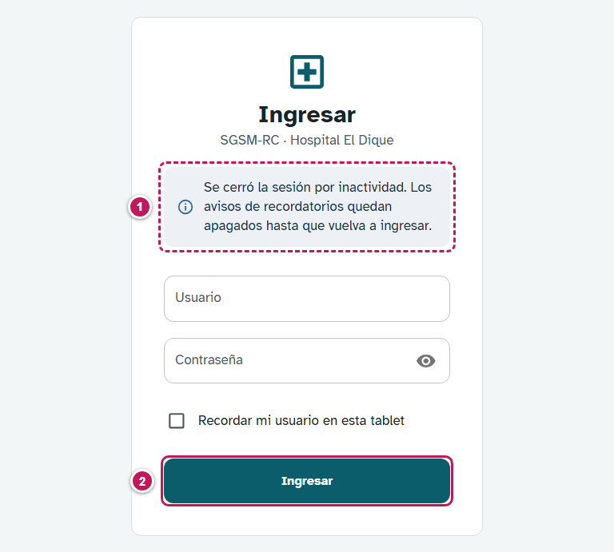

**En la imagen:**

- ① «Se cerró la sesión por inactividad. Los avisos de recordatorios quedan apagados hasta que vuelva a ingresar.» **Mientras no vuelva a entrar, la tablet no suena ni avisa las tomas.**
- ② **Ingresar**: escriba su usuario y su contraseña y vuelva a entrar.

Lo que había confirmado con su rostro quedó guardado. Lo que estaba cargando sin confirmar se perdió: vuelva a cargarlo.

Además, una sesión dura como máximo 12 horas aunque la esté usando. Pasado ese tiempo, la pantalla de ingreso dice «La sesión alcanzó su duración máxima. Vuelva a ingresar.»

### Salir

Toque **Salir** (arriba a la derecha) al terminar el turno o cuando otra persona vaya a usar la tablet. Sale enseguida, sin preguntar.

**Si encuentra la tablet con la sesión de otra persona** (arriba a la derecha dice otro nombre):

1. Si esa compañera está cerca, avísele: puede tener algo a medio cargar.
2. Toque **Salir** y entre con su usuario. Lo que ella había confirmado con su rostro ya está guardado; lo que dejó sin confirmar se pierde.
3. **Nunca registre nada en la sesión de otra persona.** Quedaría a nombre de ella, y además el sistema compara su cara con la de quien abrió la sesión: no la va a reconocer y, al tercer intento, avisa al administrador.

### En el teléfono

Las tareas son las mismas que en la tablet. Cambia dónde están algunos botones.

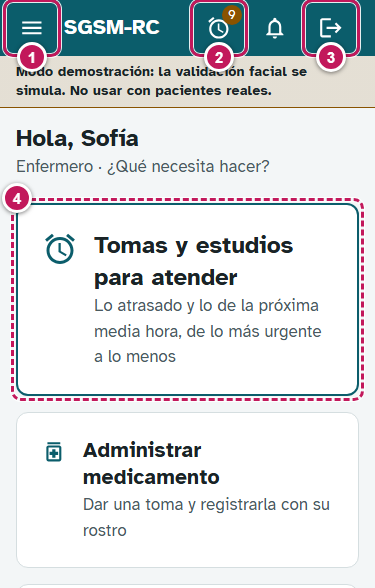

**En la imagen:**

- ① **Menú**: el botón de tres rayas, arriba a la izquierda.
- ② **El reloj con un número**: igual que en la tablet.
- ③ **Salir**: en el teléfono es solo el dibujo de una flecha que sale de una puerta, sin texto.
- ④ **Tomas y estudios para atender**: la primera tarea; abre Recordatorios.

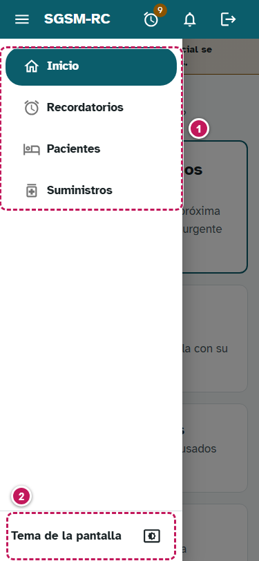

**En la imagen:**

- ① **Inicio**, **Recordatorios**, **Pacientes** y **Suministros**. Al tocar una, el menú se cierra solo.
- ② **Tema de la pantalla**: claro u oscuro. En el teléfono está al pie del menú.

---

## Recordatorios: las tomas y estudios para atender

Para saber qué toca ahora en el hospital, de lo más urgente a lo menos. En este manual, esta pantalla se llama siempre **Recordatorios**. Se abre de tres maneras, y las tres llevan al mismo lugar: la tarea **Tomas y estudios para atender** del Inicio, **el reloj con un número** de arriba, o **Recordatorios** en el menú.

1. Abra **Recordatorios**.
2. En **Sala**, elija su sala. La tablet la recuerda para la próxima vez.
3. Empiece por la primera tarjeta: es la más urgente.

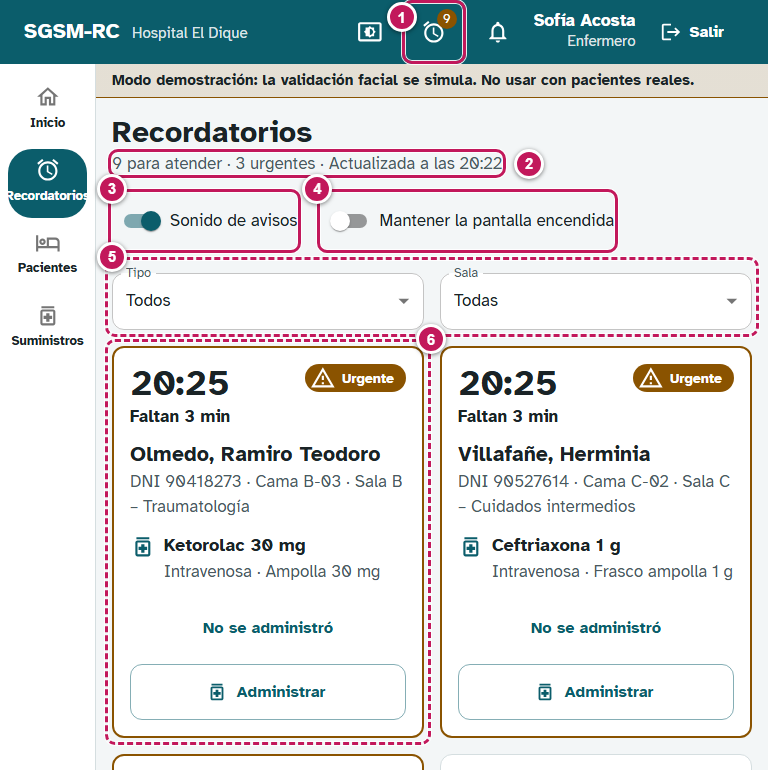

**En la imagen:**

- ① **El reloj con un número**: cuántas tomas y estudios hay para atender en todo el hospital. Se ve en todas las pantallas.
- ② **Resumen**: «9 para atender · 3 urgentes · Actualizada a las 20:22». La hora dice cuándo se actualizó la lista.
- ③ **Sonido de avisos**: prendido, la tablet suena y vibra cuando aparece un recordatorio nuevo. Ver [Los avisos y el sonido](#los-avisos-y-el-sonido).
- ④ **Mantener la pantalla encendida**: ver [más abajo](#mantener-la-pantalla-encendida).
- ⑤ **Tipo** (**Todos**, **Tomas** o **Estudios**) y **Sala** (**Todas** o una sala).
- ⑥ **Tarjeta de un recordatorio**: una toma o un estudio.

Cada recordatorio aparece **30 minutos antes** de la hora de la toma. La lista se actualiza sola: no hace falta recargarla. Cuando una toma se atiende (se administra o se registra que no se administró), sale de la lista.

Si no hay nada pendiente, dice «No hay tomas ni estudios para atender ahora.» y la hora de la última actualización.

### Cómo leer una tarjeta

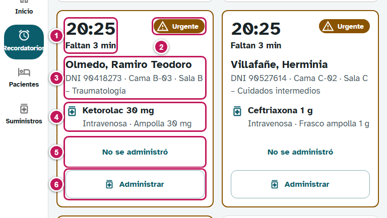

**En la imagen:**

- ① **La hora de la toma**, grande, en 24 horas («20:25»), y cuánto falta («Faltan 3 min»). Si ya pasó la hora, dice «Atrasada 5 min»; si está vencida, «Hace 45 min».
- ② **El nivel**: **Urgente**, **Pronto**, **Programada** o **Vencida**, siempre escrito. Ver [la tabla](#urgente-pronto-programada-y-vencida).
- ③ **El paciente**: apellido y nombre, DNI, cama y sala.
- ④ **Qué se da**: el medicamento con su dosis («Ketorolac 30 mg»), la vía y la presentación («Intravenosa · Ampolla 30 mg»).
- ⑤ **No se administró**: **es un botón, aunque se vea como texto suelto.** Sirve para registrar que esta toma no se dio, con el motivo. Está cerca de **Administrar**: con guantes, toque con cuidado. Si lo toca sin querer, toque **Cancelar** en la ventana que se abre: no se registra nada. Ver [No se administró](#cuando-una-toma-no-se-da-no-se-administró).
- ⑥ **Administrar**: abre la pantalla para darla, con el paciente y el medicamento ya elegidos. Ver [Desde un recordatorio](#desde-un-recordatorio).

Las indicaciones del médico (por ejemplo, «Controlar la tensión arterial antes de dar») no están en la tarjeta: se leen al tocar **Administrar**.

La tarjeta de un **estudio** dice el nombre del estudio, la **Preparación** si el médico la indicó (por ejemplo, ayuno) y tiene el botón **Confirmar que se realizó**. Ver [Confirmar que se realizó un estudio](#confirmar-que-se-realizó-un-estudio).

### Urgente, Pronto, Programada y Vencida

El nivel se calcula solo, minuto a minuto: una toma **Programada** pasa a **Pronto** y después a **Urgente** a medida que se acerca la hora.

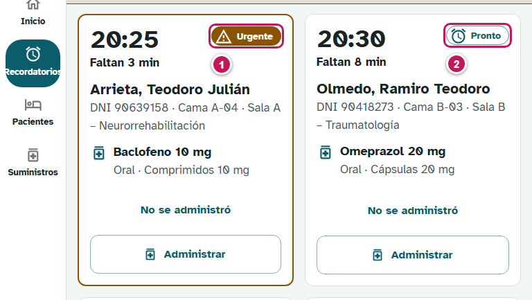

**En la imagen:**

- ① **Urgente**: relleno de color ámbar con un triángulo. La tarjeta tiene además el borde ámbar.
- ② **Pronto**: con contorno y un reloj despertador.

| Nivel          | Qué significa                                                                                                                                                                         | Cómo se ve                                                       |
| -------------- | ------------------------------------------------------------------------------------------------------------------------------------------------------------------------------------- | ---------------------------------------------------------------- |
| **Urgente**    | Faltan 5 minutos o menos, o ya está atrasada.                                                                                                                                         | Relleno ámbar con un triángulo; la tarjeta con borde ámbar.      |
| **Pronto**     | Faltan entre 5 y 15 minutos.                                                                                                                                                          | Contorno con un reloj despertador.                               |
| **Programada** | Faltan más de 15 minutos. En un estudio dice «Programado».                                                                                                                            | Contorno gris con un reloj.                                      |
| **Vencida**    | Nadie la atendió: en general, unos 30 minutos después de la hora de la toma. El sistema le avisa al administrador. **Todavía se puede atender, tarde.** En un estudio dice «Vencido». | Relleno ámbar con un reloj de arena; la tarjeta con borde ámbar. |

Una toma vencida sigue en la lista hasta 12 horas, o hasta que alguien la atiende: tóquele **Administrar** si la da (lea antes [¿La puedo dar igual?](#una-toma-quedó-vencida-la-puedo-dar-igual)), o **No se administró** con el motivo si no la da.

**Pasadas 12 horas sin que nadie la atienda, la tarjeta sale de la lista.** La toma no se borra: queda registrada como vencida sin atender. El administrador recibió el aviso cuando venció, y en la ficha del paciente, **Historial** › **Modificaciones**, queda un renglón que en **Acción** dice «VENCER», con la hora y el usuario «Sistema». **No queda como «No se administró»:** si no la dio, regístrelo antes de que pasen las 12 horas, con el motivo.

### Los avisos y el sonido

Cuando aparece un recordatorio nuevo, la tablet avisa en cualquier pantalla, de tres maneras:

- **Con texto**: una franja debajo de la barra de arriba dice «1 recordatorio nuevo» (o «3 recordatorios nuevos»), con el botón **Ver recordatorios**. La **X** la cierra. Se va sola a los 15 segundos, salvo que haya alguno urgente: entonces queda hasta que usted la cierre.
- **Con el número del reloj**, que sube.
- **Con sonido y vibración**: dos notas cortas, y vibra si la tablet puede. Mientras haya tomas urgentes o vencidas sin atender, el sonido se repite cada 5 minutos.

**Suena por todo el hospital, también por las tomas de otras salas**, aunque usted haya elegido su sala en **Sala**: el filtro cambia lo que ve en la lista, no lo que suena. El número del reloj también cuenta todo el hospital.

El interruptor **Sonido de avisos** prende o apaga el sonido y la vibración. Al prenderlo suena una vez, para comprobar que se oye. El texto y el número aparecen siempre, con sonido o sin él.

> **No apague el sonido.** Si lo apaga, queda apagado **en esa tablet**, también para la próxima persona que la use, que no se va a enterar. Si lo apagó, vuelva a prenderlo antes de entregar el turno.

> **Después de ingresar, la tablet puede sonar recién cuando usted toca la pantalla una vez.** El toque de **Ingresar** no cuenta; cualquier toque después sirve (por ejemplo, abrir Recordatorios). Si no va a tocar nada, toque una parte vacía, como al lado de «Hola, …» en el Inicio. Revise también que el volumen de la tablet esté alto.

### Mantener la pantalla encendida

Para que la pantalla de la tablet no se apague mientras **Recordatorios** está abierta.

1. Abra **Recordatorios**.
2. Prenda **Mantener la pantalla encendida**.

Funciona solo mientras Recordatorios está abierta: en otras pantallas, la tablet se apaga como siempre. La tablet recuerda la elección. El interruptor aparece solo si la tablet lo permite.

> **No deje la tablet sola esperando que suene.** Que la pantalla siga encendida no evita que la sesión se cierre: si nadie la toca en 15 minutos (en general), aparece **¿Sigue ahí?**, que no suena, y después la sesión se cierra y **la tablet deja de avisar**, aunque la pantalla siga prendida. Cada vez que vuelva a la tablet, mire usted la lista. Ver [Si deja de tocar la pantalla](#si-deja-de-tocar-la-pantalla).

### Si dice «Sin conexión en tiempo real»

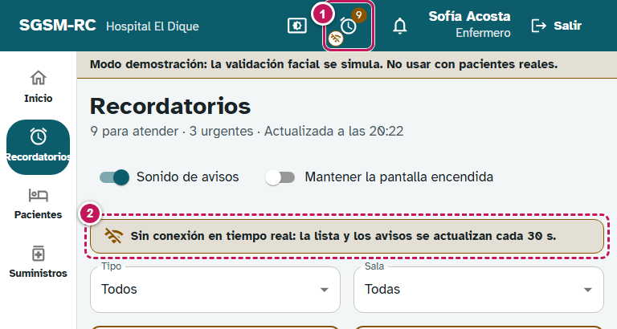

**En la imagen:**

- ① **El reloj con un ícono de sin señal** abajo: se ve en cualquier pantalla.
- ② **La franja**: «Sin conexión en tiempo real: la lista y los avisos se actualizan cada 30 s.»

La tablet dejó de recibir los avisos al instante. **La lista se sigue actualizando sola**, cada 30 segundos, y los avisos de nuevos llegan con esa demora. No tiene que hacer nada: cuando vuelve la conexión, la franja desaparece sola.

Si la franja sigue **más de 10 minutos**, o aparece «No hay conexión con el servidor. Revise el Wi-Fi e intente de nuevo.», revise que la tablet tenga el Wi-Fi prendido y avise al área de sistemas.

---

## Administrar un medicamento

Para dar la medicación indicada y dejarla registrada a su nombre.

Solo se puede administrar sobre una **prescripción vigente** del paciente. Si el medicamento que le piden no aparece, consulte al médico: tiene que indicarlo él. Las indicaciones «si dolor» o «a demanda» y lo indicado de palabra en una urgencia tienen su propio camino: ver [esta pregunta](#cómo-registro-una-indicación-si-dolor-una-dosis-única-o-algo-que-el-médico-indicó-de-palabra).

Se llega por tres caminos a la misma pantalla: **Administrar** en la tarjeta de un recordatorio (lo más común), **Administrar medicamento** en la pantalla de Inicio, o **Administrar** en una prescripción de la ficha del paciente.

### El orden correcto

1. **Antes de preparar el medicamento**, toque **Administrar** en la tarjeta de la toma y lea todo: el paciente, la línea gris con las indicaciones del médico y los avisos amarillos. Si dice «**Esta toma ya se dio a las …**», **no la prepare**: alguien ya la dio. Revise el historial y consulte.
2. Prepare el medicamento.
3. Al lado de la cama, vuelva a abrir la pantalla (por ejemplo, toque la flecha **Volver** y otra vez **Administrar** en la tarjeta): **la pantalla no se actualiza sola**, y si otra persona la dio mientras usted preparaba, recién al abrirla de nuevo aparece «Esta toma ya se dio…». Si la tarjeta ya no está en Recordatorios, es que alguien la atendió: no la dé sin revisar el historial.
4. Compare el nombre, el DNI y la cama de la pantalla con el paciente que tiene delante.
5. **Dé el medicamento.**
6. **Recién ahí**, enseguida y al lado de la cama, toque **Confirmar con mi rostro**.

¿Por qué en este orden?

- **La hora que queda registrada es la del momento en que confirma.** Si da todo en la recorrida y registra después, queda una hora que no es la real. Si por algún motivo confirma más tarde, escriba en **Observaciones** la hora real en que la dio («Dada a las 03:10»).
- **Si confirma antes de darla y el paciente no la toma, no se puede deshacer.** Ver [Confirmé, pero el paciente no la tomó o la vomitó](#confirmé-pero-el-paciente-no-la-tomó-o-la-vomitó-qué-hago).
- Si prepararla le lleva más de 15 minutos sin tocar la tablet, la sesión se cierra: vuelva a ingresar y abra la pantalla de nuevo al lado de la cama.

### Desde un recordatorio

1. En **Recordatorios**, toque **Administrar** en la tarjeta de la toma.
2. Se abre **Administrar medicamento** con el paciente y el medicamento ya elegidos.
3. Compare la identificación con el paciente que tiene delante.
4. **Lea la línea gris de la prescripción elegida** (debajo del nombre del medicamento): ahí están la vía, cada cuántas horas y **las indicaciones del médico**, por ejemplo «Controlar la tensión arterial antes de dar». Haga lo que indica antes de dar.
5. Siga en [Revisar y confirmar con su rostro](#revisar-y-confirmar-con-su-rostro).

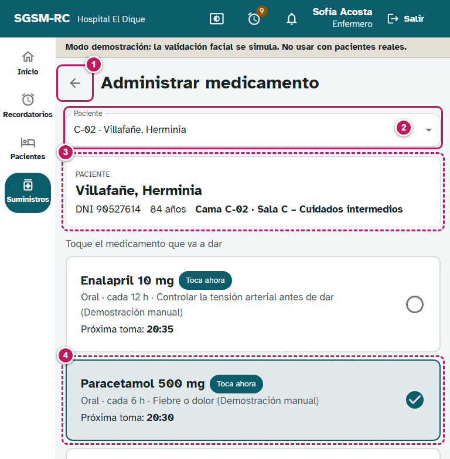

**En la imagen:**

- ① **La flecha Volver**: vuelve a Recordatorios, con los mismos filtros.
- ② **Paciente**: el del recordatorio («C-02 · Villafañe, Herminia»).
- ③ **Identificación del paciente**: nombre, DNI, edad, cama y sala. Compárela con el paciente que tiene delante.
- ④ **La prescripción del recordatorio**, ya elegida, con la tilde. Su línea gris dice «Oral · cada 6 h · Fiebre o dolor».

También aparecen las otras prescripciones vigentes del paciente, cada una con su línea gris (en la imagen, la de Enalapril dice «Controlar la tensión arterial antes de dar»). Más abajo, en el resumen **Revise antes de confirmar**, el renglón **Toma** de la que vino del recordatorio termina en «(recordatorio)».

### Desde Administrar medicamento

1. Toque **Administrar medicamento** en la pantalla de Inicio.
2. Toque **Paciente** y elija al paciente. Cada renglón empieza con la cama y sigue con el nombre («A-04 · Arrieta, Teodoro Julián»), pero la lista está **ordenada por apellido**, no por cama. Ahí no se puede escribir para buscar: deslice la lista con el dedo. Si hay muchos pacientes, es más rápido buscarlo en [Buscar paciente](#buscar-un-paciente) y tocar **Administrar medicamento** en su ficha: se abre con el paciente ya elegido.
3. Compare la identificación con el paciente que tiene delante.
4. Toque el medicamento que va a dar y **lea su línea gris** con las indicaciones del médico.

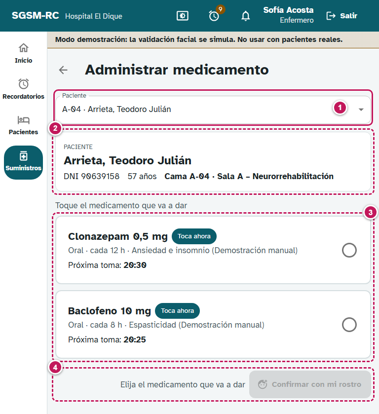

**En la imagen:**

- ① **Paciente**: en la lista están solo los pacientes internados.
- ② **Identificación del paciente**: nombre, DNI, edad, cama y sala.
- ③ **Prescripciones vigentes**: cada una con el medicamento y la dosis, cómo va la toma (**Toca ahora**, **Faltan 2 h**, **Atrasada 10 min** o **Ya se dio a las 14:05**), la línea gris (vía, cada cuántas horas y las indicaciones del médico) y la **Próxima toma**.
- ④ **Confirmar con mi rostro** está gris hasta que elige un medicamento. Al lado dice por qué: «Elija el medicamento que va a dar».

Si el paciente no tiene ninguna, dice «El paciente no tiene prescripciones vigentes. Los insumos no medicinales se registran desde Registrar insumos.»

### Revisar y confirmar con su rostro

Con el medicamento elegido, abajo aparecen la cantidad y el resumen. Recuerde [el orden](#el-orden-correcto): **estos pasos se hacen después de dar el medicamento**, al lado de la cama.

1. Vuelva a leer la línea gris de la prescripción elegida (las indicaciones del médico).
2. Revise la **Cantidad**: viene con la dosis prescripta. Cámbiela solo si corresponde. Para los decimales use la coma o el punto del teclado, la que tenga (0,5 o 0.5): las dos sirven y en la pantalla se ve 0,5.
3. Si hace falta, escriba una nota en **Observaciones** (por ejemplo, la hora real si la está registrando tarde).
4. Lea el recuadro **Revise antes de confirmar**, renglón por renglón. Fíjese sobre todo en **Dar**: si la cantidad no es la prescripta (por ejemplo, escribió 5 en lugar de 0,5), aparece un aviso amarillo y **Dar** dice «Distinta de la prescripta».
5. Toque **Confirmar con mi rostro**.
6. Mire a la cámara de la tablet.

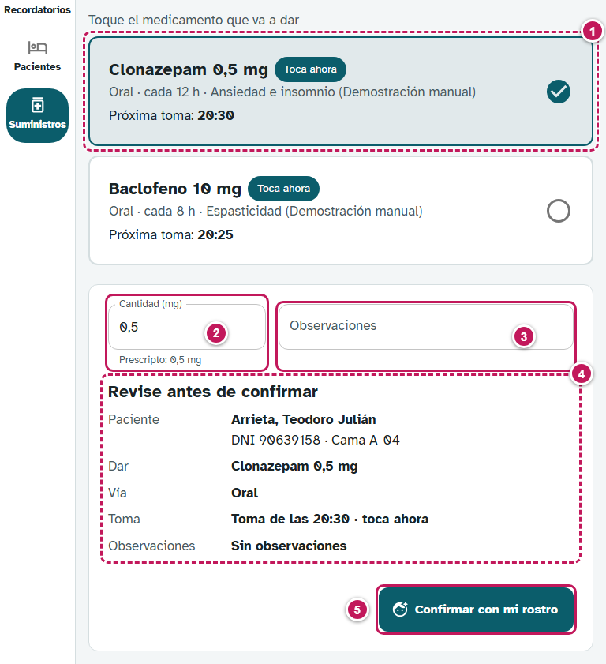

**En la imagen:**

- ① **El medicamento elegido**, con la tilde. Para cambiarlo, toque otro.
- ② **Cantidad (mg)**: la unidad es la de la prescripción. Debajo dice la dosis indicada («Prescripto: 0,5 mg»).
- ③ **Observaciones**: opcional.
- ④ **Revise antes de confirmar**: **Paciente** (con DNI y cama), **Dar** (medicamento y cantidad), **Vía**, **Toma** (de qué hora y si toca ahora) y **Observaciones**.
- ⑤ **Confirmar con mi rostro**.

Se abre la ventana **Confirmar con su rostro**:

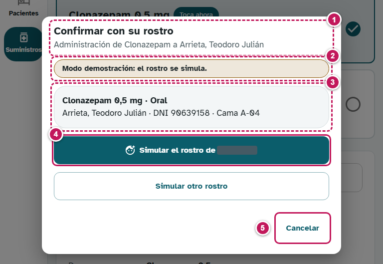

**En la imagen:**

- ① **Qué se va a registrar**: «Administración de Clonazepam a Arrieta, Teodoro Julián».
- ② «Modo demostración: el rostro se simula.»: aparece solo en el equipo de prueba.
- ③ **El detalle**: medicamento, dosis y vía, y el paciente con DNI y cama. Léalo otra vez.
- ④ **En la tablet del hospital, acá se ve la cámara.** En el equipo de prueba, en su lugar están los botones «Simular el rostro de …» y «Simular otro rostro» (ver [Sobre las imágenes](#sobre-las-imágenes)).
- ⑤ **Cancelar**: vuelve atrás sin registrar nada.

Con la cámara:

- Ponga la tablet frente a su cara. La pantalla dice «Mire a la cámara, con buena luz y el rostro descubierto.»
- No hace falta tocar nada. Cuando la reconoce dice «Rostro capturado.» y después «Verificando…».
- Si dice «Hay más de un rostro: quede solo usted frente a la tablet.», que nadie más quede en la imagen, tampoco el paciente.
- Si el paciente está en aislamiento y no puede sacarse el barbijo ahí, ver [esta pregunta](#el-paciente-está-en-aislamiento-tengo-que-sacarme-el-barbijo-para-confirmar).

**Cuando sale bien**, arriba aparece **Administración registrada**: «Se registró Clonazepam 0,5 mg a Arrieta, Teodoro Julián (cama A-04) a las 20:31.» Esa hora es la del momento en que confirmó. Si vino desde un recordatorio, toque **Volver a Recordatorios** para seguir con el próximo. **Ir a la ficha** abre la ficha del paciente. La toma sale de Recordatorios y la prescripción pasa a decir «Ya se dio a las 20:31».

Lo que confirma con su rostro queda **a su nombre**. Si se equivocó, ver [Corregir algo que cargó mal](#corregir-algo-que-cargó-mal).

### Avisos antes de confirmar

El sistema avisa, pero la decisión clínica es suya. Estos avisos aparecen apenas elige el medicamento: por eso conviene abrir la pantalla **antes de preparar** ([el orden correcto](#el-orden-correcto)).

| Aviso                                                                                           | Qué hacer                                                                                                                                                                                                                                        |
| ----------------------------------------------------------------------------------------------- | ------------------------------------------------------------------------------------------------------------------------------------------------------------------------------------------------------------------------------------------------ |
| «La cantidad 1 mg es distinta de la dosis prescripta (0,5 mg). Verifique antes de confirmar.»   | Revise la cantidad. Si es la que corresponde dar, puede confirmar igual. En el resumen, **Dar** dice «Distinta de la prescripta (0,5 mg)».                                                                                                       |
| «Faltan 2 h para la toma de las 08:00. Verifique que corresponda adelantarla.»                  | Esa toma todavía no toca. Confirme solo si corresponde adelantarla. Si está registrando tarde una toma que ya dio, ver [Si no puede registrar](#si-no-puede-registrar), paso 4.                                                                  |
| «Esta toma ya se dio a las 20:31 (Acosta, Sofía). Revise el historial antes de registrar otra.» | Alguien ya la registró. **No la dé.** Revise el historial del paciente. **Confirmar con mi rostro** queda gris hasta que marque **Corresponde dar otra toma (por ejemplo, por indicación médica)**. Márquela solo si de verdad corresponde otra. |

### Si el sistema no reconoce su rostro

| Lo que ve                                                                                                                  | Qué hacer                                                                                                                                                                                                                                                                                                  |
| -------------------------------------------------------------------------------------------------------------------------- | ---------------------------------------------------------------------------------------------------------------------------------------------------------------------------------------------------------------------------------------------------------------------------------------------------------- |
| «No se reconoció su rostro. Le quedan 2 intentos.»                                                                         | Busque buena luz, despeje la cara (barbijo, antiparras, pelo) y toque **Intentar de nuevo**.                                                                                                                                                                                                               |
| «Se canceló la operación por tres validaciones fallidas. Quedó registrado y se avisó al administrador.»                    | **Lo que quedó registrado son los intentos fallidos, NO la administración. La toma sigue sin registrar.** Toque **Entendido** y vuelva a cargarla desde el principio: tiene tres intentos nuevos. Si sigue sin reconocerla, llame al administrador y siga [Si no puede registrar](#si-no-puede-registrar). |
| «Usted no tiene el rostro registrado, así que no puede confirmar esta operación. Pídale al administrador que lo registre.» | Llame al administrador. Hasta entonces no puede confirmar registros: siga [Si no puede registrar](#si-no-puede-registrar).                                                                                                                                                                                 |
| «No se pudo encender la cámara…» con el botón **Reintentar**                                                               | Toque **Reintentar**. Si sigue igual, avise al área de sistemas (puede faltar un permiso de la tablet) y siga [Si no puede registrar](#si-no-puede-registrar).                                                                                                                                             |
| «No se pudo verificar: revise la conexión.»                                                                                | Revise que la tablet tenga el Wi-Fi prendido y toque **Intentar de nuevo**.                                                                                                                                                                                                                                |

### Si aparece «No se sabe si quedó registrada»

Pasa cuando se corta la red justo al confirmar: el registro pudo quedar guardado o no.

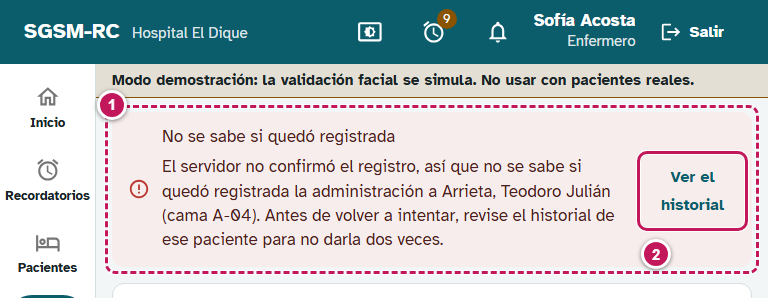

**En la imagen:**

- ① **El aviso**: «El servidor no confirmó el registro, así que no se sabe si quedó registrada la administración a Arrieta, Teodoro Julián (cama A-04). Antes de volver a intentar, revise el historial de ese paciente para no darla dos veces.»
- ② **Ver el historial**: abre la ficha del paciente en la pestaña **Historial**.

Qué hacer:

1. **No la registre de nuevo todavía.**
2. Toque **Ver el historial**.
3. Toque la solapa **Suministros** que está debajo de las fechas **Desde** y **Hasta** (no la opción **Suministros** del menú de la izquierda). Ver la [imagen del historial](#el-historial).
4. Busque un renglón de ese medicamento, a esa hora, registrado por usted.
5. Si está, quedó registrada: no haga nada más.
6. Si no está, vuelva a **Administrar medicamento** y regístrela otra vez.

Si al registrarla otra vez aparece «Esta toma ya se dio a las…», es que sí había quedado guardada: no la registre de nuevo.

### Cuando una toma no se da: No se administró

Para dejar registrado que una toma no se dio y por qué (ayuno, rechazo, el paciente no estaba…), así no queda como olvidada. Se hace desde la tarjeta del recordatorio, o sea, desde 30 minutos antes de la toma y hasta 12 horas después de que venció.

1. En **Recordatorios**, toque **No se administró** en la tarjeta de la toma.
2. Lea qué toma y de qué paciente es.
3. Escriba el motivo en **Por qué no se administró**.
4. Toque **Registrar**.

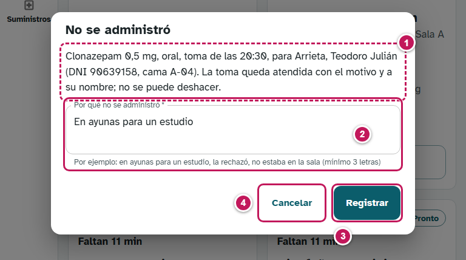

**En la imagen:**

- ① **Qué toma y de quién**: medicamento, dosis, vía, hora y paciente con DNI y cama. Termina diciendo: «La toma queda atendida con el motivo y a su nombre; no se puede deshacer.»
- ② **Por qué no se administró**: obligatorio, al menos 3 letras. Debajo hay ejemplos: «en ayunas para un estudio, la rechazó, no estaba en la sala».
- ③ **Registrar**.
- ④ **Cancelar**: cierra sin registrar nada.

No pide el rostro. **Cuando sale bien**, la tarjeta sale de la lista y arriba dice «Se registró que no se administró Clonazepam a Arrieta, Teodoro Julián».

El sistema **no le avisa al médico**: si la toma que no se dio es importante para el paciente, avísele usted. Tampoco se ve en las prescripciones ni en **Suministros**: queda en el historial del paciente, en **Modificaciones** ([cómo encontrarlo](#el-historial)). Si es importante, dígalo también en el pase de turno.

| Aviso                                                                               | Qué pasó                                                                                         |
| ----------------------------------------------------------------------------------- | ------------------------------------------------------------------------------------------------ |
| «Ya estaba atendido (por usted o por otra persona). Revise el historial.»           | Otra persona (o usted desde otra tablet) ya la atendió. Revise el historial antes de hacer nada. |
| «Ese recordatorio se canceló: la prescripción cambió o el paciente se fue de alta.» | Esa toma ya no corresponde. No hay que hacer nada con ella.                                      |

---

## Registrar insumos

Para anotar los insumos (material no medicinal: pañales, gasas, guantes, sondas…) que usó con un paciente. Los medicamentos van por [Administrar](#administrar-un-medicamento).

1. Toque **Registrar insumos** en la pantalla de Inicio (o en la ficha del paciente).
2. En **Paciente**, elija al paciente y compare la identificación con el paciente que tiene delante.
3. Toque cada insumo que usó. **Cada toque suma UNA unidad: un pañal, una gasa, un par de guantes.** Lo que dice debajo del nombre («Caja x 50», «Paquete x 10») es cómo viene el envase, no lo que se registra.
4. Revise la lista **Insumos a registrar** y ajuste las cantidades.
5. Toque **Confirmar con mi rostro** y mire a la cámara.

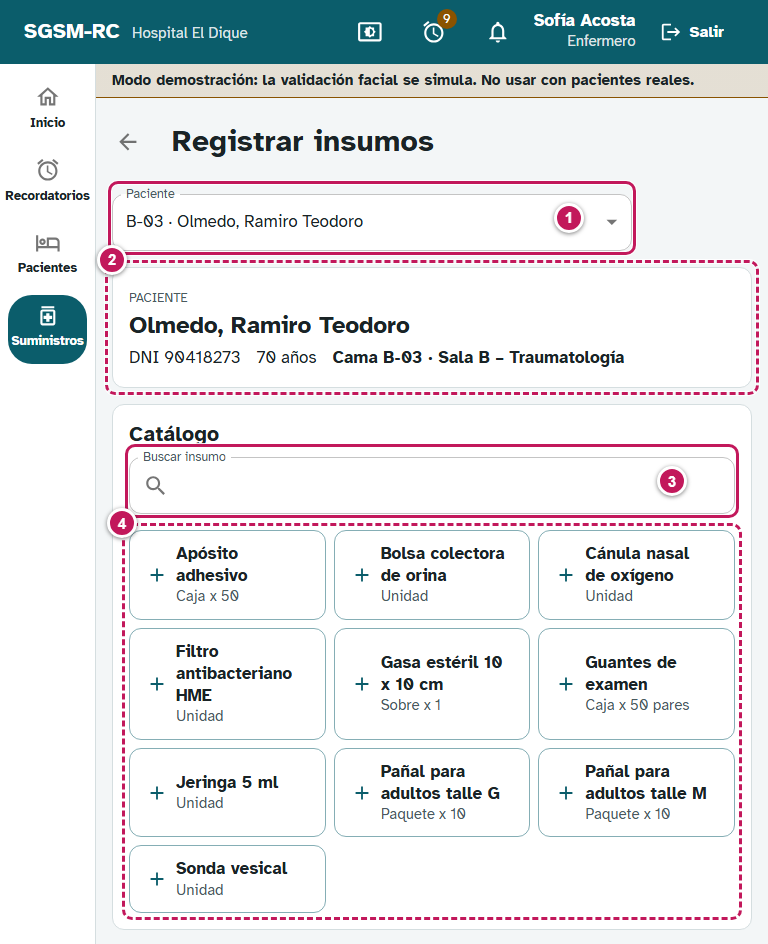

**En la imagen:**

- ① **Paciente**.
- ② **Identificación del paciente**: nombre, DNI, edad, cama y sala.
- ③ **Buscar insumo**: escriba parte del nombre (por ejemplo, «pañal») para achicar la lista.
- ④ **Catálogo**: cada botón es un insumo, con su envase debajo («Caja x 50», «Paquete x 10»). Cada toque suma una unidad, no una caja ni un paquete.

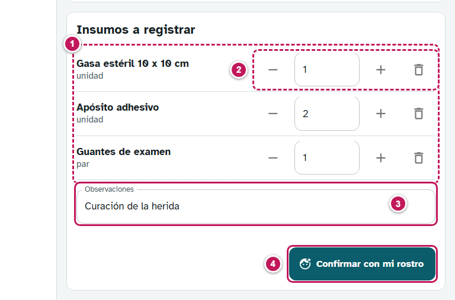

**En la imagen:**

- ① **Insumos a registrar**: lo que tocó, cada uno con su cantidad. Debajo del nombre dice en qué se cuenta: «unidad» (un pañal, una gasa) o «par» (un par de guantes).
- ② **La cantidad**: **−** resta uno y **+** suma uno; también puede escribir el número. El tacho quita el insumo de la lista.
- ③ **Observaciones**: opcional (en la imagen, «Curación de la herida»).
- ④ **Confirmar con mi rostro**: se puede tocar cuando hay al menos un insumo con cantidad 1 o más.

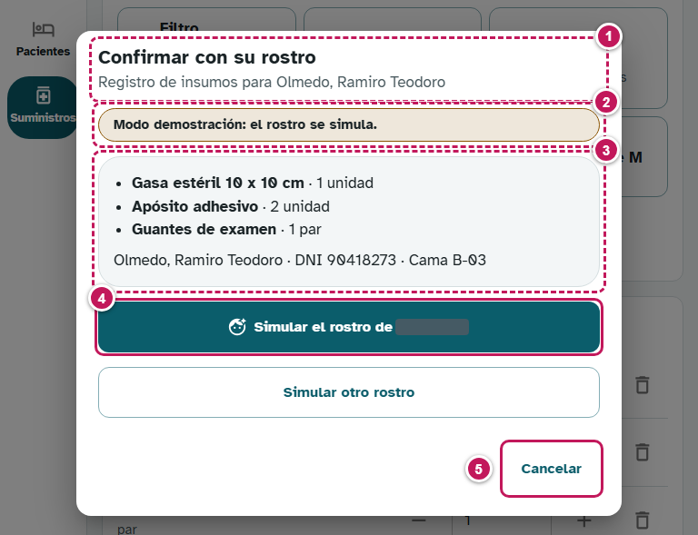

**En la imagen:**

- ① **Qué se va a registrar**: «Registro de insumos para Olmedo, Ramiro Teodoro».
- ② «Modo demostración: el rostro se simula.»: solo en el equipo de prueba.
- ③ **El detalle**: cada insumo con su cantidad, y el paciente con DNI y cama.
- ④ **En la tablet del hospital, acá se ve la cámara.**
- ⑤ **Cancelar**: vuelve sin registrar.

**Cuando sale bien** dice «Se registraron 3 insumos para Olmedo, Ramiro Teodoro.» y la lista queda vacía para el próximo registro.

> **El paciente queda elegido.** Si pasa a la cama de al lado y sigue tocando insumos, se los carga al paciente anterior. Antes de cada registro, cambie el **Paciente** y revise que la identificación sea la del paciente que tiene delante.

| Aviso                                                                                                  | Qué hacer                                                                                                                                                                      |
| ------------------------------------------------------------------------------------------------------ | ------------------------------------------------------------------------------------------------------------------------------------------------------------------------------ |
| «Ningún insumo coincide con “…”. Revise el nombre o pida al administrador que lo agregue al catálogo.» | Pruebe con otra palabra. Si de verdad no está, avise al administrador.                                                                                                         |
| «Ingrese una cantidad de 1 o más»                                                                      | Una cantidad quedó vacía o en 0. Corríjala o quite ese insumo.                                                                                                                 |
| «No hay conexión con el servidor. Revise el Wi-Fi e intente de nuevo.»                                 | Antes de repetir, revise si quedó registrado: en la ficha del paciente, pestaña **Historial**, solapa **Suministros** (debajo de las fechas). Si no está, regístrelo de nuevo. |

---

## Buscar un paciente y ver su ficha

Para encontrar a un paciente y ver qué tiene indicado, sus alergias, qué se le dio y quién lo dio.

### Buscar un paciente

1. Toque **Buscar paciente** en la pantalla de Inicio, o **Pacientes** en el menú.
2. Escriba parte del apellido o del nombre, el comienzo del DNI o la cama (por ejemplo, «olmedo», «9041» o «B-03»). No importan las mayúsculas ni las tildes. La lista se filtra mientras escribe.
3. Toque la fila del paciente.

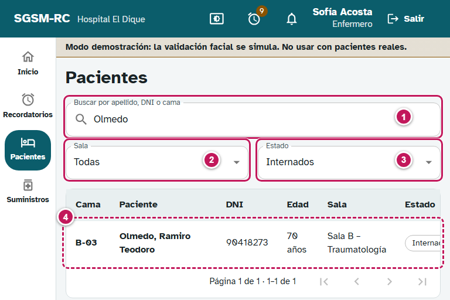

**En la imagen:**

- ① **Buscar por apellido, DNI o cama**.
- ② **Sala**: solo los pacientes de una sala. Por defecto, **Todas**.
- ③ **Estado**: **Internados** (por defecto), **Egresados** o **Todos**. A un paciente que se fue de alta lo encuentra con **Todos** o **Egresados**.
- ④ **La fila del paciente**: cama, nombre, DNI, edad, sala y estado. Tóquela para abrir la ficha.

Si la tabla no entra en la pantalla, deslícela de costado para ver la última columna. Si no aparece nadie, la pantalla dice por qué y qué probar (por ejemplo, «Pruebe con otro apellido, DNI o cama, o cambie Estado a Todos.»), con el botón **Quitar filtros**.

### La ficha: prescripciones y próxima toma

Para ver qué tiene indicado el paciente y cuándo le toca. La ficha se abre en la pestaña **Prescripciones**.

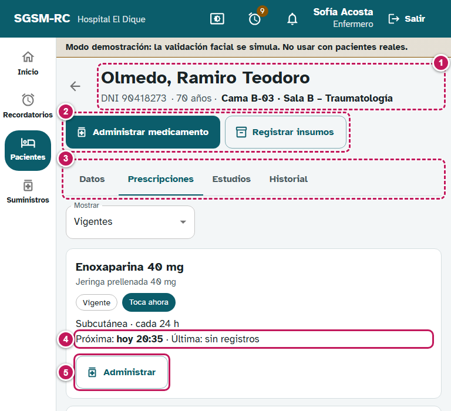

**En la imagen:**

- ① **Identificación**: nombre, DNI, edad, cama y sala. Está siempre arriba.
- ② **Administrar medicamento** y **Registrar insumos**: abren esas pantallas con este paciente ya elegido.
- ③ **Pestañas**: **Datos** (datos personales, diagnóstico, contacto y observaciones, donde el médico anota, por ejemplo, alergias), **Prescripciones**, **Estudios** e **Historial**.
- ④ **Próxima** toma («hoy 20:35») y **Última** administración, con fecha, hora y quién la registró. Dice «sin registros» si todavía no se dio ninguna.
- ⑤ **Administrar**: abre Administrar medicamento con esta prescripción ya elegida.

Cada tarjeta muestra el medicamento con su dosis y presentación («Enoxaparina 40 mg», «Jeringa prellenada 40 mg»), el estado (**Vigente**), cómo va la toma (**Toca ahora**), la vía y la frecuencia («Subcutánea · cada 24 h»). Tocando la tarjeta se ve el detalle. **Mostrar** cambia entre **Vigentes** (por defecto) y **Todas**.

### Datos: las alergias

El sistema no tiene un lugar propio para las alergias ni las muestra al administrar: si el médico las anotó, están en la pestaña **Datos**, en **Observaciones**. **Mírelas antes de abrir Administrar medicamento**, sobre todo con un paciente que no conoce.

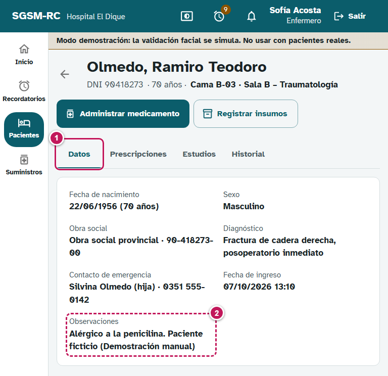

**En la imagen:**

- ① **Datos**: la pestaña con los datos del paciente.
- ② **Observaciones**: al final de la lista. En la imagen, «Alérgico a la penicilina.» (un ejemplo). Si dice «—», el médico no anotó nada; eso no quiere decir que no tenga alergias.

Si ya está en **Administrar medicamento** y quiere mirarlas: mientras no haya escrito nada (ni cambiado la cantidad ni escrito observaciones), puede salir a mirar la ficha y volver a abrir **Administrar** sin perder nada; solo tiene que elegir otra vez el medicamento. Si ya escribió algo, al salir aparece «¿Descartar lo cargado?»: toque **Seguir editando** para quedarse, o **Descartar** y vuelva a cargarlo después de mirar.

### El historial

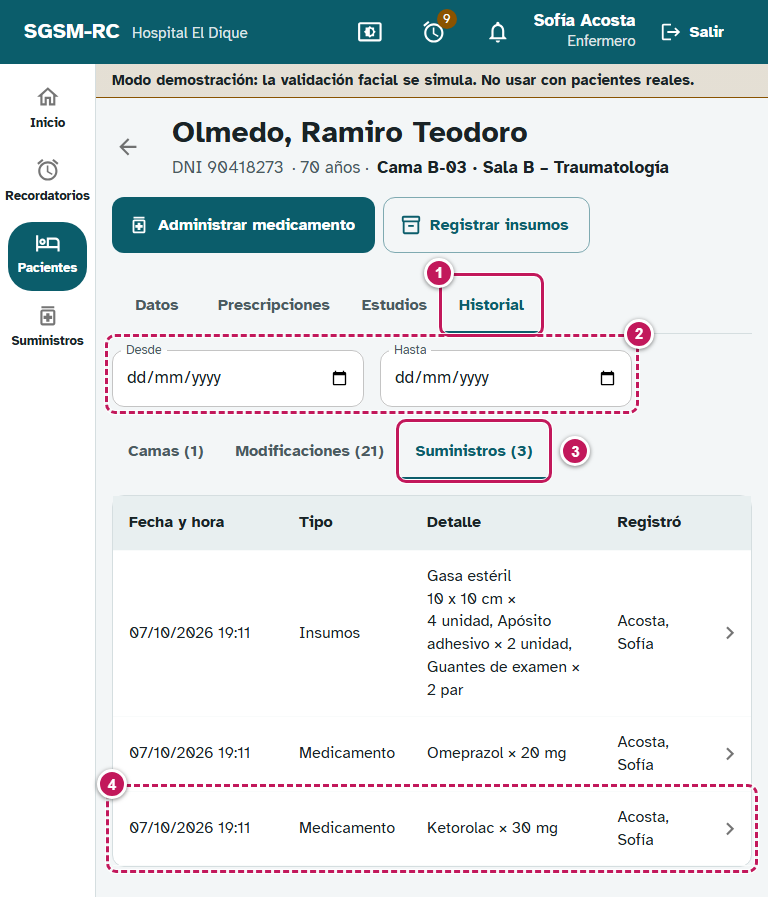

**En la imagen:**

- ① **Historial**.
- ② **Desde** y **Hasta**: para ver un período. Vacías, se ve todo.
- ③ **Suministros**: la solapa con los medicamentos dados y los insumos registrados; entre paréntesis, cuántos hay. Las otras dos son **Camas** y **Modificaciones**. Ojo: es la solapa de acá, debajo de las fechas, no la opción **Suministros** del menú.
- ④ **Un registro**: fecha y hora, tipo (**Medicamento** o **Insumos**), detalle («Ketorolac × 30 mg») y quién lo registró. Tóquelo para abrirlo.

**Dónde se ve un «No se administró».** No está en **Suministros** (ahí solo están los medicamentos que sí se dieron) ni en las prescripciones. Está en la solapa **Modificaciones**, que muestra todo lo que cambió en la ficha, con palabras técnicas del sistema. Lo más nuevo está arriba.

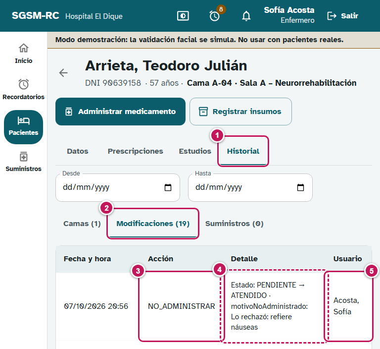

**En la imagen:**

- ① **Historial**.
- ② **Modificaciones**: la solapa, debajo de las fechas.
- ③ **Acción**: un «No se administró» dice **NO_ADMINISTRAR**, así, en mayúsculas.
- ④ **Detalle**: el motivo está después de «motivoNoAdministrado:» (en la imagen, «Lo rechazó: refiere náuseas»).
- ⑤ **Usuario**: quién lo registró.

Para encontrarlo rápido, ponga en **Desde** y **Hasta** la fecha de ese día y busque **NO_ADMINISTRAR** en la columna **Acción**. Los renglones que dicen «GENERAR» o «VENCER», con el usuario «Sistema», son los recordatorios que el sistema creó o que vencieron sin atender.

### Corregir algo que cargó mal

Para arreglar una cantidad mal cargada. Se puede **dentro de las 24 horas** del registro, con el motivo y su rostro.

- En una administración se corrige **solo la cantidad** (por ejemplo, si dio la mitad). No se puede poner 0 ni anular el registro.
- En un registro de insumos se corrigen las cantidades o se quita un insumo.
- Si se equivocó de paciente o de medicamento, **no use Corregir**: vea [más abajo](#si-lo-registró-en-el-paciente-o-el-medicamento-equivocado).

1. En la ficha del paciente, toque la pestaña **Historial** y después la solapa **Suministros**, debajo de las fechas. (También puede usar la opción **Suministros** del menú, que muestra los registros de todos los pacientes.)
2. Toque el registro.
3. Toque **Corregir**.
4. Escriba la cantidad correcta.
5. Escriba el motivo.
6. Toque **Confirmar corrección con mi rostro** y mire a la cámara.

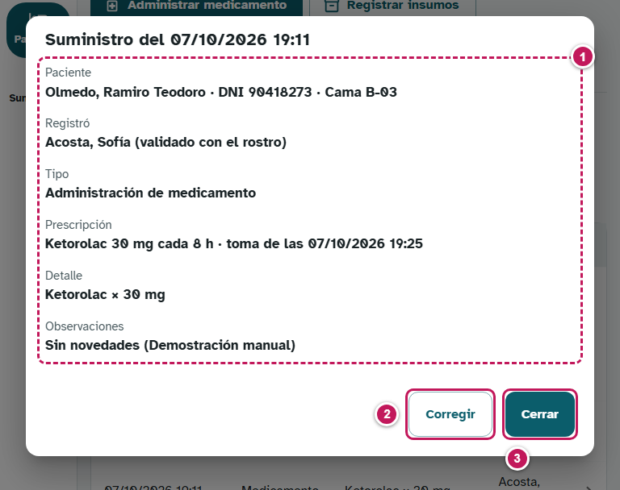

**En la imagen:**

- ① **Los datos del registro**: paciente con DNI y cama, quién lo registró («Acosta, Sofía (validado con el rostro)»), tipo, prescripción con su toma, detalle y observaciones.
- ② **Corregir**: aparece solo dentro de las 24 horas del registro.
- ③ **Cerrar**.

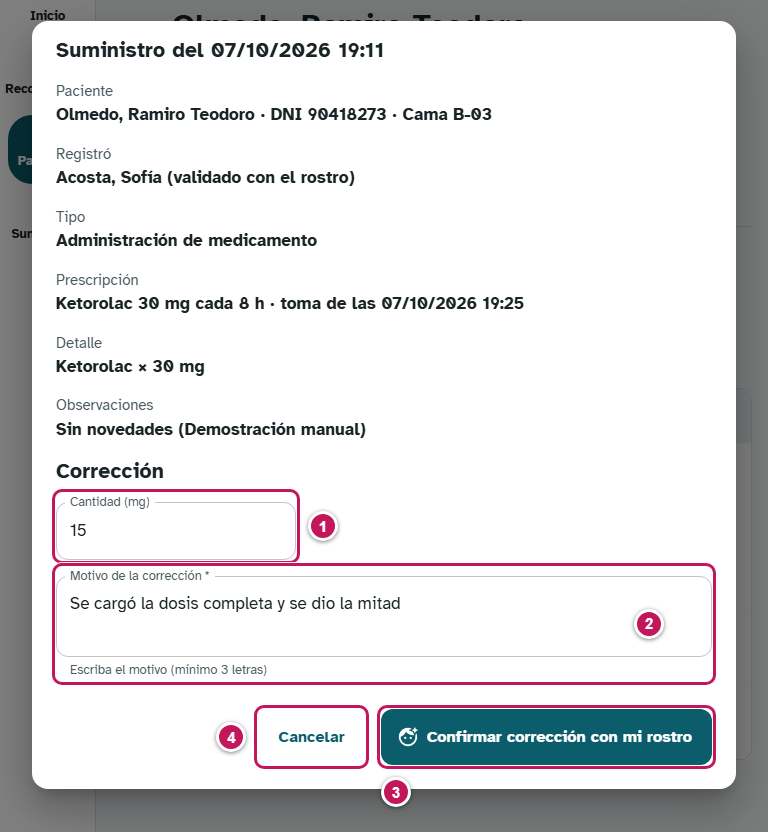

**En la imagen:**

- ① **Cantidad (mg)**: la cantidad correcta. En la imagen, 15 en lugar de 30.
- ② **Motivo de la corrección**: obligatorio, al menos 3 letras («Se cargó la dosis completa y se dio la mitad»).
- ③ **Confirmar corrección con mi rostro**: gris hasta que estén la cantidad y el motivo. Al lado dice qué falta («Falta indicar el motivo (mínimo 3 letras).»).
- ④ **Cancelar**: deja el registro como estaba.

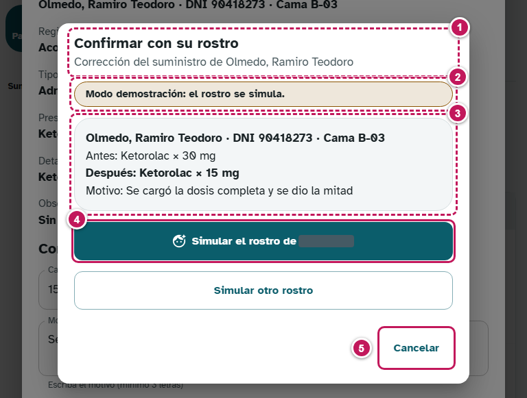

**En la imagen:**

- ① **Qué se va a registrar**: «Corrección del suministro de Olmedo, Ramiro Teodoro».
- ② «Modo demostración: el rostro se simula.»: solo en el equipo de prueba.
- ③ **La corrección**: paciente con DNI y cama, **Antes** («Ketorolac × 30 mg»), **Después** («Ketorolac × 15 mg») y **Motivo**.
- ④ **En la tablet del hospital, acá se ve la cámara.**
- ⑤ **Cancelar**.

**Cuando sale bien**, el registro muestra arriba «Corregido por Acosta, Sofía el 07/10/2026 20:40. Motivo: …». Nada se borra: queda quién lo cargó, quién lo corrigió, qué había antes y por qué.

Pasadas las 24 horas, **Corregir** no aparece y el registro dice «El plazo de corrección venció (24 h desde el registro). Si hay un error, pídale la corrección al administrador.» Avísele al administrador. Un **No se administró** no se corrige ni se deshace.

#### Si lo registró en el paciente o el medicamento equivocado

El registro equivocado **no se puede borrar ni anular desde la tablet**. Salvo que el hospital indique otra cosa, haga esto en el momento:

1. **Registre lo que de verdad dio**, en el paciente correcto y con el medicamento correcto, como siempre ([Administrar un medicamento](#administrar-un-medicamento)). En **Observaciones** escriba qué pasó, por ejemplo: «Primero se registró por error a Olmedo, cama B-03». No tenga miedo de duplicarla: es un registro distinto, en otro paciente o de otro medicamento.
2. **Avise enseguida** a su supervisora, al administrador y al médico, con los dos pacientes (o los dos medicamentos), la hora y qué se registró mal.
3. **Cuidado con la toma que registró por error** (la del otro paciente, o la del otro medicamento): **salió de Recordatorios y figura como dada, pero no se dio**, así que la tablet no va a avisar. Si le corresponde, hay que dársela igual. Al abrir **Administrar** va a decir «Esta toma ya se dio…»: marque **Corresponde dar otra toma** y explique en **Observaciones** («La anterior se registró por error; no se había dado»).
4. **Dígalo en el pase de turno**, para que el relevo no se guíe solo por la tablet.

### Confirmar que se realizó un estudio

Para dejar registrado, con su rostro, que un estudio programado (laboratorio, radiografía…) se hizo.

1. En la ficha del paciente, toque la pestaña **Estudios**. (O, en **Recordatorios**, toque **Confirmar que se realizó** en la tarjeta del estudio.)
2. Busque el estudio en **Programados**.
3. Toque **Confirmar que se realizó**.
4. Revise el resumen y, si quiere, escriba una observación.
5. Toque **Confirmar con mi rostro** y mire a la cámara.

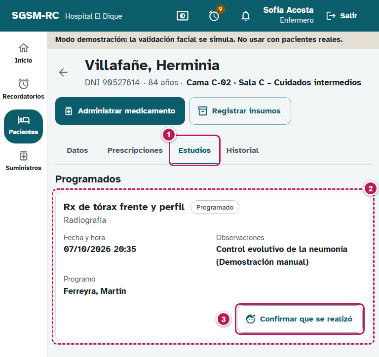

**En la imagen:**

- ① **Estudios**: la pestaña.
- ② **El estudio programado**: nombre y tipo («Rx de tórax frente y perfil», «Radiografía»), **Fecha y hora**, **Observaciones** del médico y quién lo programó.
- ③ **Confirmar que se realizó**.

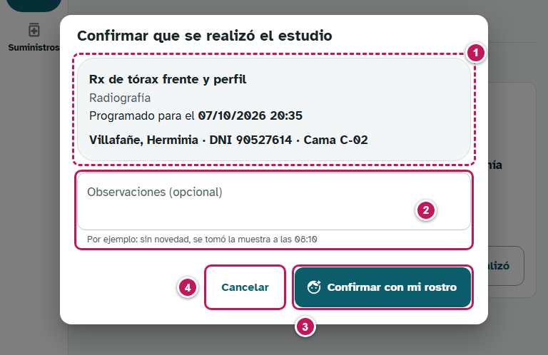

**En la imagen:**

- ① **Qué se confirma**: estudio, tipo, fecha y hora programada, y el paciente con DNI y cama.
- ② **Observaciones (opcional)**: por ejemplo, «sin novedad, se tomó la muestra a las 08:10».
- ③ **Confirmar con mi rostro**.
- ④ **Cancelar**.

**Cuando sale bien** dice «Se confirmó que se realizó Rx de tórax frente y perfil a Villafañe, Herminia (…)», con la fecha y la hora, y el estudio pasa a **Realizados y cancelados** con el estado **Realizado**.

**Si el estudio no se pudo hacer, no lo confirme:** avise al médico para que lo reprograme o lo cancele. Usted no puede sacar la tarjeta de la lista. Hasta que el médico lo haga, la tarjeta sigue en **Recordatorios**: pasa a **Vencido** y queda hasta 12 horas, y mientras esté atrasada la tablet vuelve a sonar cada 5 minutos. En cuanto el médico lo reprograma o lo cancela, la tarjeta sale de la lista y deja de sonar.

Si aparece «Este estudio ya estaba confirmado o cancelado (por usted o por otra persona).», no hay nada más que hacer.

---

## Si no puede registrar

Cuando el sistema no anda, no hay conexión, la cámara no enciende, el rostro no la reconoce o su cuenta está bloqueada, **la atención del paciente no espera al sistema**. Pero lo que hizo tiene que quedar escrito en algún lado, para que nadie lo repita. Salvo que el hospital indique otra cosa:

1. **Anótelo en papel**, en la planilla de contingencia del servicio: paciente y cama, medicamento, dosis y vía, **la hora real** en que lo dio y su nombre. Lo mismo para una toma que no se dio (con el motivo), los insumos o un estudio.
2. **Avise a su supervisora** y a quien corresponda según el problema ([A quién llamar](#a-quién-llamar)).
3. **Avise al relevo, de palabra y por escrito en el pase de turno, qué tomas ya dio aunque la tablet las muestre pendientes o Vencidas.** La tablet no sabe lo que se anotó en papel: la compañera del turno siguiente las va a ver en la lista y las podría volver a dar.
4. **Cuando el sistema vuelva a andar, regístrelo usted lo antes posible:**
   - Si la tarjeta de esa toma sigue en **Recordatorios**, tóquele **Administrar**: la pantalla muestra esa toma, con la hora que tenía.
   - Si no está, use **Administrar medicamento**. Puede aparecer «Faltan … para la toma de las … Verifique que corresponda adelantarla»: es por el retraso.
   - En **Observaciones** escriba la hora real: «Dada a las 03:10; registro tardío por falla del sistema». La hora que guarda el sistema es la del registro.
5. **Si ya pasó más de la mitad del tiempo entre una toma y la siguiente** (más de 4 horas en un medicamento cada 8 h, más de 3 horas en uno cada 6 h, más de 6 horas en uno cada 12 h), **no la registre**: el sistema la contaría como la toma siguiente, y esa toma ya no le avisaría. Déjela en el papel y avise al administrador y a su supervisora.

---

## Si algo no funciona

| Lo que ve                                                                                                    | Qué pasó y qué hacer                                                                                                                                                                                                                                                                |
| ------------------------------------------------------------------------------------------------------------ | ----------------------------------------------------------------------------------------------------------------------------------------------------------------------------------------------------------------------------------------------------------------------------------- |
| «No hay conexión con el servidor. Revise el Wi-Fi e intente de nuevo.»                                       | La tablet perdió la red del hospital. Revise que tenga el Wi-Fi prendido. **Antes de repetir un registro, fíjese en el historial del paciente si quedó guardado.** Si no vuelve, siga [Si no puede registrar](#si-no-puede-registrar).                                              |
| «No se pudo cargar …» con el botón **Reintentar**                                                            | La información no llegó. **No quiere decir que no haya datos**: toque **Reintentar**.                                                                                                                                                                                               |
| «El servidor tuvo un problema…» u «Ocurrió un problema inesperado…»                                          | Una falla del sistema. Revise si lo último quedó guardado e intente de nuevo en unos minutos. Si se repite, llame al área de sistemas y siga [Si no puede registrar](#si-no-puede-registrar).                                                                                       |
| «El paciente no está internado»                                                                              | Le dieron el alta mientras usted cargaba: ya no se le puede registrar nada. Para encontrarlo, en **Pacientes** cambie **Estado** a **Todos**. Si ya le dio el medicamento, anótelo en papel ([Si no puede registrar](#si-no-puede-registrar)) y avise al médico y al administrador. |
| «No se puede registrar el medicamento: la prescripción está suspendida» (o «finalizada», «ya terminó»)       | El médico cambió la indicación mientras usted cargaba. Vuelva a abrir **Administrar medicamento**. Si falta lo que tiene que dar, consulte al médico. Si ya la dio, anótelo en papel y avísele.                                                                                     |
| «¿Descartar lo cargado?»                                                                                     | Quiso salir de una pantalla con datos sin confirmar. **Seguir editando** vuelve a la pantalla; **Descartar** sale y lo cargado se pierde.                                                                                                                                           |
| «La sesión alcanzó su duración máxima. Vuelva a ingresar.» o «La sesión ya no es válida. Vuelva a ingresar.» | Ingrese de nuevo con su usuario y su contraseña.                                                                                                                                                                                                                                    |
| La tablet no suena                                                                                           | Revise que **Sonido de avisos** esté prendido, que el volumen esté alto y que haya tocado una parte vacía de la pantalla después de ingresar. El texto y el número aparecen igual.                                                                                                  |

---

## Preguntas frecuentes

### ¿Por qué se cerró la sesión? ¿Me avisa igual de las tomas?

Se cierra sola si nadie toca la pantalla un rato (en general, 15 minutos); un minuto antes aparece **¿Sigue ahí?**, que no suena. Con la sesión cerrada, con la tablet bloqueada o con el sistema cerrado, **no avisa nada**. Al volver a la tablet, ingrese y mire la lista de Recordatorios.

### ¿Primero doy el medicamento o primero confirmo?

Primero lo da y enseguida confirma, al lado de la cama. Pero abra la pantalla **antes de preparar**, para ver si alguien ya la dio. Ver [El orden correcto](#el-orden-correcto).

### Confirmé, pero el paciente no la tomó o la vomitó. ¿Qué hago?

El registro no se puede deshacer ni pasar a «No se administró».

- **Si tomó una parte**: corrija la cantidad con lo que de verdad tomó, dentro de las 24 horas ([Corregir](#corregir-algo-que-cargó-mal)), con el motivo («Tomó la mitad, rechazó el resto»).
- **Si no tomó nada** (la rechazó después de que usted confirmó): avise a su supervisora, al administrador y al médico, y dígalo en el pase de turno. La toma figura como dada.
- **Si la vomitó**: estaba dada; avise al médico, que decide si se repite. Si indica repetirla, regístrela con **Administrar**: va a decir «Esta toma ya se dio…»; marque **Corresponde dar otra toma** y escriba en **Observaciones** «Se repite por vómito, indicación del Dr. …».

Para que no pase, confirme solo después de darla ([el orden correcto](#el-orden-correcto)).

### ¿Cómo registro una indicación «si dolor», una dosis única o algo que el médico indicó de palabra?

- **«Si dolor», «si fiebre», «a demanda» (SOS):** el sistema no las tiene. El médico no las puede cargar como tales, así que no aparecen en Recordatorios ni en Administrar medicamento y no se pueden registrar acá. Regístrelas como indique el hospital fuera del sistema (por ejemplo, en papel) y consulte a su supervisora. Si ve una prescripción con horario fijo que en la línea gris dice «si dolor» o «fiebre o dolor», el sistema la recuerda igual a cada hora indicada: consulte al médico cómo darla.
- **Dosis única:** el médico la carga como una prescripción con una sola toma. Aparece en **Administrar medicamento** y, desde 30 minutos antes de su hora, en Recordatorios. Regístrela apenas la da: si tarda, puede aparecer «No se puede registrar el medicamento: la prescripción ya terminó»; en ese caso, anótela en papel y avise al médico.
- **Indicación de palabra en una urgencia:** mientras el médico no la cargue, no hay dónde registrarla. Anote en papel la hora real, el medicamento, la dosis y la vía, y pídale al médico que la cargue. Cuando aparezca, regístrela y escriba en **Observaciones** la hora real y que fue por indicación verbal (tenga en cuenta el paso 5 de [Si no puede registrar](#si-no-puede-registrar)).

### El paciente está en aislamiento: ¿tengo que sacarme el barbijo para confirmar?

La cámara pide «el rostro descubierto» y con barbijo o antiparras puede no reconocerla. **No se saque el equipo al lado de la cama.** Abra la pantalla y lea los avisos antes de entrar; dé el medicamento; al salir, después de retirarse el equipo según la norma del hospital, confirme enseguida y escriba en **Observaciones** la hora real en que la dio. Tiene tres intentos; al tercero fallido se cancela (la toma sigue sin registrar) y se avisa al administrador.

### Me equivoqué en la cantidad. ¿Cómo lo arreglo?

Dentro de las 24 horas, ábralo en el historial del paciente y toque **Corregir** ([cómo](#corregir-algo-que-cargó-mal)). Después de 24 horas, avise al administrador.

### Lo registré en el paciente equivocado (o con otro medicamento).

No use Corregir. Registre lo que de verdad dio en el paciente correcto, avise y cuide la toma que quedó registrada por error: ver [Si lo registró en el paciente o el medicamento equivocado](#si-lo-registró-en-el-paciente-o-el-medicamento-equivocado).

### Registré «No se administró» por error.

No se puede deshacer. Si al final la dio, regístrela con **Administrar medicamento** como siempre y escriba en **Observaciones** la hora real. Avise al administrador del error.

### Encontré la tablet con la sesión de otra compañera abierta.

Toque **Salir** y entre con su usuario; nunca registre en la sesión de otra persona. Ver [Salir](#salir).

### ¿Por qué veo tomas de otras salas? ¿Suena por ellas?

La lista muestra todo el hospital hasta que elige su sala en **Sala** (la tablet la recuerda). **El sonido y el número del reloj, en cambio, cuentan siempre todo el hospital**: la tablet suena también por las tomas de otras salas. No apague el sonido por eso; si lo apaga, vuelva a prenderlo antes de entregar el turno ([Los avisos y el sonido](#los-avisos-y-el-sonido)).

### Se cortó el Wi-Fi justo cuando confirmé. ¿Quedó registrado?

No lo registre de nuevo enseguida. Revise el historial del paciente, como se explica en [No se sabe si quedó registrada](#si-aparece-no-se-sabe-si-quedó-registrada).

### Se cayó el sistema (o no me reconoce) y ya di el medicamento.

Anótelo en papel, avise a su supervisora y al relevo, y regístrelo cuando el sistema vuelva: [Si no puede registrar](#si-no-puede-registrar).

### Una toma quedó «Vencida». ¿La puedo dar igual?

Sí, si todavía no pasó la mitad del tiempo hasta la toma siguiente (por ejemplo, 4 horas en un medicamento cada 8 h). Toque **Administrar** en la tarjeta: queda registrada con la hora en que confirma; escriba en **Observaciones** la hora real si la dio antes. Pasado ese tiempo, consulte al médico antes de darla: está cerca de la siguiente, y el sistema la contaría como la toma siguiente. Si no la va a dar, registre **No se administró** con el motivo.

### ¿Qué pasa con una toma que nadie atendió?

Vence (en general, 30 minutos después de su hora), se le avisa al administrador y sigue en la lista hasta 12 horas. Después sale de la lista, pero queda registrada como vencida sin atender ([ver](#urgente-pronto-programada-y-vencida)).

### ¿Dónde veo si el paciente es alérgico?

En la ficha, pestaña **Datos**, en **Observaciones**, si el médico lo anotó ([cómo](#datos-las-alergias)). El sistema no controla alergias ni interacciones: ante cualquier duda, consulte al médico antes de dar.

---

## Glosario

| Palabra                                   | Qué significa en el sistema                                                                                                                                           |
| ----------------------------------------- | --------------------------------------------------------------------------------------------------------------------------------------------------------------------- |
| **Ingresar**                              | Entrar al sistema con su usuario y su contraseña. No confundir con internar a un paciente.                                                                            |
| **Sesión**                                | El tiempo que usted está adentro del sistema con su usuario, desde que toca **Ingresar** hasta que toca **Salir** o se cierra sola.                                   |
| **Servidor**                              | La computadora central donde se guarda todo lo que se registra. La tablet le manda los datos por el Wi-Fi.                                                            |
| **Enfermero**                             | El nombre del perfil de todo el personal de enfermería en el sistema. Define qué puede hacer.                                                                         |
| **Internar** / **Internado**              | Registrar el ingreso de un paciente al hospital con su cama. Solo se registra algo a pacientes internados.                                                            |
| **Dar de alta** / **Egresado**            | El paciente se fue del hospital: se libera la cama y se suspenden sus prescripciones.                                                                                 |
| **Prescripción**                          | Indicación médica de un medicamento: dosis, frecuencia y vía. Solo se administra sobre una prescripción **vigente**.                                                  |
| **Toma**                                  | Cada momento en que corresponde dar un medicamento según la prescripción.                                                                                             |
| **Administrar**                           | Dar un medicamento a un paciente y registrarlo con su rostro.                                                                                                         |
| **No se administró**                      | Registro de que una toma no se dio, con el motivo (ayuno, rechazo, estudio…). No se puede deshacer.                                                                   |
| **Insumo**                                | Material no medicinal: pañal, gasa, filtro, guantes…                                                                                                                  |
| **Suministro**                            | Registro de una administración o de los insumos usados con un paciente.                                                                                               |
| **Suministros** (menú)                    | La opción del menú, y la tarea **Ver lo que se registró** del Inicio: los registros de todos los pacientes. Administrar y Registrar insumos son parte de esta opción. |
| **Historial**                             | Pestaña de la ficha del paciente con tres solapas: **Camas**, **Modificaciones** y **Suministros** (los registros de ese paciente).                                   |
| **Modificaciones**                        | Solapa del historial con todo lo que cambió en la ficha, quién y cuándo. Ahí está un «No se administró» (NO_ADMINISTRAR).                                             |
| **Recordatorio**                          | Aviso de una toma o de un estudio que se acerca (30 minutos antes) o que está atrasado. La pantalla **Recordatorios** los muestra todos.                              |
| **Insignia de recordatorios**             | El reloj con un número, arriba: cuántos recordatorios hay para atender en todo el hospital.                                                                           |
| **Urgente** / **Pronto** / **Programada** | Cuánto falta para la toma: 5 minutos o menos (o atrasada), entre 5 y 15, o más de 15.                                                                                 |
| **Vencida**                               | Toma que nadie atendió (en general, 30 minutos después de su hora). Se avisa al administrador y todavía se puede atender, tarde.                                      |
| **Estudio**                               | Práctica programada a un paciente (laboratorio, radiografía…) que enfermería confirma con su rostro.                                                                  |
| **Confirmar con mi rostro**               | Validación facial de quien registra. Identifica a quien registra, no al paciente.                                                                                     |
