# Guía del médico

**SGSM-RC · Hospital Zonal Especializado en Rehabilitación "El Dique"**

Esta guía es para los médicos que internan pacientes, les indican la medicación y les programan estudios. Está pensada para leerla una vez y después volver a la sección que haga falta durante la recorrida. Cada tarea va paso a paso, con la pantalla tal como se ve en la tablet.

## Antes de empezar

**Qué necesita**

- **Una tablet o una PC del hospital**, conectada a la red del hospital (Wi-Fi). También se puede usar desde un teléfono: ver [En el teléfono](#en-el-teléfono).
- **Su usuario y su contraseña.** Se los entrega el administrador del sistema (ver [A quién llamar](#a-quién-llamar)). No los comparta: todo lo que haga queda registrado a su nombre.

No necesita tener su rostro registrado: **Confirmar con mi rostro** se pide al administrar un medicamento o al confirmar un estudio, que son tareas de enfermería.

**Qué puede hacer con el sistema**

Internar, trasladar y dar de alta pacientes; indicar, cambiar, suspender y finalizar prescripciones; programar, reprogramar y cancelar estudios; ver los recordatorios del hospital y consultar los reportes. **No** administra medicamentos ni atiende recordatorios: eso lo registra enfermería con su rostro.

**Lo que el sistema no hace** (léalo antes de la primera indicación)

- **No controla alergias, interacciones ni dosis máxima.** Lo único que avisa es si el paciente ya tiene vigente el mismo medicamento del catálogo ([aviso de duplicada](#aviso-de-posible-prescripción-duplicada)). No tiene un campo de alergias: anótelas en **Observaciones** de los datos del paciente (se ven en la pestaña **Datos** de la ficha, no al indicar ni al administrar).
- **No admite indicaciones «si dolor», «si fiebre» (SOS) ni infusiones continuas.** Ver [Indicaciones que no son cada tantas horas](#indicaciones-que-no-son-cada-tantas-horas).
- **No le hace el pedido al laboratorio, a imágenes ni al interconsultor**, y no muestra resultados. Ver [Estudios](#estudios).
- **No le avisa a usted** si una toma de su paciente no se dio. Ver [Ver si una toma no se dio](#ver-si-una-toma-no-se-dio).

### A quién llamar

Cuando esta guía dice «el administrador» o «el área de sistemas», es esto:

| Para…                                                                                                                                                 | A quién                                                    | Interno y horario                                                 |
| ----------------------------------------------------------------------------------------------------------------------------------------------------- | ---------------------------------------------------------- | ----------------------------------------------------------------- |
| Cuenta bloqueada, contraseña olvidada, falta un medicamento en el catálogo, cama fuera de servicio, paciente sin DNI, pedir un reporte en PDF o Excel | Administrador del sistema: _(a completar por el hospital)_ | _(interno y horario; a quién llamar de noche y el fin de semana)_ |
| El sistema no anda (no carga, da errores, no hay conexión en todo el sector)                                                                          | Área de sistemas: _(a completar por el hospital)_          | _(interno y horario; guardia fuera de horario)_                   |

**Sobre las capturas.** Todos los pacientes y datos que se ven en las imágenes son ficticios. La franja de arriba que dice «Modo demostración: la validación facial se simula. No usar con pacientes reales.» aparece solo en el equipo de prueba. **Si la ve en una tablet del hospital, no cargue nada de pacientes reales en ese equipo** y avise al administrador; use otro equipo hasta que lo resuelva. Los números en círculo de cada imagen se explican debajo de ella.

**Índice**

1. [Entrar al sistema](#entrar-al-sistema)
2. [La pantalla de Inicio y el menú](#la-pantalla-de-inicio-y-el-menú)
3. [Buscar un paciente](#buscar-un-paciente)
4. [Internar un paciente](#internar-un-paciente) (y [sin DNI](#si-el-paciente-no-tiene-dni), [reingreso](#reingreso-el-paciente-ya-estuvo-internado))
5. [La ficha del paciente](#la-ficha-del-paciente) (y [si una toma no se dio](#ver-si-una-toma-no-se-dio))
6. [Cambiar de cama](#cambiar-de-cama)
7. [Dar de alta](#dar-de-alta) (y [si dio de alta por error](#si-dio-de-alta-por-error))
8. [Indicar un medicamento](#indicar-un-medicamento) (y [lo que no es cada tantas horas](#indicaciones-que-no-son-cada-tantas-horas), [aviso de duplicada](#aviso-de-posible-prescripción-duplicada))
9. [Cambiar una indicación](#cambiar-una-indicación) (y [si cambia la frecuencia](#si-cambia-la-frecuencia))
10. [Suspender, reanudar o finalizar una indicación](#suspender-reanudar-o-finalizar-una-indicación)
11. [Estudios: programar, reprogramar y cancelar](#estudios)
12. [Ver los recordatorios](#ver-los-recordatorios)
13. [En el teléfono](#en-el-teléfono)
14. [Si algo no funciona](#si-algo-no-funciona)
15. [Preguntas frecuentes](#preguntas-frecuentes)
16. [Glosario](#glosario)
17. [Anexo: reportes y estadísticas](#anexo-reportes-y-estadísticas)

---

## Entrar al sistema

Para empezar a trabajar con su nombre. La pantalla se llama **Ingresar**.

1. Abra el SGSM-RC en la tablet (el administrador le indica cómo: un acceso directo o una dirección).
2. En **Usuario**, escriba su usuario.
3. En **Contraseña**, escriba su contraseña.
4. Toque **Ingresar**.

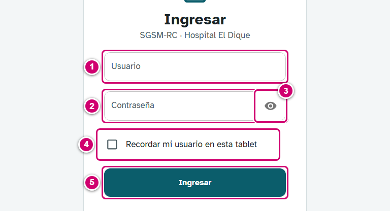

1. **Usuario**.
2. **Contraseña**.
3. **El ojo**: muestra u oculta la contraseña mientras la escribe.
4. **Recordar mi usuario en esta tablet**: márquelo solo si la tablet la usa siempre usted. Guarda el usuario, nunca la contraseña.
5. **Ingresar**.

**Cuando sale bien**, se abre la pantalla de Inicio con su nombre: «Hola, Martín» y debajo «Médico · ¿Qué necesita hacer?».

| Aviso que puede aparecer                                     | Qué hacer                                                                                                                                                                                |
| ------------------------------------------------------------ | ---------------------------------------------------------------------------------------------------------------------------------------------------------------------------------------- |
| «Ingrese su usuario» / «Ingrese su contraseña»               | Falta completar ese campo.                                                                                                                                                               |
| «Usuario o contraseña incorrectos»                           | Vuelva a escribirlos. Revise mayúsculas.                                                                                                                                                 |
| «La cuenta está bloqueada por intentos fallidos hasta las …» | Después de tres intentos fallidos seguidos, la cuenta se bloquea un rato. Espere a la hora que indica o llame al administrador.                                                          |
| «Se cerró la sesión por inactividad. Vuelva a ingresar.»     | La sesión se cerró sola por falta de uso. Ingrese de nuevo.                                                                                                                              |
| Se olvidó la contraseña                                      | La pantalla no tiene forma de recuperarla: pídale una nueva al administrador ([A quién llamar](#a-quién-llamar)). No pruebe varias veces, porque al tercer intento la cuenta se bloquea. |

El sistema no le pide cambiar la contraseña la primera vez que entra.

**Cierre por inactividad.** Si no toca la pantalla durante un rato (en general, 15 minutos), un minuto antes aparece **¿Sigue ahí?**: «Por seguridad, la sesión se cierra en … segundos si no hay actividad. Lo que no se guardó se pierde.» Toque **Seguir trabajando** para continuar o **Cerrar sesión** para salir.

**Para salir** en cualquier momento, toque **Salir** (arriba a la derecha). Hágalo siempre que deje la tablet.

---

## La pantalla de Inicio y el menú

Desde la pantalla de Inicio se llega a cada tarea con un toque.

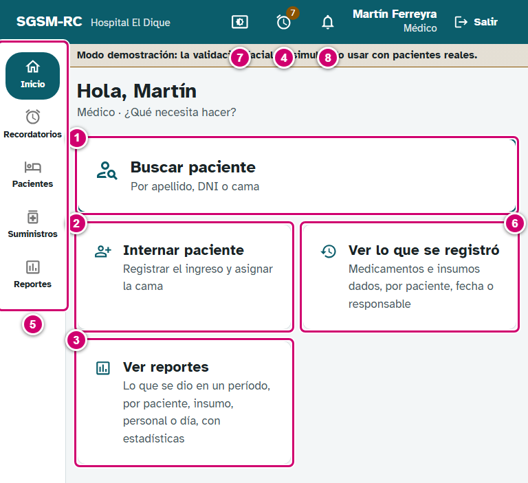

1. **Buscar paciente**: por apellido, DNI o cama. Es la tarea más usada.
2. **Internar paciente**: registrar la internación y asignar la cama.
3. **Ver reportes**: lo que se dio en un período, con estadísticas (ver el [anexo](#anexo-reportes-y-estadísticas)).
4. **Recordatorios**: el **reloj con un número**, arriba. El número dice cuántas tomas y estudios hay para atender en el hospital; si alguno es urgente, el número va sobre fondo de color. Un toque abre la lista, desde cualquier pantalla. En esta guía también se lo llama «insignia de recordatorios».
5. **Menú lateral**: Inicio, Recordatorios, Pacientes, Suministros y Reportes. La opción en la que está se ve resaltada.
6. **Ver lo que se registró**: los medicamentos e insumos que registró enfermería, por paciente, fecha o responsable. Es solo para consultar. Es la misma pantalla que **Suministros** en el menú.
7. **Tema de la pantalla**: claro, oscuro o igual que el dispositivo. El ícono cambia según lo elegido: un rectángulo con medio círculo relleno (igual que el dispositivo), un sol (claro) o una luna (oscuro).
8. **Notificaciones** (la campana): son avisos para los administradores (cuentas bloqueadas, validaciones faciales fallidas, recordatorios vencidos). Hoy al médico no le llega ninguno: si la abre, dice «No hay notificaciones.» Lo de sus pacientes se ve en el reloj (4) y en la ficha.

Arriba a la derecha están, además, su nombre con su rol y **Salir**. La flecha **←** de cada pantalla vuelve a la anterior.

---

## Buscar un paciente

Para abrir la ficha de un paciente en dos toques.

1. Toque **Buscar paciente** en la pantalla de Inicio, o **Pacientes** en el menú.
2. Escriba parte del apellido o del nombre, el comienzo del DNI o la cama completa (por ejemplo, «olmedo», «9041» o «B-03»). No importan las mayúsculas ni las tildes. La lista se filtra sola mientras escribe.
3. Toque la fila del paciente.

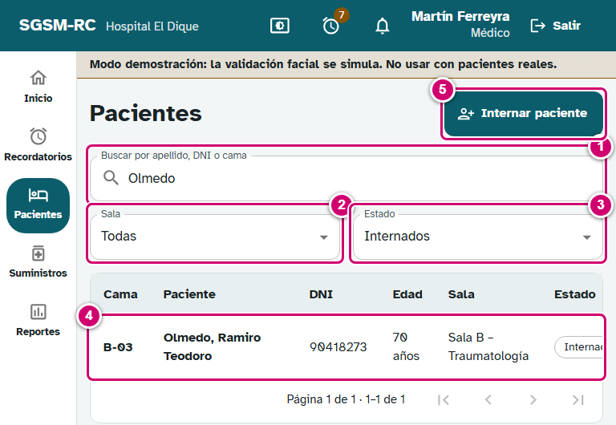

1. **Buscar por apellido, DNI o cama**: el campo de búsqueda.
2. **Sala**: muestra solo los pacientes de una sala. Por defecto, **Todas**.
3. **Estado**: **Internados** (por defecto), **Egresados** o **Todos**. Para encontrar a alguien que ya se fue de alta, elija **Egresados** o **Todos**.
4. **Fila del paciente**: cama, nombre, DNI, edad, sala y estado. Tóquela para abrir la ficha.
5. **Internar paciente**: abre el formulario de internación.

Si hay muchos resultados, debajo de la tabla se pasa de página con las flechas. Al volver de una ficha con la flecha **←**, la búsqueda sigue como la dejó.

**Si no aparece nadie**, la pantalla dice por qué y qué probar; por ejemplo: «No hay pacientes internados que coincidan con «Olmeda». Pruebe con otro apellido, DNI o cama, o cambie Estado a Todos.» Toque **Quitar filtros** para volver a la lista completa.

---

## Internar un paciente

Para registrar la internación de un paciente y asignarle una cama libre, todo en un solo paso.

> **Antes de completar el formulario**, si el paciente pudo haber estado internado antes, búsquelo en **Pacientes** con **Estado: Todos**. Si aparece como egresado, es un [reingreso](#reingreso-el-paciente-ya-estuvo-internado): abra su ficha y tenga a mano sus datos (pestaña **Datos**), porque el formulario los reemplaza.

1. Toque **Internar paciente** (en la pantalla de Inicio o en Pacientes).
2. Complete los **Datos personales** y, si los tiene, los **Datos clínicos y contacto**.
3. En **Cama**, elija una cama libre.
4. Revise los datos y toque **Internar**.

**La internación queda con la fecha y hora en que toca Internar.** El formulario no tiene un campo para otra hora y después no se puede corregir. Cárguela apenas llega el paciente: el alta no puede ser anterior a esa hora.

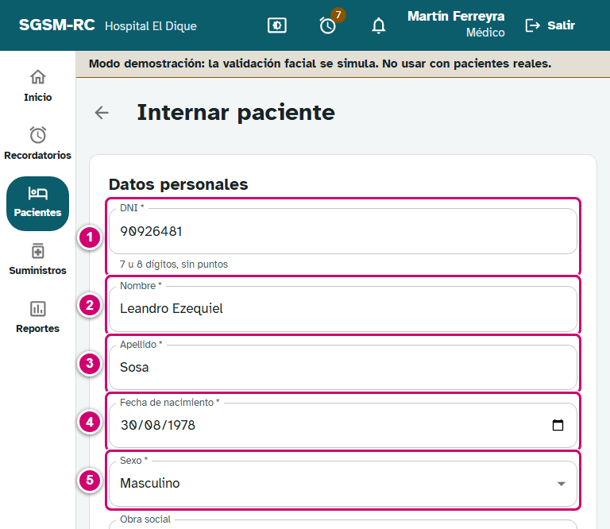

1. **DNI**: 7 u 8 dígitos, sin puntos. Es obligatorio. Si no lo tiene, vea [abajo](#si-el-paciente-no-tiene-dni).
2. **Nombre**: obligatorio.
3. **Apellido**: obligatorio.
4. **Fecha de nacimiento**: obligatoria. Toque el calendario o escríbala.
5. **Sexo**: Femenino, Masculino u Otro. Obligatorio.

Más abajo siguen **Obra social** y **N.º de afiliado**, que son opcionales. Los campos con asterisco (\*) son obligatorios.

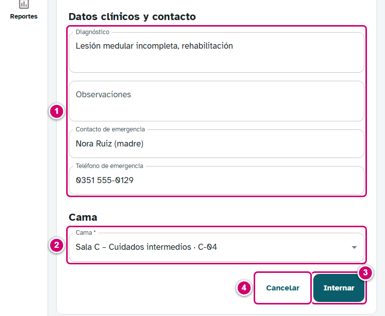

1. **Datos clínicos y contacto** (opcionales): **Diagnóstico**, **Observaciones**, **Contacto de emergencia** y **Teléfono de emergencia**. El formulario no tiene un campo de alergias ni de peso: anote las alergias en **Observaciones**.
2. **Cama**: la lista muestra **solo camas libres**, con la sala y el número (por ejemplo, «Sala C – Cuidados intermedios · C-04»).
3. **Internar**: guarda la internación.
4. **Cancelar**: sale sin guardar nada.

**Cuando sale bien**, se abre la ficha del paciente con el aviso «Paciente internado en Sala C – Cuidados intermedios · C-04».

| Aviso que puede aparecer                                                  | Qué pasó y qué hacer                                                                                                                               |
| ------------------------------------------------------------------------- | -------------------------------------------------------------------------------------------------------------------------------------------------- |
| «Ingrese el DNI», «Ingrese el nombre», «Elija el sexo», «Elija la cama»…  | Falta un dato obligatorio. El sistema lleva la pantalla al primer campo con error.                                                                 |
| «El DNI debe tener 7 u 8 dígitos, sin puntos»                             | Escriba solo los números.                                                                                                                          |
| «Ya existe un paciente con ese DNI»                                       | Ese paciente ya está internado: un DNI tiene una sola ficha. Búsquelo en Pacientes en lugar de internarlo de nuevo.                                |
| «El paciente ya estuvo internado»                                         | Se fue de alta antes. Ver [Reingreso](#reingreso-el-paciente-ya-estuvo-internado).                                                                 |
| «La cama C-04 ya está ocupada»                                            | Alguien la asignó mientras usted completaba el formulario: una cama tiene un solo paciente. Elija otra.                                            |
| «No hay camas libres. Hay que liberar o habilitar una antes de internar.» | No queda ninguna cama libre. Hace falta un alta o un traslado, o que el administrador habilite una cama.                                           |
| «¿Descartar lo cargado?»                                                  | Tocó la flecha, el menú o **Cancelar** con datos sin guardar. **Seguir editando** vuelve al formulario; **Descartar** sale y se pierde lo escrito. |

### Si el paciente no tiene DNI

El sistema solo acepta un DNI de 7 u 8 dígitos: no tiene número provisorio ni lugar para un pasaporte. **No invente un número**: podría ser el de otra persona, y un DNI tiene una sola ficha. Llame al administrador ([A quién llamar](#a-quién-llamar)) para saber cómo procede el hospital en ese caso. Cuando se tenga el DNI correcto, se corrige con **Editar datos** en la ficha del paciente.

### Reingreso: el paciente ya estuvo internado

Si el DNI es de un paciente que ya se fue de alta, el sistema no crea otra ficha: le ofrece registrar el reingreso en la misma.

1. Complete el formulario y elija la cama como en cualquier internación.
2. Toque **Internar**.
3. Arriba aparece el aviso **El paciente ya estuvo internado**. Lea el nombre que muestra.
4. Si es la misma persona, toque **Registrar reingreso**.

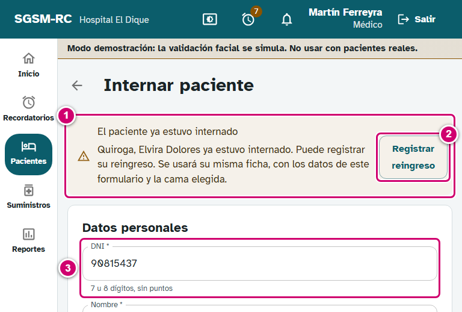

1. **El aviso**: dice quién es el paciente de ese DNI y que se usará su misma ficha, con los datos de este formulario y la cama elegida.
2. **Registrar reingreso**: lo interna de nuevo en la cama elegida.
3. **El DNI** que escribió.

> **Revise el nombre antes de tocar Registrar reingreso.** Si no es el paciente que tiene delante, probablemente el DNI está mal escrito: corríjalo y toque **Internar** otra vez.

**Los datos del formulario reemplazan los de la ficha**: nombre, fecha de nacimiento, obra social, diagnóstico, contacto, observaciones. **Lo que deje vacío queda vacío en la ficha** (por ejemplo, la obra social o las alergias que estaban anotadas). Por eso conviene buscarlo antes y copiar sus datos.

**Cuando sale bien**, se abre la ficha con el aviso «Reingreso registrado en …» y la cama nueva. Su historial anterior sigue en la misma ficha, y la **Fecha de ingreso** pasa a ser la del reingreso.

**Sus prescripciones anteriores quedaron suspendidas** por el alta y sus estudios, cancelados. En **Prescripciones**, elija **Mostrar: Todas**, revise cada una y [reanude](#suspender-reanudar-o-finalizar-una-indicación) solo las que sigan correspondiendo, o cargue otras nuevas. Los estudios se programan de nuevo.

---

## La ficha del paciente

Todo lo del paciente en un lugar: su identificación, sus acciones y sus pestañas.

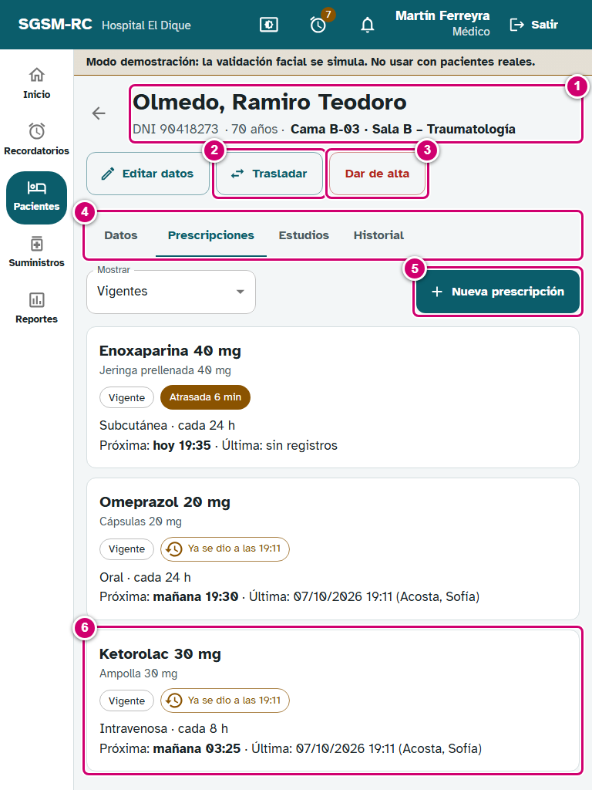

1. **Identificación**: nombre, DNI, edad, cama y sala. Está siempre arriba: confirme que es el paciente correcto antes de cargar algo.
2. **Trasladar**: cambiar de cama. Ver [Cambiar de cama](#cambiar-de-cama).
3. **Dar de alta**: ver [Dar de alta](#dar-de-alta). Va en rojo porque libera la cama y suspende las indicaciones.
4. **Pestañas**:
   - **Datos**: datos personales, diagnóstico, contacto, observaciones (donde se anotan las alergias) y fecha de ingreso.
   - **Prescripciones**: las indicaciones (la ficha se abre en esta).
   - **Estudios**: los programados, realizados y cancelados.
   - **Historial**: camas, modificaciones y suministros.
5. **Nueva prescripción**: indicar un medicamento.
6. **Tarjeta de una prescripción**: tóquela para ver el detalle, cambiarla, suspenderla o finalizarla.

**Cómo leer cada tarjeta de prescripción:** arriba, el medicamento con su dosis («Ketorolac 30 mg») y la presentación («Ampolla 30 mg»); el estado (**Vigente**, Suspendida o Finalizada) y cómo va la toma (**Atrasada 6 min**, **Toca ahora**, **Faltan 20 min** o **Ya se dio a las 19:11**); la vía y la frecuencia («Intravenosa · cada 8 h»); la **Próxima** toma («hoy 19:35», «mañana 03:25») y la **Última** administración, con fecha, hora y quién la registró.

**La próxima toma sigue el horario de la prescripción, no la hora en que se dio la anterior.** El horario es el **Inicio** más cada tantas horas. En la imagen, Ketorolac cada 8 h empezó a las 19:25: se dio a las 19:11 y la próxima es 03:25, no 03:11.

El selector **Mostrar** cambia entre **Vigentes** (por defecto) y **Todas**, para ver también las suspendidas y finalizadas. En una pantalla ancha, las prescripciones se ven en una tabla en lugar de tarjetas; se toca la fila igual.

El botón **Editar datos** corrige los datos personales o clínicos; la cama se cambia con **Trasladar**. Cuando el paciente está de alta, en lugar de la cama aparece **Egresado** y ya no se ven los botones de acción ni **Nueva prescripción**.

### Ver si una toma no se dio

No le llega ningún aviso: hay que mirarlo.

- **Una toma que nadie atendió** aparece en [Recordatorios](#ver-los-recordatorios) como **Vencida** y se sigue viendo ahí hasta 12 horas, o hasta que alguien la atiende.
- **Una toma que enfermería marcó «No se administró»** sale de Recordatorios y queda en la ficha: pestaña **Historial**, sección **Modificaciones**, en una fila cuya acción dice «NO_ADMINISTRAR» (así, en mayúsculas), con el motivo en la columna **Detalle**.
- En la tarjeta de la prescripción, **Última** muestra siempre la última dosis que **sí** se dio.

---

## Cambiar de cama

Para trasladar a un paciente a otra cama libre. La cama anterior queda libre.

1. Abra la ficha del paciente.
2. Toque **Trasladar**.
3. En **Cama nueva**, elija la cama.
4. Toque **Trasladar**.

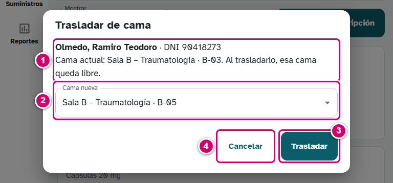

1. **Paciente y cama actual**: nombre, DNI y la cama que va a quedar libre.
2. **Cama nueva**: solo ofrece camas libres.
3. **Trasladar**: confirma el cambio. Se activa cuando eligió una cama.
4. **Cancelar**: cierra sin cambiar nada.

**Cuando sale bien**, la ficha muestra «Paciente trasladado a Sala B – Traumatología · B-05» y la cama nueva arriba. El traslado queda en **Historial**. **Si no hay camas libres**, el diálogo dice: «No hay camas libres en este momento. Se puede trasladar cuando se libere una.»

---

## Dar de alta

Para registrar que el paciente se va del hospital, también por derivación o fallecimiento.

**Antes de confirmar, sepa qué pasa:** se libera la cama, se **suspenden** sus prescripciones vigentes y se **cancelan** sus estudios y recordatorios pendientes. **El alta no se puede deshacer**: si se equivocó, vea [Si dio de alta por error](#si-dio-de-alta-por-error).

1. Abra la ficha del paciente y **confirme que es el paciente correcto**.
2. Toque **Dar de alta**.
3. Revise la **Fecha y hora de egreso**. Viene con la hora actual; cámbiela si el alta fue antes.
4. Escriba el **Motivo del egreso**.
5. Toque **Dar de alta**.

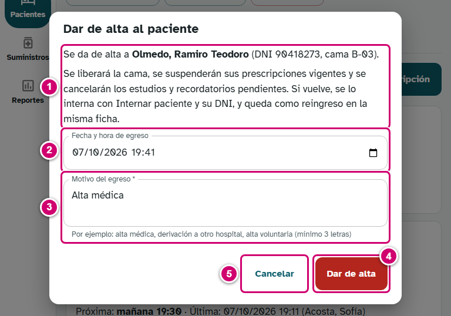

1. **A quién se da de alta y qué pasa**: nombre, DNI y cama, los efectos del alta y cómo se reingresa.
2. **Fecha y hora de egreso**: viene con la hora actual.
3. **Motivo del egreso** (obligatorio): por ejemplo, alta médica, derivación a otro hospital, alta voluntaria o fallecimiento. Mínimo 3 letras.
4. **Dar de alta**: confirma. Se activa cuando hay un motivo.
5. **Cancelar**: cierra sin dar de alta.

**Cuando sale bien**, la ficha muestra «El paciente quedó egresado y su cama se liberó».

| Aviso que puede aparecer               | Qué hacer                                             |
| -------------------------------------- | ----------------------------------------------------- |
| «Escriba al menos 3 letras»            | El motivo es muy corto.                               |
| «No puede ser posterior a ahora»       | La fecha de egreso no puede estar en el futuro.       |
| «No puede ser anterior al ingreso (…)» | La fecha es anterior a la internación. Revise el día. |

### Si dio de alta por error

Al paciente equivocado o antes de tiempo. El alta no se deshace, pero se puede volver a dejar todo como estaba:

1. **Avise ya a enfermería de la sala**: desde el alta, ese paciente no tiene recordatorios.
2. Busque al paciente en **Pacientes** con **Estado: Todos** y tenga a mano sus datos (pestaña **Datos**). Toque **Internar paciente**, complete el formulario **con esos mismos datos** (lo que deje vacío se borra de la ficha) y elija **la misma cama**, si sigue libre.
3. Toque **Internar** y después **Registrar reingreso** (ver [Reingreso](#reingreso-el-paciente-ya-estuvo-internado)).
4. En la ficha, pestaña **Prescripciones**, elija **Mostrar: Todas**. Las que estaban vigentes quedaron **Suspendidas**, con el motivo «Egreso del paciente: …». [Reanude](#suspender-reanudar-o-finalizar-una-indicación) cada una; siguen su horario de siempre.
5. En la pestaña **Estudios**, los que estaban programados quedaron cancelados: [prográmelos](#programar-un-estudio) de nuevo.

El alta y el reingreso quedan en el **Historial**, y la **Fecha de ingreso** de la ficha pasa a ser la del reingreso.

---

## Indicar un medicamento

Para cargar una prescripción: qué medicamento, cuánto, cada cuánto, por qué vía y desde cuándo. Con ella el sistema calcula las tomas y avisa a enfermería 30 minutos antes de cada una. **Un medicamento solo se administra sobre una prescripción vigente del paciente.**

**Lo que controla el sistema:** que estén todos los datos, que la dosis sea mayor a 0 y que el paciente no tenga vigente el mismo medicamento (aviso de duplicada). **No controla** alergias, interacciones ni dosis máxima: eso queda a su criterio.

1. Abra la ficha del paciente, pestaña **Prescripciones**.
2. Toque **Nueva prescripción**.
3. Confirme arriba que es el paciente correcto.
4. Complete el medicamento, la dosis, la frecuencia y la vía.
5. Revise el **Inicio** (la primera toma) y, si corresponde, el **Fin**.
6. Revise las **Primeras tomas**.
7. Toque **Guardar prescripción**.

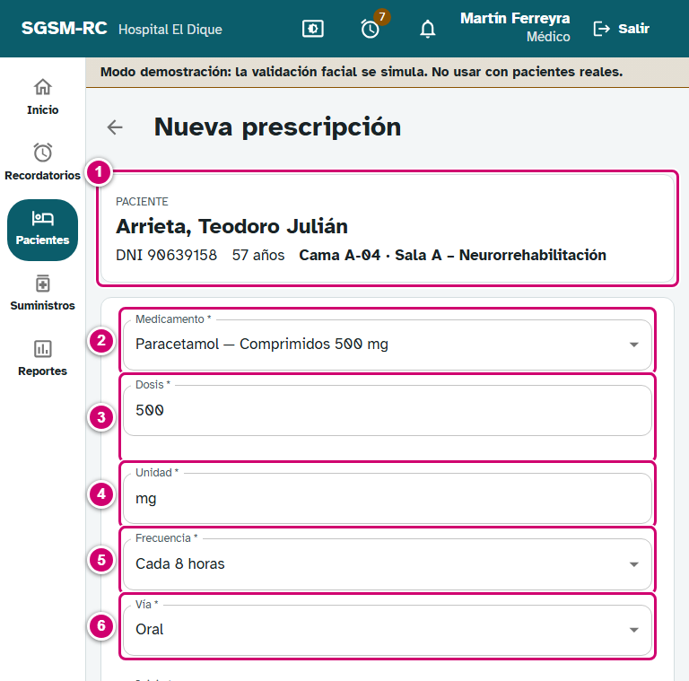

1. **Paciente**: nombre, DNI, edad, cama y sala de a quién se le indica.
2. **Medicamento**: se elige de la lista del catálogo, en orden alfabético, con su presentación («Paracetamol — Comprimidos 500 mg»). Es una lista para tocar: no se puede escribir para buscar. **Si falta un medicamento**, el administrador lo agrega al catálogo ([A quién llamar](#a-quién-llamar)); aparece en la lista al volver a abrir **Nueva prescripción** (puede tardar un minuto). Mientras no esté, no se puede indicar en el sistema y enfermería no puede registrar su administración: indíquelo como prevea el hospital para esos casos y avísele a enfermería.
3. **Dosis**: solo el número. Acepta decimales con coma o con punto (0,5 o 0.5).
4. **Unidad**: se completa con la del medicamento («mg»). Se puede cambiar, pero **el sistema no la controla**: acepta cualquier texto, así que un «mcg» escrito como «mg» no lo detecta. El número y la unidad siempre se muestran juntos: «500 mg».
5. **Frecuencia**: **Cada 1, 2, 4, 6, 8, 12, 24, 48 o 72 horas**. Para lo que no es cada tantas horas, vea [abajo](#indicaciones-que-no-son-cada-tantas-horas).
6. **Vía**: Oral, Sublingual, Intravenosa, Intramuscular, Subcutánea, Tópica, Inhalatoria, Por sonda, Rectal u Otra.

**Dosis y unidad.** Conviene dejar la unidad del medicamento y escribir la dosis en esa unidad: la presentación ya dice cuánto trae cada comprimido o ampolla. Por ejemplo, medio comprimido de «Clonazepam — Comprimidos 0,5 mg» se indica como dosis **0,25** y unidad **mg**. Revise siempre mg, mcg y g: es el error que el sistema no ve.

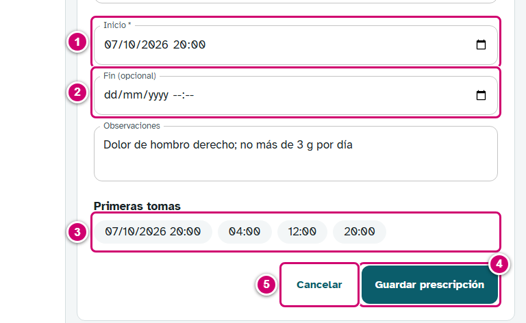

1. **Inicio**: fecha y hora de **la primera toma que tiene que dar enfermería**. Viene con la hora actual; cámbiela a la hora en que debe darse (en la imagen, 20:00). Ver los casos de abajo.
2. **Fin (opcional)**: déjelo vacío si la indicación sigue hasta que la cambie o la finalice. **La toma que cae justo a la hora de Fin también se da.**
3. **Primeras tomas**: las cuatro primeras tomas que calcula el sistema, en formato de 24 horas. Solo la primera lleva la fecha; las demás siguen en orden (en la imagen, 04:00, 12:00 y 20:00 ya son del 08/10). Revíselas antes de guardar.
4. **Guardar prescripción**: guarda la indicación.
5. **Cancelar**: sale sin guardar.

**Sobre el Inicio:**

- **Si lo deja con la hora actual**, la primera toma toca ahora: aparece enseguida en Recordatorios como **Urgente**, sin la media hora de aviso. Si la primera dosis es ya, **avísele a enfermería**.
- **Si la primera dosis ya se dio** (por ejemplo, en la guardia a las 10:00 y sigue cada 8 h), ponga como Inicio **la próxima**: 18:00. El sistema acepta un Inicio anterior a ahora, pero no lo use para eso: si cae dentro de la última media hora, genera el recordatorio de esa toma como atrasada y enfermería podría darla de nuevo.

**Sobre el Fin, un ejemplo:** un antibiótico cada 8 h durante 7 días (21 tomas), con Inicio el 08/10 a las 08:00. La toma 21 es el 15/10 a las 00:00. Ponga **Fin el 15/10 a las 07:00** (cualquier hora entre las 00:00 y las 07:59). Si pone el Fin a las 08:00 del 15/10, esa toma también se da y serían 22.

**Observaciones** (sin número, debajo del Fin) es opcional; por ejemplo, «diluir en 100 ml, pasar en 30 min» o «no más de 3 g por día». Enfermería la ve en la pantalla **Administrar medicamento**, en la tarjeta de la prescripción, después de la vía y la frecuencia («Intravenosa · cada 24 h · Pasar en 30 minutos»). **No aparece en la tarjeta del recordatorio.** Observaciones no cambia el horario: las tomas se generan igual.

**Cuando sale bien**, vuelve a la ficha con el aviso «Prescripción cargada: Paracetamol 500 mg cada 8 h» y la tarjeta nueva en la lista.

| Aviso que puede aparecer                                                                                                    | Qué hacer                                                                      |
| --------------------------------------------------------------------------------------------------------------------------- | ------------------------------------------------------------------------------ |
| «Elija el medicamento», «Ingrese la dosis», «Ingrese la unidad», «Elija la frecuencia», «Elija la vía», «Ingrese el inicio» | Complete el dato que falta.                                                    |
| «La dosis debe ser mayor a 0»                                                                                               | Revise el número.                                                              |
| «La fecha de fin debe ser posterior al inicio»                                                                              | Corrija el Fin o déjelo vacío.                                                 |
| «… está dado de baja en el catálogo»                                                                                        | Ese medicamento ya no está disponible. Elija otro o consulte al administrador. |
| «Posible prescripción duplicada»                                                                                            | Ver [abajo](#aviso-de-posible-prescripción-duplicada).                         |

### Indicaciones que no son cada tantas horas

El sistema calcula todas las tomas como **Inicio + cada tantas horas**. Lo que no entra en esa regla se resuelve así:

| Lo que quiere indicar                                                    | Cómo se hace                                                                                                                                                                                                                                                                                                                                                            |
| ------------------------------------------------------------------------ | ----------------------------------------------------------------------------------------------------------------------------------------------------------------------------------------------------------------------------------------------------------------------------------------------------------------------------------------------------------------------- |
| Horarios fijos a intervalos iguales (8 y 20 h; 6, 14 y 22 h)             | Frecuencia cada 12 h (o cada 8 h) con **Inicio** a la primera de esas horas (08:00 o 06:00).                                                                                                                                                                                                                                                                            |
| Una vez por día, en ayunas                                               | Cada 24 h con **Inicio** a la hora del ayuno (por ejemplo, 06:00).                                                                                                                                                                                                                                                                                                      |
| Horarios que no son a intervalos iguales (con las comidas: 8, 13 y 20 h) | Una sola prescripción no los admite. Si hace falta, cargue una por horario, cada 24 h, cada una con su Inicio; desde la segunda aparece **Posible prescripción duplicada** y hay que tocar **Cargar igual**.                                                                                                                                                            |
| Dosis única («stat»)                                                     | **Inicio** a la hora de la dosis y **Fin** un minuto después: el sistema calcula una sola toma (Primeras tomas muestra una). La frecuencia se pide igual: elija cada 24 h. Si la dosis es ya, avísele a enfermería. Después, finalícela.                                                                                                                                |
| «Si dolor», «si fiebre», SOS                                             | **No se pueden cargar.** No elija una frecuencia y escriba «SOS» en Observaciones: el sistema genera las tomas igual, le avisa a enfermería a cada hora y el paciente la recibiría reglada. Indíquela como prevea el hospital fuera del sistema y avísele a enfermería. Sin prescripción en el sistema, enfermería no puede registrar esa administración en el SGSM-RC. |
| Infusión continua (goteo, bomba)                                         | **No se puede cargar**: la frecuencia mínima es cada 1 hora y el sistema generaría una toma por hora. Igual que SOS.                                                                                                                                                                                                                                                    |

### Aviso de posible prescripción duplicada

Si el paciente ya tiene una prescripción **vigente** del mismo medicamento del catálogo, el sistema no la guarda de entrada: le muestra la que ya existe para que usted decida. **La decisión clínica es suya**: el sistema avisa, no decide.

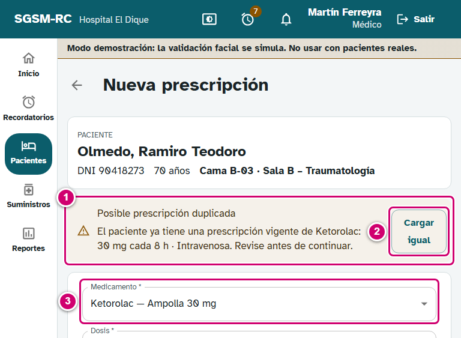

1. **El aviso**: dice qué prescripción vigente ya tiene el paciente (en la imagen: «Ketorolac: 30 mg cada 8 h · Intravenosa») y pide revisar antes de continuar.
2. **Cargar igual**: guarda la nueva de todas formas. Úselo solo si de verdad corresponden las dos.
3. **Medicamento**: si se equivocó de medicamento, cámbielo acá.

**Al cambiar cualquier dato, el aviso se oculta, pero el control sigue:** al tocar **Guardar prescripción** otra vez, el sistema vuelve a revisar y lo muestra de nuevo si el paciente sigue teniendo vigente ese medicamento.

**Qué compara:** el mismo medicamento **con la misma presentación** del catálogo. Si el mismo fármaco está en otra presentación (por ejemplo, comprimidos y ampolla), el sistema **no** avisa: revise la lista de prescripciones del paciente.

Si lo que quería era **cambiar** la dosis de la que ya existe, no cargue otra: toque **Cancelar**; aparece **¿Descartar lo cargado?**: toque **Descartar** y [cambie la indicación](#cambiar-una-indicación) existente.

---

## Cambiar una indicación

Para modificar la dosis, la unidad, la frecuencia, la vía, el fin o las observaciones de una prescripción vigente. Cada cambio pide un motivo y queda registrado a su nombre.

1. En la ficha del paciente, toque la tarjeta de la prescripción.
2. En **Indicación**, cambie lo que corresponda.
3. Toque **Guardar cambios**.
4. Revise la tabla **Antes / Después**.
5. Escriba el **Motivo del cambio**.
6. Toque **Guardar**.

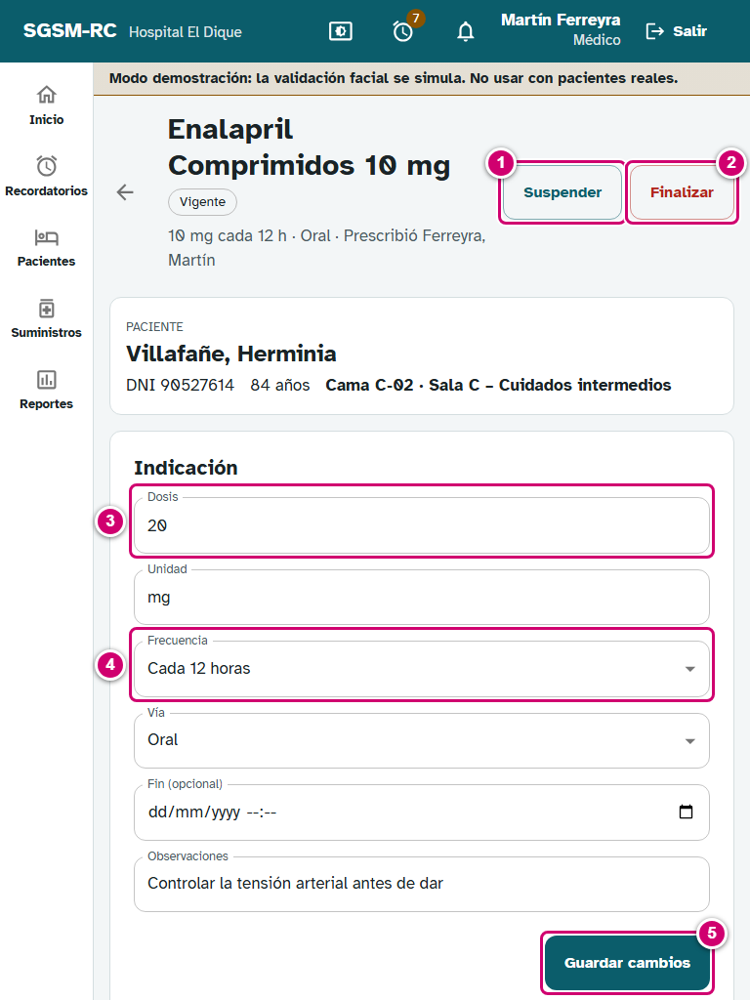

1. **Suspender**: ver [Suspender, reanudar o finalizar](#suspender-reanudar-o-finalizar-una-indicación).
2. **Finalizar**: ídem. Va en rojo porque no se puede deshacer.
3. **Dosis**: en la imagen se cambió de 10 a **20**.
4. **Frecuencia**: antes de cambiarla, lea [Si cambia la frecuencia](#si-cambia-la-frecuencia).
5. **Guardar cambios**: abre la revisión. Mientras no haya cambios está desactivado y al lado dice «No hay cambios para guardar».

Arriba del detalle se ven el medicamento, el estado, el resumen («10 mg cada 12 h · Oral») y quién la prescribió; debajo, el paciente con su DNI, edad y cama. A la derecha (o más abajo, en pantallas angostas) están las **Próximas tomas (24 h)** y las **Últimas administraciones**.

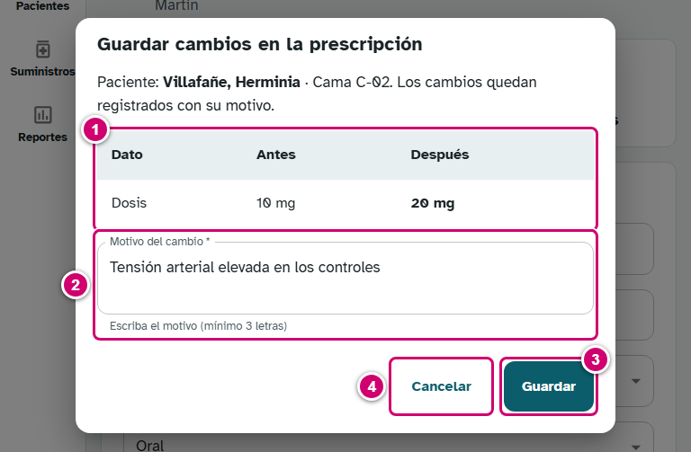

1. **Tabla Antes / Después**: solo lo que cambia (en la imagen, Dosis: 10 mg → **20 mg**).
2. **Motivo del cambio** (obligatorio, mínimo 3 letras).
3. **Guardar**: confirma el cambio.
4. **Cancelar**: vuelve al detalle sin guardar.

**Cuando sale bien**, el detalle muestra «Los cambios se guardaron».

**Si cambió la dosis, la unidad, la vía o las observaciones**, el horario no cambia. Los recordatorios pendientes de esa prescripción muestran la indicación nueva cuando la pantalla de enfermería se actualiza. Si la próxima toma es en minutos, avísele a enfermería del cambio.

**Si cambió el fin**, los recordatorios pendientes se cancelan y el sistema genera los del horario nuevo.

**Lo que no se cambia acá:** el medicamento y el inicio. Si se equivocó de medicamento o necesita otro inicio, finalice la prescripción con ese motivo y cargue una nueva.

Después de guardar, vuelva a la ficha y revise la **Próxima** en la tarjeta.

### Si cambia la frecuencia

El horario nuevo se cuenta **desde el Inicio original** de la prescripción, no desde la última dosis, y cada dosis ya dada cuenta para la toma del horario nuevo que le quede más cerca.

**Ejemplo.** Inicio 06:00, cada 6 h; se dio a las 06:00 y a las 12:00. A las 13:00 la pasa a cada 8 h. El horario nuevo es 06:00, 14:00 y 22:00. El sistema toma la dosis de las 12:00 como si fuera la de las 14:00, y la próxima toma que le recuerda a enfermería es la de las **22:00**: diez horas después de la última. Si la pasara a cada 12 h, la próxima quedaría a las 06:00 del día siguiente.

**Por eso, si ya se dio alguna toma, no cambie la frecuencia acá.** Haga esto:

1. [Finalice](#suspender-reanudar-o-finalizar-una-indicación) la prescripción, con un motivo como «cambio de frecuencia».
2. Cargue una [nueva](#indicar-un-medicamento) con la misma dosis, la frecuencia nueva y el **Inicio** a la hora en que corresponde la próxima dosis. En el ejemplo, cada 8 h con Inicio 20:00 (8 horas después de la de las 12:00).

Cambiar la frecuencia acá sirve si todavía no se dio ninguna toma.

---

## Suspender, reanudar o finalizar una indicación

- **Suspender**: corta las tomas por ahora. **Se puede reanudar** después.
- **Finalizar**: termina la indicación. **No se puede reanudar**; si hace falta otra vez, se carga una nueva.

En los dos casos se cancelan los recordatorios pendientes de esa prescripción y se pide un motivo.

**Para suspender**

1. Abra la prescripción desde la ficha del paciente.
2. Toque **Suspender**.
3. Escriba el **Motivo**.
4. Toque **Suspender**.

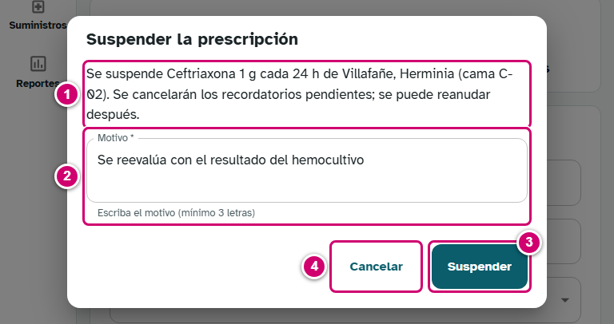

1. **Qué se suspende**: medicamento, dosis, frecuencia, paciente y cama, y que se puede reanudar después.
2. **Motivo** (obligatorio, mínimo 3 letras).
3. **Suspender**: confirma.
4. **Cancelar**: cierra sin suspender.

**Cuando sale bien**, el detalle dice «La prescripción quedó suspendida» y muestra el motivo. En la ficha deja de verse con **Mostrar: Vigentes**; elija **Todas** para encontrarla.

**Para reanudar** (solo si el paciente está internado)

1. En la ficha del paciente, pestaña **Prescripciones**, cambie **Mostrar** a **Todas**.
2. Toque la tarjeta que dice **Suspendida**.
3. Toque **Reanudar**.
4. Escriba el **Motivo**.
5. Toque **Reanudar**.

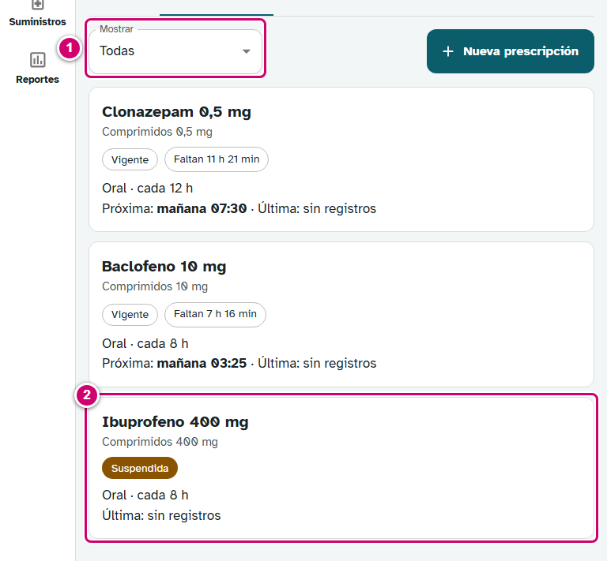

1. **Mostrar: Todas**: con **Vigentes** (por defecto) las suspendidas no se ven.
2. **La tarjeta suspendida**: lleva la etiqueta **Suspendida** y no tiene próxima toma.

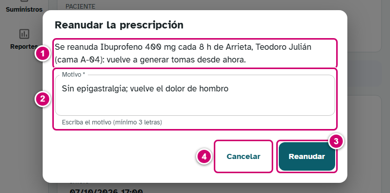

1. **Qué se reanuda**: medicamento, dosis, frecuencia, paciente y cama.
2. **Motivo** (obligatorio, mínimo 3 letras).
3. **Reanudar**: confirma.
4. **Cancelar**: cierra sin reanudar.

**Cuando sale bien**, el detalle dice «La prescripción volvió a estar vigente».

**Desde cuándo se cuentan las tomas.** El diálogo dice «vuelve a generar tomas desde ahora», pero el horario es el de siempre: **Inicio + cada tantas horas**. La próxima toma es la siguiente de ese horario, y las que cayeron mientras estuvo suspendida no se recuperan. Ejemplo: Inicio 06:00, cada 8 h, suspendida a las 10:00 y reanudada a las 17:00: la próxima toma es a las **22:00**. Si una toma del horario cayó en la última media hora, aparece enseguida en Recordatorios como atrasada. Si necesita otro horario, finalícela y cargue una nueva con el Inicio que corresponda.

**Para finalizar**

1. Abra la prescripción.
2. Toque **Finalizar** (en rojo).
3. Escriba el **Motivo**.
4. Toque **Finalizar**.

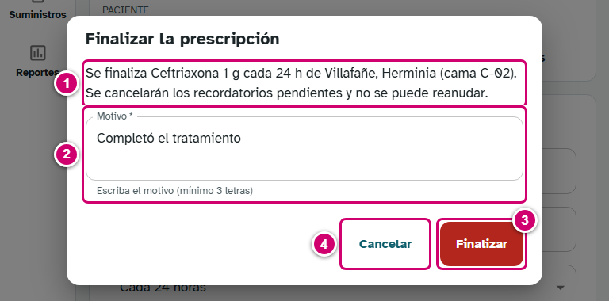

1. **Qué se finaliza**, y la aclaración de que no se puede reanudar.
2. **Motivo** (obligatorio, mínimo 3 letras); por ejemplo, «Completó el tratamiento».
3. **Finalizar**: confirma. Va en rojo porque no tiene vuelta atrás.
4. **Cancelar**: cierra sin finalizar.

**Cuando sale bien**, el detalle dice «La prescripción quedó finalizada».

> Los diálogos con motivo no se cierran si toca afuera, para no perder lo escrito: se sale con **Cancelar** (o **Volver**, al cancelar un estudio). El botón de confirmar se activa recién cuando el motivo tiene 3 letras o más.

---

## Estudios

Para programar una práctica a un paciente internado (laboratorio, radiografía, tomografía, interconsulta…). Enfermería recibe el recordatorio 30 minutos antes y confirma con su rostro que se realizó.

> **El sistema no le envía el pedido al laboratorio, a imágenes ni al interconsultor**: solo genera el recordatorio para enfermería. Pida el estudio además por la vía de siempre (orden, teléfono). **Los resultados no se ven en el sistema**: en **Realizados** solo figura quién confirmó que se hizo y cuándo.

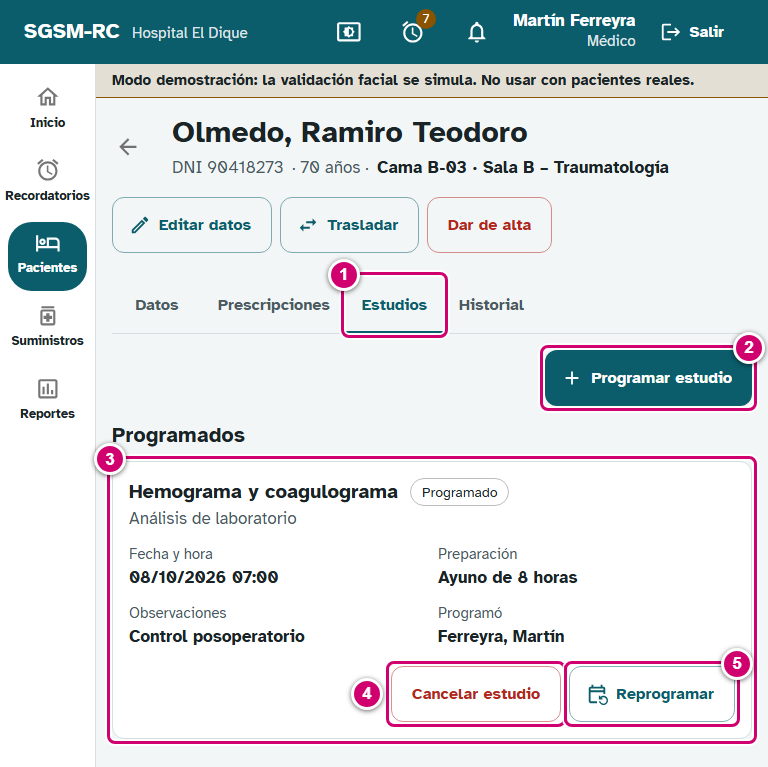

1. **Pestaña Estudios** de la ficha del paciente.
2. **Programar estudio**: abre el formulario. Si el paciente no tiene ninguno, la pestaña dice «No tiene estudios programados» y el botón aparece debajo.
3. **Tarjeta del estudio**: nombre y tipo, estado (**Programado**), fecha y hora, preparación, observaciones y quién lo programó.
4. **Cancelar estudio**: ver [Cancelar un estudio](#cancelar-un-estudio).
5. **Reprogramar**: cambiar la fecha y hora.

Más abajo, la sección **Realizados y cancelados** muestra los cerrados: quién confirmó que se realizó (con sus observaciones) o el motivo de la cancelación.

### Programar un estudio

1. En la pestaña **Estudios**, toque **Programar estudio**.
2. Elija el **Tipo de estudio**.
3. Elija la **Fecha y hora**.
4. Si quiere, precise el **Nombre del estudio** y revise la **Preparación**.
5. Agregue **Observaciones** si hacen falta.
6. Toque **Programar estudio**.
7. Pida el estudio al servicio que corresponda por la vía de siempre.

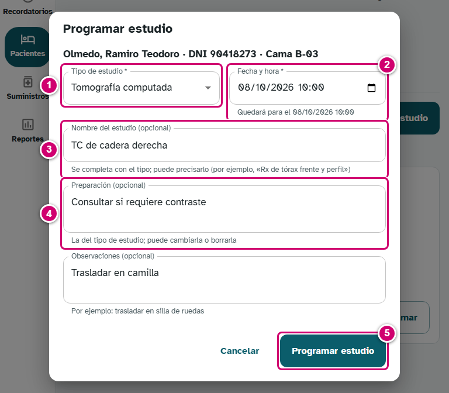

1. **Tipo de estudio**: del catálogo (Análisis de laboratorio, Radiografía, Ecografía abdominal, Electrocardiograma, Tomografía computada, Resonancia magnética, Videodeglución, Interconsulta…).
2. **Fecha y hora**: debajo confirma cómo queda, en 24 horas: «Quedará para el 08/10/2026 10:00». Se acepta entre 5 minutos atrás y 90 días adelante.
3. **Nombre del estudio** (opcional): se completa con el tipo; puede precisarlo (en la imagen, «TC de cadera derecha»).
4. **Preparación** (opcional): la del tipo de estudio («Consultar si requiere contraste»). Puede cambiarla o borrarla.
5. **Programar estudio**: guarda.

Arriba del formulario está siempre el paciente: nombre, DNI y cama. **Observaciones** (sin número) sirve para indicaciones como «Trasladar en camilla». **Cancelar** cierra sin programar.

**Cuando sale bien**, la pestaña muestra «Se programó TC de cadera derecha para el 08/10/2026 10:00.»

| Aviso que puede aparecer                                                 | Qué hacer                       |
| ------------------------------------------------------------------------ | ------------------------------- |
| «Elija el tipo de estudio» / «Indique la fecha y hora del estudio»       | Complete el dato.               |
| «Esa hora ya pasó: elija una entre 5 min atrás y 90 días adelante.»      | Elija una hora futura.          |
| «Es demasiado adelante: elija una entre 5 min atrás y 90 días adelante.» | Elija una fecha más cercana.    |
| «Ese tipo de estudio ya no está disponible. Elija otro.»                 | Lo dieron de baja del catálogo. |
| «El paciente ya no está internado: no se le pueden programar estudios.»  | El paciente se fue de alta.     |

### Reprogramar un estudio

1. En la tarjeta del estudio, toque **Reprogramar**.
2. Elija la **Nueva fecha y hora**.
3. Toque **Reprogramar**.

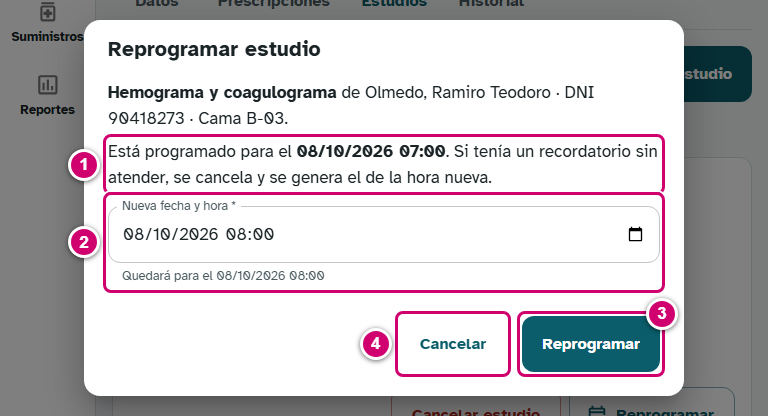

1. **Para cuándo está programado ahora** (en la imagen, 08/10/2026 07:00). Si tenía un recordatorio sin atender, se cancela y se genera el de la hora nueva.
2. **Nueva fecha y hora**: debajo dice cómo queda («Quedará para el 08/10/2026 08:00»).
3. **Reprogramar**: confirma. Se activa cuando la fecha es distinta de la actual.
4. **Cancelar**: cierra sin cambiar nada.

**Cuando sale bien**: «Se reprogramó Hemograma y coagulograma para el 08/10/2026 08:00.» Avísele el cambio de horario también al servicio que hace el estudio.

### Cancelar un estudio

1. En la tarjeta del estudio, toque **Cancelar estudio**.
2. Escriba el **Motivo de la cancelación**.
3. Toque **Cancelar estudio** (en rojo).

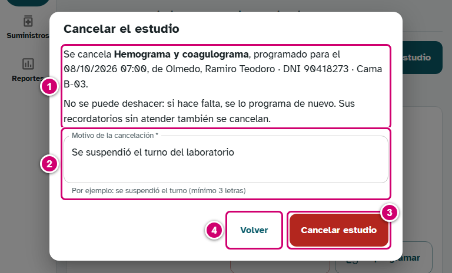

1. **Qué estudio se cancela**, para cuándo estaba y de quién (nombre, DNI y cama). **No se puede deshacer**: si hace falta, se lo programa de nuevo. Sus recordatorios sin atender también se cancelan.
2. **Motivo de la cancelación** (obligatorio, mínimo 3 letras); por ejemplo, «se suspendió el turno».
3. **Cancelar estudio**: confirma la cancelación.
4. **Volver**: cierra **sin cancelar nada**.

**Cuando sale bien**: «Se canceló Hemograma y coagulograma.» El estudio pasa a **Realizados y cancelados**. Cancelar en el sistema no anula el pedido en el servicio: avíseles por la vía de siempre.

**Si otra persona ya lo cerró**, aparece: «Este estudio ya estaba confirmado o cancelado (por usted o por otra persona). Revise el historial.»

---

## Ver los recordatorios

Para ver qué tomas y estudios hay que atender ahora en el hospital. **El médico los ve pero no los atiende**: las tarjetas no tienen botones. Los atiende enfermería.

1. Toque el **reloj con un número**, arriba (o **Recordatorios** en el menú).
2. Si quiere, filtre por **Tipo** o por **Sala**.

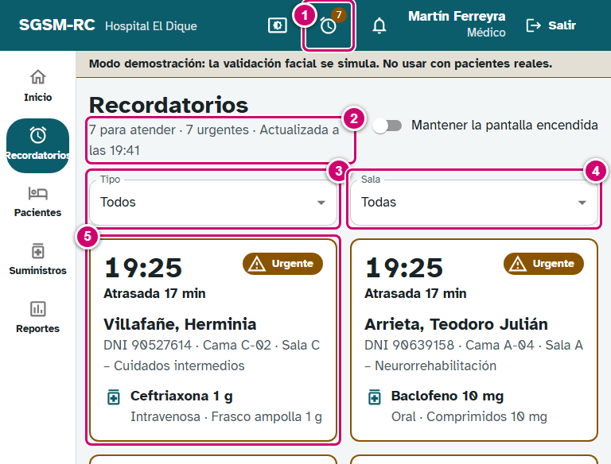

1. **El reloj de recordatorios**: a un toque desde cualquier pantalla.
2. **Resumen**: cuántos hay para atender, cuántos urgentes y a qué hora se actualizó la lista («7 para atender · 7 urgentes · Actualizada a las 19:41»).
3. **Tipo**: **Todos**, **Tomas** o **Estudios**.
4. **Sala**: **Todas** o una sala.
5. **Tarjeta de un recordatorio**: la hora de la toma (en 24 horas), la prioridad, cuánto falta o cuánto lleva atrasada, el paciente con su DNI, cama y sala, y qué toca (medicamento, dosis, vía y presentación, o el estudio). Las observaciones de la prescripción no aparecen acá.

La lista viene ordenada de lo más urgente a lo menos y se actualiza sola. La prioridad siempre se dice con texto, no solo con color:

| Prioridad      | Significa                                                                                                                                                                                                                          |
| -------------- | ---------------------------------------------------------------------------------------------------------------------------------------------------------------------------------------------------------------------------------- |
| **Urgente**    | Faltan 5 minutos o menos, o ya está atrasada.                                                                                                                                                                                      |
| **Pronto**     | Faltan entre 5 y 15 minutos.                                                                                                                                                                                                       |
| **Programada** | Faltan más de 15 minutos.                                                                                                                                                                                                          |
| **Vencida**    | Pasaron 60 minutos desde que apareció el recordatorio sin que nadie lo atendiera. Como aparece 30 minutos antes, en general es a los 30 minutos de la hora de la toma. Se avisa al administrador y todavía se puede atender tarde. |

Si una toma no se dio (ayuno, rechazo, estudio…), enfermería registra **No se administró** con el motivo. A usted no le llega aviso de una toma vencida ni de una no administrada: vea [Ver si una toma no se dio](#ver-si-una-toma-no-se-dio). Si no hay nada pendiente, la pantalla dice «No hay tomas ni estudios para atender ahora.»

**Mantener la pantalla encendida** evita que la tablet se apague mientras la lista está a la vista (por ejemplo, en el office). Aparece solo si el equipo lo permite.

> Ve un recordatorio atrasado y nadie lo atiende: avise a enfermería de esa sala. Desde su usuario no se registra la toma.

---

## En el teléfono

El sistema también funciona en un teléfono. Las tareas son las mismas; cambia dónde están algunas cosas.

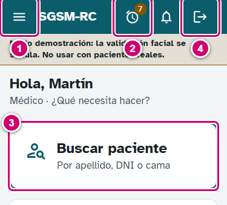

1. **Abrir el menú**: el botón de tres rayas, arriba a la izquierda.
2. **Recordatorios**: el reloj con un número, igual que en la tablet.
3. **Buscar paciente**: la primera tarea de la pantalla de Inicio.
4. **Salir**: en el teléfono es solo una flecha que sale de una puerta, sin texto, a la derecha de la campana.

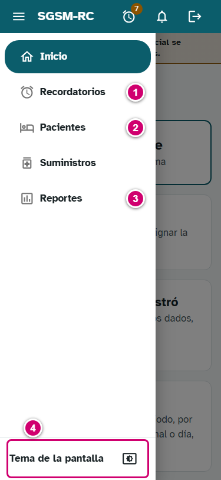

1. **Recordatorios**.
2. **Pacientes**.
3. **Reportes**.
4. **Tema de la pantalla**: claro, oscuro o igual que el dispositivo. En el teléfono está al pie del menú.

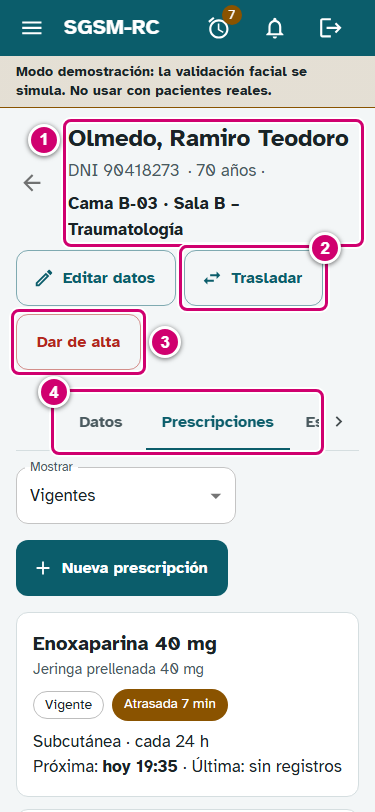

1. **Identificación**: nombre, DNI, edad, cama y sala.
2. **Trasladar**.
3. **Dar de alta**: los botones pasan debajo del nombre.
4. **Pestañas**: se desplazan de costado. Deslice o toque la flecha **›** para llegar a **Estudios** e **Historial**.

---

## Si algo no funciona

| Lo que ve                                                                                                               | Qué pasó y qué hacer                                                                                                                                                                                                                                                                                                                                     |
| ----------------------------------------------------------------------------------------------------------------------- | -------------------------------------------------------------------------------------------------------------------------------------------------------------------------------------------------------------------------------------------------------------------------------------------------------------------------------------------------------- |
| «No hay conexión con el servidor. Revise el Wi-Fi e intente de nuevo.»                                                  | La tablet perdió la red del hospital. Revise el Wi-Fi. **Antes de repetir lo que estaba haciendo, abra la ficha y fíjese si quedó guardado**: el corte pudo llegar después de guardar. Si al repetir una prescripción aparece **Posible prescripción duplicada**, lo más probable es que se había guardado: revise la ficha y **no toque Cargar igual**. |
| «No se pudo cargar …» con el botón **Reintentar**                                                                       | La información no llegó. **No significa que no haya datos**: toque **Reintentar**.                                                                                                                                                                                                                                                                       |
| «Sin conexión en tiempo real: la lista se actualiza cada 30 s.» y un ícono de sin señal sobre el reloj de recordatorios | Los recordatorios siguen actualizándose, pero cada 30 segundos. Se normaliza solo cuando vuelve la conexión.                                                                                                                                                                                                                                             |
| «El servidor tuvo un problema…» u «Ocurrió un problema inesperado…»                                                     | Una falla del sistema. Revise en la ficha si lo último quedó guardado e intente de nuevo en unos minutos; si se repite, llame al área de sistemas ([A quién llamar](#a-quién-llamar)).                                                                                                                                                                   |
| «El paciente no está internado»                                                                                         | Otra persona le dio el alta mientras usted trabajaba. Vuelva a abrir la ficha.                                                                                                                                                                                                                                                                           |
| «Solo se puede modificar una prescripción vigente»                                                                      | La prescripción se suspendió o finalizó mientras la editaba. Vuelva a abrirla.                                                                                                                                                                                                                                                                           |

---

## Preguntas frecuentes

**¿Puedo registrar yo que se le dio una medicación?**
No. Administrar y registrar una toma lo hace enfermería, confirmando con su rostro. Usted indica la prescripción y ve en la ficha cuándo se dio y quién la dio.

**¿El sistema me avisa si el paciente es alérgico o si hay una interacción?**
No. Solo avisa si el paciente ya tiene vigente el mismo medicamento. Las alergias se anotan en **Observaciones** de los datos del paciente (pestaña **Datos**).

**Cargué una prescripción con un error. ¿Cómo la borro?**
Las prescripciones no se borran: todo queda registrado. Si el error está en la dosis, la unidad, la vía, el fin o las observaciones, [cámbiela](#cambiar-una-indicación) con el motivo. Si se equivocó de medicamento, de inicio o de frecuencia (y ya se dio alguna toma), [finalícela](#suspender-reanudar-o-finalizar-una-indicación) con el motivo («cargada por error») y cargue la correcta.

**¿Cómo indico algo «si dolor»?**
No se puede en el sistema. Ver [Indicaciones que no son cada tantas horas](#indicaciones-que-no-son-cada-tantas-horas).

**¿Cuándo suspendo y cuándo finalizo?**
Suspenda si piensa retomarla (por ejemplo, hasta ver un resultado): después se reanuda con su horario de siempre. Finalice si terminó: no se puede reanudar.

**Le di el alta a un paciente y vuelve. ¿Qué pasa con sus indicaciones?**
Intérnelo con **Internar paciente** y su DNI: el sistema le ofrece **Registrar reingreso** en la misma ficha. Sus prescripciones quedaron suspendidas por el alta; en **Prescripciones**, elija **Mostrar: Todas**, revise cada una y reanude solo las que sigan correspondiendo, o cargue otras nuevas.

**Di de alta al paciente equivocado.**
Avise a enfermería y siga los pasos de [Si dio de alta por error](#si-dio-de-alta-por-error).

**No encuentro la cama que quiero en la lista.**
La lista muestra solo camas libres. Si la cama está ocupada, primero hay que trasladar o dar de alta al paciente que la tiene. Si está fuera de servicio, consulte al administrador.

**¿Por qué no veo los botones para descargar el reporte?**
La descarga en PDF o Excel la hace el administrador. Arme el reporte en pantalla y [pídale el archivo](#pedir-el-archivo-pdf-o-excel) con el período y los filtros.

**Veo una toma atrasada en Recordatorios. ¿La puedo atender?**
No desde su usuario. Avise a enfermería de la sala. Si nadie la atiende, pasa a **Vencida** (en general, a los 30 minutos de la hora de la toma) y el sistema avisa al administrador.

**¿Por qué el sistema me cerró la sesión?**
Por seguridad, la sesión se cierra sola después de un rato sin uso (en general, 15 minutos). Un minuto antes aparece **¿Sigue ahí?**: toque **Seguir trabajando** para continuar. Lo que no había guardado se pierde.

---

## Glosario

| Palabra                                   | Qué significa en el sistema                                                                                                                                   |
| ----------------------------------------- | ------------------------------------------------------------------------------------------------------------------------------------------------------------- |
| **Ingresar**                              | Entrar al sistema con su usuario y contraseña. No confundir con la internación del paciente.                                                                  |
| **Internar** / **Internación**            | Registrar el ingreso de un paciente al hospital con su cama.                                                                                                  |
| **Reingreso**                             | Volver a internar a un paciente que ya estuvo, en su misma ficha.                                                                                             |
| **Traslado**                              | Cambio de cama.                                                                                                                                               |
| **Dar de alta** / **Egreso**              | El paciente se va del hospital: libera la cama y suspende sus prescripciones.                                                                                 |
| **Pantalla de Inicio**                    | La primera pantalla después de entrar, con las tareas del día.                                                                                                |
| **Inicio** (de una prescripción)          | Fecha y hora de la primera toma que tiene que dar enfermería.                                                                                                 |
| **Prescripción**                          | Indicación médica de un medicamento: dosis, frecuencia y vía.                                                                                                 |
| **Toma**                                  | Cada momento en que corresponde dar un medicamento según la prescripción (Inicio + cada tantas horas).                                                        |
| **Administrar**                           | Dar un medicamento a un paciente y registrarlo (lo hace enfermería).                                                                                          |
| **Insumo**                                | Material no medicinal: pañal, gasa, filtro…                                                                                                                   |
| **Suministro**                            | Registro de una administración o de los insumos usados con un paciente.                                                                                       |
| **Recordatorio**                          | Aviso de una toma o de un estudio que se acerca (30 minutos antes) o que está atrasado.                                                                       |
| **Insignia de recordatorios**             | El reloj con un número, arriba: cuántos recordatorios hay para atender.                                                                                       |
| **Urgente** / **Pronto** / **Programada** | Cuánto falta para la toma: 5 minutos o menos (o atrasada), entre 5 y 15, o más de 15.                                                                         |
| **Vencida**                               | Toma cuyo recordatorio pasó 60 minutos sin atenderse (en general, 30 minutos después de la hora de la toma): avisa al administrador y se puede atender tarde. |
| **No se administró**                      | Registro de que una toma no se dio, con su motivo (ayuno, rechazo, estudio…).                                                                                 |
| **Estudio**                               | Práctica programada a un paciente (laboratorio, radiografía…) que enfermería confirma con su rostro.                                                          |
| **Confirmar con mi rostro**               | Validación facial de quien registra una administración o un estudio.                                                                                          |
| **Reporte** / **Estadísticas**            | Totales de lo que se usó en un período; el administrador los descarga en PDF o Excel.                                                                         |

---

## Anexo: reportes y estadísticas

No hace falta para la recorrida. Sirve para ver cuánto se usó en un período: por paciente, por medicamento o insumo, por personal o por día. El médico **ve** los reportes; la **descarga** del archivo la hace el administrador.

1. Toque **Ver reportes** en la pantalla de Inicio, o **Reportes** en el menú.
2. Elija el período, y si quiere la sala, el tipo y cómo agrupar.
3. Baje para ver el resultado.

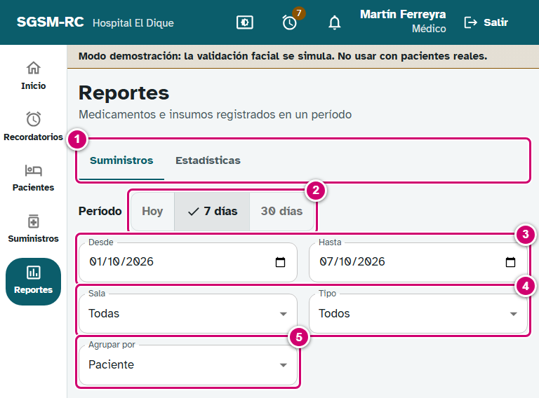

1. **Pestañas**: **Suministros** (la tabla) y **Estadísticas** (indicadores y gráficos).
2. **Período**: **Hoy**, **7 días** (por defecto) o **30 días**.
3. **Desde** y **Hasta**: otro período, de hasta 366 días.
4. **Sala** y **Tipo** (**Todos**, **Medicamentos** o **Insumos**).
5. **Agrupar por**: **Paciente**, **Medicamento o insumo**, **Personal** (quién registró) o **Día**.

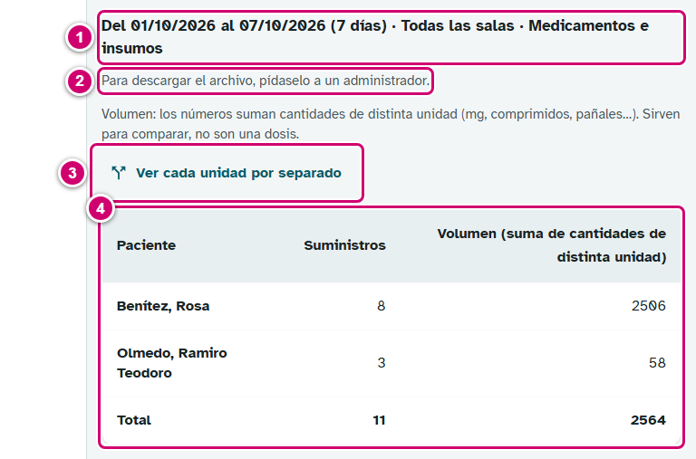

1. **Qué está viendo**: el período, las salas y los tipos.
2. **«Para descargar el archivo, pídaselo a un administrador.»**: ver [Pedir el archivo](#pedir-el-archivo-pdf-o-excel).
3. **Ver cada unidad por separado**: cambia **Agrupar por** a **Medicamento o insumo** (con el mismo período y filtros) y muestra cada unidad en su fila: mg, comprimidos, pañales.
4. **Tabla del reporte**: una fila por lo que eligió en Agrupar por, con la cantidad de suministros y el total al pie.

**La columna Volumen no es una dosis**: suma números de distinta unidad (mg, comprimidos, pañales…) y solo sirve para comparar filas entre sí. Para ver cantidades reales, toque **Ver cada unidad por separado**.

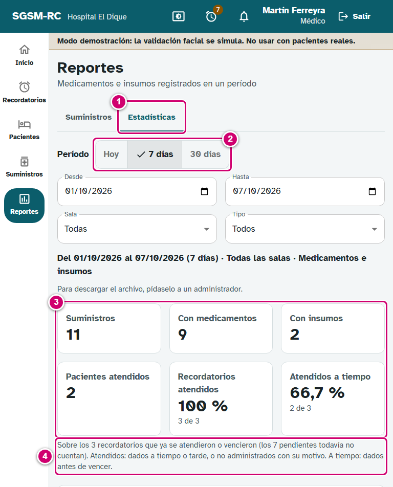

1. **Pestaña Estadísticas**.
2. **El mismo período y filtros** que en Suministros.
3. **Indicadores del período**: Suministros, Con medicamentos, Con insumos, Pacientes atendidos, Recordatorios atendidos y Atendidos a tiempo.
4. **Cómo se cuentan los recordatorios**: solo los que ya se atendieron o vencieron. «Atendidos» incluye los dados a tiempo o tarde y los no administrados con su motivo; «a tiempo», los dados antes de vencer.

Más abajo hay cuatro gráficos (más usados, consumo por tipo, evolución diaria y recordatorios del período). Cada uno tiene **Ver como tabla**, para leer los números exactos.

**Si no hay datos**, la pantalla lo dice con el período y qué probar (ampliar el período, cambiar Tipo a Todos u otra sala).

### Pedir el archivo (PDF o Excel)

Su usuario no tiene los botones de descarga. Para tener el archivo:

1. Arme el reporte en pantalla con el período, los filtros y la agrupación que necesita.
2. Anote el renglón del resumen que está arriba de la tabla (marcador 1 de la imagen del resultado: «Del … al … · …») y cómo lo agrupó.
3. Pídale al administrador el archivo en **PDF** o **Excel** con esos datos, por el medio que figura en [A quién llamar](#a-quién-llamar).
