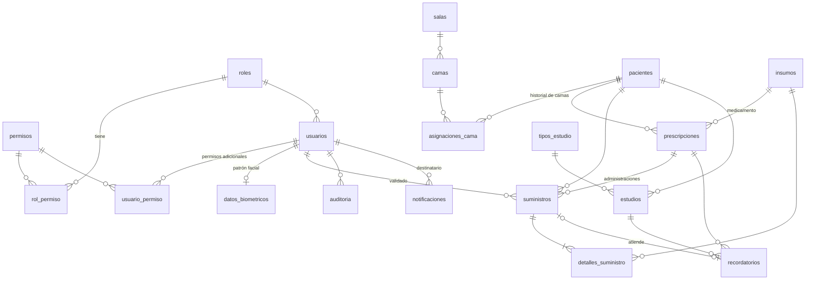

# Modelo de datos

> Tareas T101 y T102. Fuente de verdad: [`backend/prisma/schema.prisma`](../backend/prisma/schema.prisma)
> y las migraciones en [`backend/prisma/migrations/`](../backend/prisma/migrations/).

## Origen del modelo

El plan de trabajo pide "las 17 tablas del DER" de la Actividad 6, pero ese documento no estaba
disponible al construir el prototipo. El modelo se **infirió de las tareas del plan** (qué datos
guarda, consulta o modifica cada una) y quedó en **19 tablas**. Cuando el equipo tenga a mano el
DER original conviene compararlo; las candidatas a no haber sido tablas propias en el DER son
`salas` (podría ser un atributo de la cama) y `notificaciones` (el plan las menciona en T112,
T407 y T508 pero sin decir dónde se guardan).

## Diagrama

## Tablas

| Tabla                 | Qué guarda                                                                                             | Tareas           |
| --------------------- | ------------------------------------------------------------------------------------------------------ | ---------------- |
| `roles`               | Los tres roles: Administrador, Médico, Enfermero                                                       | T103, T106       |
| `permisos`            | Catálogo de permisos `modulo.accion`                                                                   | T103, T106       |
| `rol_permiso`         | Permisos que trae cada rol                                                                             | T106             |
| `usuarios`            | Personal del hospital; baja lógica, bloqueo por intentos fallidos                                      | T105, T109, T112 |
| `usuario_permiso`     | Permisos adicionales otorgados a un usuario puntual (CU05)                                             | T111             |
| `salas`               | Salas o servicios del hospital                                                                         | T103, T201       |
| `camas`               | Camas de cada sala; `habilitada` permite sacarlas de servicio                                          | T201             |
| `pacientes`           | Datos personales, estado (internado/egresado), ingreso y egreso                                        | T202             |
| `asignaciones_cama`   | Historial de camas; la activa es la que no tiene `fecha_hasta`                                         | T201, T207       |
| `insumos`             | Catálogo de medicamentos e insumos no medicinales                                                      | T303             |
| `prescripciones`      | Indicaciones médicas: dosis, frecuencia, vía, estado                                                   | T301             |
| `suministros`         | Cada administración de medicamento o movimiento de insumos                                             | T408, T409       |
| `detalles_suministro` | Insumos y cantidades de cada suministro                                                                | T408, T409       |
| `datos_biometricos`   | Patrón facial (128 valores) y foto de referencia por usuario                                           | T403             |
| `tipos_estudio`       | Catálogo de tipos de estudio                                                                           | T103 (E5)        |
| `estudios`            | Estudios programados por paciente                                                                      | E5               |
| `recordatorios`       | Recordatorios de tomas y estudios: prioridad, estado, atención (administración o motivo) y vencimiento | E5               |
| `auditoria`           | Quién, cuándo, qué acción, sobre qué entidad, valor anterior y nuevo                                   | T104             |
| `notificaciones`      | Avisos al administrador (bloqueos, validaciones faciales fallidas)                                     | T112, T407       |

Las tablas de estudios y recordatorios se crean ya en E1 porque el plan pide el esquema completo
en T101 y porque el egreso del paciente (T210) tiene que cancelar los estudios y recordatorios
pendientes. La lógica que las usa corresponde a la etapa E5.

## Convenciones

- Tablas y columnas en `snake_case`; en el código (Prisma) los mismos nombres en `camelCase`.
- Fechas y horas en `timestamptz` (se guardan en UTC). La fecha de nacimiento es `date`.
- Claves primarias enteras autoincrementales.
- **No hay borrado físico** de datos clínicos ni de usuarios: los usuarios tienen `activo` y
  `fecha_baja`, los pacientes `estado` y `fecha_egreso`, los insumos `activo`, las
  prescripciones `estado`. Lo único que se elimina es el dato biométrico (CU09), por ser un dato
  sensible que el administrador debe poder borrar.
- Dosis y cantidades son `double precision` (admiten fracciones: 0,5 comprimido, 2,5 ml).

## Restricciones de negocio en la base (T102)

| Regla                                                        | Restricción                                                                                                                                                                                                             |
| ------------------------------------------------------------ | ----------------------------------------------------------------------------------------------------------------------------------------------------------------------------------------------------------------------- |
| RN02 — una cama tiene un solo paciente activo                | Índice único parcial `asignaciones_cama(cama_id) WHERE fecha_hasta IS NULL`                                                                                                                                             |
| RN02 — un paciente ocupa una sola cama a la vez              | Índice único parcial `asignaciones_cama(paciente_id) WHERE fecha_hasta IS NULL`                                                                                                                                         |
| RN08 — no hay DNI repetido                                   | Índice único `pacientes(dni)` y `usuarios(dni)`                                                                                                                                                                         |
| Datos coherentes                                             | `CHECK` de dosis y cantidades positivas, frecuencia entre 1 y 168 h, egreso con fecha y motivo, patrón facial de 128 valores                                                                                            |
| T502 — una toma tiene un solo recordatorio activo (E5 · D13) | Índices únicos parciales `recordatorios(prescripcion_id, fecha_hora_objetivo)` y `recordatorios(estudio_id, fecha_hora_objetivo)` `WHERE estado <> 'CANCELADO'`: una toma cancelada se puede volver a recordar          |
| Recordatorios coherentes (E5)                                | `CHECK`: el origen coincide con el tipo (toma → prescripción, estudio → estudio); `ATENDIDO` con `atendido_en` y una sola resolución (la administración o el motivo; ninguna en un estudio); `VENCIDO` con `vencido_en` |

Las restricciones de recordatorios están en la migración
[`recordatorios_e5`](../backend/prisma/migrations/20261007162336_recordatorios_e5/migration.sql);
las reglas que las usan, en [recordatorios.md](recordatorios.md). Prisma no conoce los índices
parciales ni los `CHECK`: al crear una migración con `--create-only` hay que revisar que no los
borre.

**Decisión sobre el DNI.** El plan habla de índices _parciales_ también para el DNI. Se optó por
un índice único total: cuando un paciente egresado vuelve a internarse, el sistema **reutiliza
su ficha** (reingreso, T204) en lugar de crear una nueva, para que su historial clínico siga en
un solo lugar (CU16). Con una sola ficha por persona, el índice parcial no aporta nada y el total
es más estricto.
